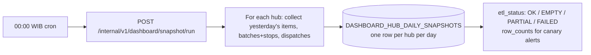

# Docking Dashboard — Context v1

> Purpose: the shared understanding of how this module works **today**. This is the doc an agent or new teammate reads before touching anything in the module. Keep it current — update it whenever a feature ships.

## Overview

The docking-dashboard module gives **leadership** visibility into hub docking operational performance: how fast packages move through each stage of a hub (inbound scan → dispatch preview/commit → rider scan), how much volume each hub processes, and how those two interact. It is a hub *performance* dashboard (trends, comparisons, capacity signals), not a live *ops* dashboard — real-time backlog and floor-level "what to do right now" signals belong to the **inbound** module.

The module has two halves. The **write side** is a daily ETL inside `nest-logistic-service` that snapshots each hub's day into `DASHBOARD_HUB_DAILY_SNAPSHOTS` at 00:00 WIB. The **read side** is a metrics API (contracts defined in the API collection, `Logistic Service/Dashboard/`) that computes metrics from those snapshots at query time, plus an ops-portal page that renders them. **Implementation state (verified 2026-07-12):** both halves are implemented on the service's `feat/dashboard` branch (migration 0038, ETL usecases, all 13 endpoints) — but that branch is **not merged to main** (2 commits ahead, 34 behind as of the check). Nothing dashboard-related runs in production yet. The read side plus this version's extensions are specified by [dock-prd-trd-v1.md](./dock-prd-trd-v1.md).

This module is **distinct from the `analytics-dashboard` module** (the KPI_DEFINITION / SNAPSHOT / DEPLOYMENT / VERDICT meta-layer in the ERD), which tracks deployment verdicts against KPIs across services. Docking-dashboard is about hub docking operations specifically.

## Standing product decisions

These were set during the 2026-06-25 scoping session and bind all future work on this module:

1. **Audience is leadership**, not floor operations. Refresh cadence is **daily** (the ETL), never real-time. Live counters and alerts belong to the inbound module.
2. **Trend metrics use a moving average** (default 7-day) — never a median of daily values. Median (with min/max) is reserved for the *distribution within a single window*, where it exposes the long tail that averages hide.
3. **Cross-hub comparison leads with velocity** (seconds per item), never throughput (items/hour). Throughput conflates speed with volume; velocity isolates the speed signal. Volume is always shown as context, never as the comparison number.
4. **Totals are volume-directed.** A total stage time is never shown without its volume. A hub with 45 minutes of inbound scanning across 2,488 packages is *fast*; the layout must make that reading automatic.
5. **Charts are ink-default** per the GSM: color only when it carries information, never decoration.

## Actors & roles

| Actor | Interaction | Auth |
|---|---|---|
| Leadership / management | Views the dashboard page in the ops portal; makes rollout, staffing, and SLA decisions from it | Portal JWT (`providerTokenPortal` surface); exact role granularity is an open question in the PRD |
| Ops / on-call engineer | Runs and monitors the snapshot ETL; triggers backfills | Internal service token (`Internal/Dashboard` collection) |
| ETL cron (internal) | Writes one snapshot row per hub per day at 00:00 WIB | Internal |
| Hub operators & riders | Do not use this module — they *generate* the scan events it measures (via hub app and rider app) | N/A |

## Current behavior & flows

### Write side (implemented on `feat/dashboard`, unmerged)



- `POST /internal/v1/dashboard/snapshot/run` — run one day (optionally one hub).
- `GET /internal/v1/dashboard/snapshot/status?date=` — per-hub ETL status + row counts for a date.
- `POST /internal/v1/dashboard/snapshot/backfill` — ranged backfill, auto-discovers full history, `max_days` clip, `dry_run` supported.

Snapshot rows preserve **row-level grain** (full item/batch/dispatch JSONB, batches nest stops, stops nest items) precisely so that today's metrics, tomorrow's new metrics, and future AI summarization can all be computed from the same data without re-running ETL.

### Read side (specified in the PRD/TRD)

Leadership opens the portal page → the page calls `/v1/dashboard/*` endpoints → the service computes metrics from snapshot JSONB at query time (compute-on-read) → cards, trends, tables render with volume context and data-quality badges.

## The docking stages

A package moves through a hub in three measured stages:

```
  INBOUND SCAN          DISPATCH (preview → commit)      RIDER SCAN (handover)
  items[].scanned_at    dispatches[].created_at          items[].handed_over_at
  "hub scan"            → committed_at                   "rider scan / packing"
```

Between stages sit **idle gaps** — time where packages wait. The June 2026 field finding: preview was built only after inbound completed, costing ~15 minutes of waiting per cycle. ("Preview before inbound" is on the roadmap and will change gap semantics when it ships.)

## Metric definitions (canonical)

These definitions are restated here from the API contract examples so the vault is self-sufficient; the collection (`Logistic Service/Dashboard/`) remains ground truth for exact response shapes.

| Metric | Definition | Unit |
|---|---|---|
| Inbound velocity | Sessionized inbound scan duration ÷ items scanned, per day. Inbound work arrives in **waves** (sessions); duration sums wave durations, not first-to-last timestamp, so a straggler rescan does not inflate the number | sec/item |
| Dispatch velocity | Preview→commit duration ÷ items in the dispatch, per day (summed across dispatch cycles). The per-dispatch median duration (as shown in weekly decks) is a derived display value; sec/item is the canonical comparison number | sec/item |
| Rider scan velocity | Sessionized rider handover scan duration ÷ items handed over, per day; distribution (min / median / max per item) reported within-window | sec/item |
| Trend / headline | 7-day moving average of the daily velocity (`currentMa`), with direction and % change vs the prior window's MA | — |
| Planner stress | Unbatchable + deferred item count per day, with MA. Measures how hard the batch planner is straining against constraints | items |
| Throughput | Scanned / dispatched / handed-over counts per bucket (hourly or daily) | items |
| Zone breakdown | Per-zone scan-time distribution + MA; single-rider vs multi-rider zone coverage share | mixed |
| Coverage | *Included* snapshot days ÷ expected days in window (a present-but-excluded PARTIAL/FAILED day does not count; `excludedDays` reported separately); below 0.8 → `lowCoverage` | ratio |
| Volume stress *(new in PRD v1)* | Window avg items/day ÷ trailing-30-day p90 of items/day | ratio |
| Idle gaps *(new in PRD v1)* | Per dispatch cycle: gap1 = preview created − last inbound scan of that cycle; gap2 = first handover − commit; median across cycles | sec |

**Data-quality semantics:** value `null` always means "no data", never 0. `INSUFFICIENT_SAMPLES` marks thin windows (MA needs ≥4 included days). Days with `etl_status` FAILED or PARTIAL are excluded from aggregates and moving averages; EMPTY days count as genuine zero-activity. `freshness.stale` marks lagging ETL. Every event is attributed to the WIB date of its own timestamp, so items spanning midnight are not double-counted.

## Data owned by this module

- **Owns:** `DASHBOARD_HUB_DAILY_SNAPSHOTS` (see `docs/modules/erd/erd.mermaid`). No FKs into operational tables — source rows are embedded as JSONB.
- **Reads (at ETL time):** `ITEMS`, `BATCHES`, `BATCH_STOPS`, `BATCH_ITEMS`, `DISPATCHES`, `ZONES` (zone names), hub master data from core-service (snapshotted into the `hub` JSONB column).
- **Reads (at query time):** only its own snapshot table. The read API never queries operational tables.

## APIs & integrations

**Exposed — read side** (collection: `Logistic Service/Dashboard/`, auth `providerTokenPortal`):
`GET /v1/dashboard/hubs`, `GET /v1/dashboard/hubs/{id}`, `GET /v1/dashboard/hubs/{id}/inbound-velocity`, `.../dispatch-velocity`, `.../rider-scan-velocity`, `.../planner-stress`, `.../throughput`, `.../zone-breakdown`, `.../coverage`, `GET /v1/dashboard/compare`. Window enum `1d|7d|30d|90d`; all times Asia/Jakarta.

**Exposed — write side** (collection: `Logistic Service/Internal/Dashboard/`, auth internal token):
`POST /internal/v1/dashboard/snapshot/run`, `GET .../status`, `POST .../backfill`.

**Consumes:** core-service hub master (ETL time only). **Pending:** delivery-service integration reserves three metric slots (`rider_packing_time`, `zero_overnight_rate`, `dock_time_distribution`) surfaced as `pendingMetrics: UNAVAILABLE` in the hub detail contract.

## Known constraints & gotchas

- **The dashboard code lives on an unmerged branch.** `feat/dashboard` in `nest-logistic-service` holds the full implementation but has drifted behind main (34 commits as of 2026-07-12, including item_media / pod-per-package / dispatch changes). The ETL reads items, batches, and dispatches, so the merge must re-verify the ETL against any schema drift since the 2026-06-24 branch point.
- **The daily fill has no scheduler.** There is no cron inside the service (by design — it stays schedule-free). `POST /internal/v1/dashboard/snapshot/run` must be triggered daily at 00:00 WIB by an external scheduler; until that is wired up, snapshots only exist when someone hits the endpoint.
- **The snapshot is the source of truth for the read side.** If the ETL misses a day, the dashboard shows a gap — by design. Never "fix" this by querying operational tables from the read API.
- **Snapshot JSONB contains PII** (addresses, phone numbers inside item rows). Read endpoints must return aggregates only — raw item/batch rows never leave the service.
- **PARTIAL days are excluded, not badge-and-included.** A half-captured day produces a confidently wrong velocity; exclusion + coverage visibility beats a badge next to a wrong number in a ranking.
- **Snapshot rows are immutable after ETL** — computed stats can be cached per (hub, day) indefinitely; the cache fills after each ETL run.
- **A `7d` view reads more than 7 rows:** + 6 days of MA lookback, + trailing 30 days for volume stress.
- **Gap metrics will change meaning** when "preview before inbound" ships (gap1 collapses toward zero / goes negative by design). Clamped negatives are counted (`overlappedCycles`) rather than hidden.
- **Stage-timeline stats finalize a day late.** A dispatch cycle belongs to the WIB date of `dispatch.created_at`, but its handovers can land after the 00:00 cutoff — so assembling day D's cycles reads day D+1's snapshot row, and day D's timeline finalizes only after D+1's ETL.
- **Unknown hub vs known-hub-no-data are different states:** unknown hub id → 404 on every read endpoint; known hub with thin/no data → 200 with INSUFFICIENT_SAMPLES/empty shapes.
- **Jakarta Barat effect:** newly onboarded hubs have days-not-weeks of history; INSUFFICIENT_SAMPLES / INSUFFICIENT_HISTORY states are first-class, not errors.
- **Weekly decks are evidence, not spec.** The 30 Jun 2026 weekly update (outside the vault) proved these metrics with real numbers, but this doc and the PRD are the spec.

## Glossary

| Term | Meaning |
|---|---|
| Hub | A pitstop facility where packages are received, batched, and handed to riders (core-service master data) |
| Pkg / item | One `ITEMS` row. Deck copy says "pkg"; the data model says item. (`quantity > 1` semantics: open question) |
| Inbound scan / hub scan | Operator scans a package into the hub (`items.scanned_at`) |
| Dispatch | One plan→preview→commit planning cycle (`DISPATCHES` row) |
| Preview → commit | The window from dispatch plan creation to operator commit |
| Rider scan / handover | Rider scans a package out of the hub into their bag (`items.handed_over_at`) |
| Wave / session | A contiguous burst of scan activity; gaps beyond the session threshold split waves so idle time is not counted as scan time |
| Velocity | Seconds per item for a stage — the canonical cross-hub comparison number |
| Volume stress | Window average items/day relative to the hub's trailing 30-day p90 |
| Planner stress | Unbatchable + deferred items per day |
| Coverage | Share of expected snapshot days actually present in a window |
| WIB | Waktu Indonesia Barat (UTC+7) — every date boundary in this module |

## Open questions

- Exact portal role(s) that map to "leadership" (see PRD Open questions).
- `quantity > 1` items: does "pkg scanned" count rows or quantity units? (Metrics currently count rows.)

## Changelog

- 2026-07-10 — created (v1, rebuilt after prior module docs were deleted; read-side API contracts recovered from the API collection)
- 2026-07-12 — corrected implementation state: write side was recorded as "shipped" but the code (both halves, 13 endpoints + migration) actually lives on the unmerged `feat/dashboard` branch; added merge-drift and missing-scheduler gotchas
