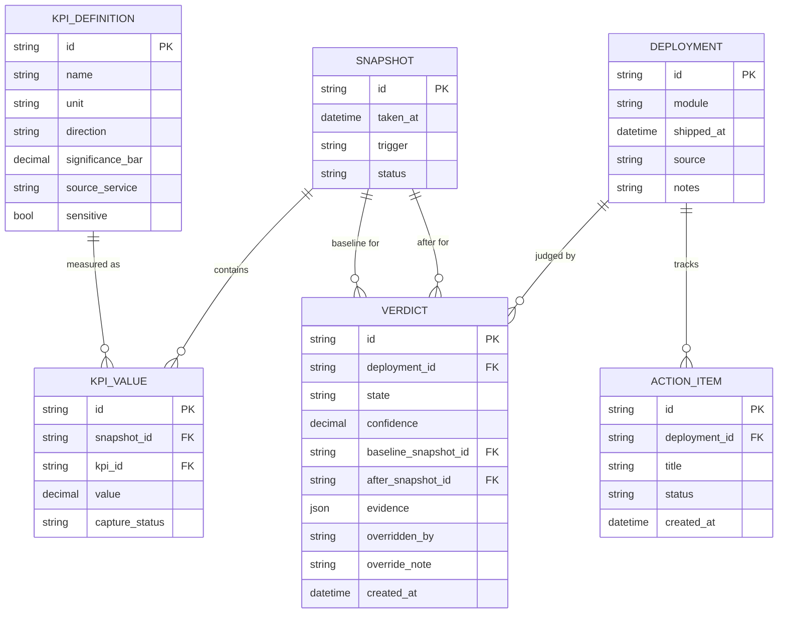

# Dash Electric Logistic — ERD

Source of truth: [`nest-logistic-service/src/database/schema/table/*.ts`](../../../../nest-logistic-service/src/database/schema/table). Field names below match the actual Postgres columns. External masters (`clients`, `users`, `riders`, `hubs`, `providers`, `outlets`) live in `nodejs-core-service` and are referenced by id without a DB foreign key — they appear as snapshot JSONB columns, not as entities here.

The canonical mermaid file is [`erd.mermaid`](erd.mermaid). This markdown wraps the same diagram for inline rendering.

## Modules

| Module | Entities |
|---|---|
| Intake & inbound | `upload_shipments`, `shipments`, `items`, `item_status_history`, `scan_events` |
| Dispatch | `dispatches`, `batches`, `batch_stops`, `batch_items` |
| Invoice / proof-of-delivery | `invoices`, `invoice_status_history`, `ai_checker_logs` |
| Zoning | `zones`, `zone_cells` |
| Docking dashboard | `dashboard_hub_daily_snapshots` |
| Analytics dashboard (meta) | `snapshot`, `kpi_definition`, `kpi_value`, `deployment`, `verdict`, `action_item` |

## Diagram

```mermaid
erDiagram
    %% ── Intake & inbound (Stage 2: CSV upload → shipments → items → hub scan) ──
    UPLOAD_SHIPMENTS ||--o{ SHIPMENTS : "imports (soft fk)"
    SHIPMENTS ||--o{ ITEMS : contains
    ITEMS ||--o{ ITEM_STATUS_HISTORY : "audits transitions"
    ITEMS ||--o{ SCAN_EVENTS : "scanned via"

    %% ── Dispatch (plan → batches → stops → item assignment) ──
    DISPATCHES ||--o{ BATCHES : plans
    BATCHES ||--o{ BATCH_STOPS : visits
    BATCHES ||--o{ BATCH_ITEMS : carries
    BATCH_STOPS ||--o{ BATCH_ITEMS : "drops at"
    ITEMS ||--o{ BATCH_ITEMS : "assigned to batch"

    %% ── Invoice (proof-of-delivery + AI checker) ──
    INVOICES ||--o{ INVOICE_STATUS_HISTORY : "audits transitions"
    INVOICES ||--o{ AI_CHECKER_LOGS : "checked by"

    %% ── Zoning (hub coverage by H3 cells; disjoint cell invariant) ──
    ZONES ||--o{ ZONE_CELLS : "covers H3 cells"

    UPLOAD_SHIPMENTS {
        uuid id PK
        text code "unique"
        integer client_id "external core-service.clients.id"
        text uploaded_by "JWT email"
        text file_name
        integer total_rows
        integer total_shipments
        integer total_items
        text status "PROCESSING|COMPLETED|FAILED"
        jsonb error_log
        timestamptz uploaded_at
        timestamptz completed_at
        timestamptz created_at
        timestamptz updated_at
    }

    SHIPMENTS {
        uuid id PK
        text waybill "unique"
        uuid upload_shipment_id FK "soft → upload_shipments.id"
        integer client_id "external core-service.clients.id"
        jsonb client "ShipmentClientSnapshot {id,name}"
        text booking_id
        text delivery_group_id
        text service_type
        text priority_time_window "HH:MM - HH:MM"
        text sender_name
        text sender_phone
        text receiver_name
        text receiver_phone
        text origin_address
        numeric origin_lat
        numeric origin_long
        text origin_h3_index
        text origin_phone
        text destination_address
        numeric destination_lat
        numeric destination_long
        text destination_h3_index
        text destination_phone
        numeric total_weight
        numeric total_volume
        text status "default CREATED"
        timestamptz dispatched_at
        uuid dispatched_by
        timestamptz cancelled_at
        uuid cancelled_by
        text cancellation_reason
        integer external_provider_id
        integer external_shift_id
        text revenue_stream "snapshot core-service.providers.revenue_stream"
        integer hub_id "external core-service pitstop id"
        jsonb hub "HubSnapshot {id,name,address,lat,long}"
        timestamptz created_at
        timestamptz updated_at
    }

    ITEMS {
        uuid id PK
        uuid shipment_id FK "→ shipments.id CASCADE"
        text hub_id "external core-service pitstop id"
        jsonb hub "HubSnapshot cloned from shipment"
        text item_name
        text invoice "PO/SP number"
        text description
        integer quantity ">0"
        numeric weight
        numeric volume
        numeric price
        text origin_address
        numeric origin_lat
        numeric origin_long
        text origin_h3_index
        text destination_address
        numeric destination_lat
        numeric destination_long
        text destination_h3_index
        timestamptz scanned_at "hub-inbound scan"
        uuid scanned_by
        timestamptz handed_over_at "rider pickup at hub"
        text assigned_rider_code
        bigint assigned_rider_id
        timestamptz assigned_at
        text assigned_by
        text external_delivery_uid
        timestamptz bridged_at
        text exception_note
        text status "default CREATED"
        timestamptz cancelled_at
        uuid cancelled_by
        text cancellation_reason
        timestamptz created_at
        timestamptz updated_at
    }

    ITEM_STATUS_HISTORY {
        uuid id PK
        uuid item_id FK "→ items.id CASCADE"
        text from_status
        text to_status
        text changed_by "email or identifier"
        text note
        timestamptz changed_at
    }

    SCAN_EVENTS {
        uuid id PK
        text scan_uid "unique — client-generated idempotency key"
        uuid item_id FK "→ items.id"
        timestamptz scanned_at
        uuid scanned_by
    }

    DISPATCHES {
        uuid id PK
        text code "unique"
        bigint hub_id "external core-service pitstop id"
        jsonb riders_snapshot
        numeric max_weight_kg
        numeric max_volume_m3
        numeric max_stop_radius_km
        integer shift_minutes "default 480 (8h)"
        jsonb time_model_snapshot "{hubOverheadMin,baseServiceMinPerStop,avgSpeedKmh,circuityFactor}"
        jsonb client_buffers_snapshot
        integer total_items
        integer total_batches
        integer deferred_batch_count
        integer deferred_item_count
        integer unbatchable_count
        text status "default PREVIEW"
        jsonb planner_stats
        text triggered_by
        timestamptz committed_at
        timestamptz created_at
        timestamptz updated_at
    }

    BATCHES {
        uuid id PK
        text code "unique — BTH{yymmdd}{seq5}"
        uuid dispatch_id FK "→ dispatches.id CASCADE"
        bigint hub_id
        jsonb hub "HubSnapshot"
        text assigned_rider_code
        bigint assigned_rider_id
        text assigned_rider_name
        integer trip_sequence
        integer stop_count
        integer item_count
        numeric total_weight_kg
        numeric total_volume_m3
        integer estimated_time_minutes
        text status "default PLANNED"
        text route_polyline "Mapbox snapshot"
        integer route_distance_m
        integer route_duration_sec
        timestamptz route_computed_at
        timestamptz bridged_at
        timestamptz created_at
        timestamptz updated_at
    }

    BATCH_STOPS {
        uuid id PK
        uuid batch_id FK "→ batches.id CASCADE"
        integer sequence "unique within batch"
        text destination_key
        text destination_address
        numeric destination_lat
        numeric destination_long
        text zone_code
        text zone_name
        integer item_count
        numeric total_weight_kg
        numeric total_volume_m3
        integer distinct_client_count
        integer computed_stop_time_min
        integer leg_distance_m "Mapbox leg ending here"
        integer leg_duration_sec
        timestamptz created_at
    }

    BATCH_ITEMS {
        uuid id PK
        uuid batch_id FK "→ batches.id CASCADE"
        uuid batch_stop_id FK "→ batch_stops.id CASCADE"
        uuid item_id FK "→ items.id (unique per batch)"
        numeric weight_kg
        numeric volume_m3
        boolean deferred "default false"
        timestamptz created_at
    }

    INVOICES {
        uuid id PK
        text invoice_number "unique — PT-INV-…"
        text airwaybill
        text batch_id
        jsonb rider "InvoiceRiderSnapshot {id,name}"
        jsonb client "InvoiceClientSnapshot {id,name}"
        jsonb outlet "InvoiceOutletSnapshot {id?,name,address?}"
        jsonb hub "InvoiceHubSnapshot {id?,name,address?}"
        integer items_count ">=0"
        date issue_date
        date due_date
        text status
        jsonb invoice_images "InvoiceImageSet {spType,images[]}"
        timestamptz returned_at
        timestamptz collected_at
        timestamptz submitted_to_client_at
        timestamptz client_acknowledged_at
        text exception_code
        text notes
        timestamptz created_at
        timestamptz updated_at
    }

    INVOICE_STATUS_HISTORY {
        uuid id PK
        uuid invoice_id FK "→ invoices.id"
        text from_status
        text to_status
        timestamptz changed_at
        jsonb changed_by "{id,name,role}"
        text note
        jsonb invoice_images "snapshot at transition"
    }

    AI_CHECKER_LOGS {
        uuid id PK
        uuid invoice_id FK "→ invoices.id"
        text sp_type "AI-detected"
        text order_id "AI-extracted PO/invoice no."
        boolean passed
        boolean is_strict_mode "ENABLE_STRICT_AI_CHECKER flag at check time"
        jsonb items "AiCheckerLogItemSnapshot[]"
        jsonb errors "string[]"
        jsonb raw_results "{currentPoNumber,results[]}"
        jsonb invoice_images
        jsonb token_usage "{promptTokenCount,candidatesTokenCount,totalTokenCount}"
        jsonb checked_by "{id,name,role}"
        timestamptz checked_at
    }

    ZONES {
        uuid id PK
        bigint hub_id "external core-service pitstop id"
        varchar code "unique per hub"
        varchar name
        varchar color "#RRGGBB"
        varchar status "default active"
        timestamptz created_at
        timestamptz updated_at
    }

    ZONE_CELLS {
        uuid id PK
        uuid zone_id FK "→ zones.id"
        varchar h3_index "globally unique (disjoint-cells invariant)"
    }

    DASHBOARD_HUB_DAILY_SNAPSHOTS {
        uuid id PK
        date snapshot_date "yesterday in WIB at ETL time"
        bigint hub_id "external core-service pitstop id"
        jsonb hub "hub master snapshot at capture"
        jsonb items "flat array of items that touched this hub on this day"
        jsonb batches "batches; each nests stops, each stop nests its items"
        jsonb dispatches "dispatches"
        jsonb external_data "cross-service captures (delivery-service later)"
        jsonb row_counts "{items,batches,stops,dispatches} for canary alerts"
        text etl_status "OK | EMPTY | PARTIAL | FAILED"
        timestamptz etl_started_at
        timestamptz etl_completed_at
        timestamptz source_cutoff_at "the instant this snapshot represents"
        timestamptz created_at
        timestamptz updated_at
    }
```

## Notes

- **Cascades.** `items` cascade-delete from `shipments`; `item_status_history` and `scan_events` cascade from `items`; `batches`, `batch_stops`, `batch_items` all cascade under their parents in the dispatch tree. `invoice_status_history` and `ai_checker_logs` do **not** cascade — invoice audit trail survives manual cleanup.
- **One batch per item.** `batch_items` has `(item_id, batch_id)` unique; the planner's COLLECT step excludes items already in `batch_items` to enforce single-active-batch.
- **H3 disjointness.** `zone_cells.h3_index` is globally unique — the same H3 cell cannot belong to two zones at the database layer.
- **External references (no FK).** `client_id`, `hub_id`, `assigned_rider_id`, `external_provider_id`, `dispatched_by`, `scanned_by`, `cancelled_by`, `uploaded_by` all point at `nodejs-core-service` masters. Names/addresses are captured into the `*_snapshot` / `*` JSONB columns at intake so later master edits don't rewrite history.
- **Status enums.** Operational status fields (`shipments.status`, `items.status`, `batches.status`, `dispatches.status`, `invoices.status`, `upload_shipments.status`, `zones.status`) are stored as `text` with values defined in `src/database/schema/enum/*.enum.ts`; the DB does not enforce the enum — the service layer does.
- **`dashboard_hub_daily_snapshots`** is the only entity owned by the docking-dashboard module. It has no FK relationships to other entities — the source row data lives inside the JSONB columns (`items`, `batches`, `dispatches`), captured verbatim by a daily ETL at 00:00 WIB. `hub_id` is an external `nodejs-core-service` reference, same as everywhere else. Touched-on-day membership: an item appears in every day's snapshot where any of its lifecycle timestamps falls. `batches` is nested two levels deep — each batch carries its `stops` (from `batch_stops`), and each stop carries its `items` (with `item_id` referencing the top-level `items` array, plus a denormalized `handed_over_at` so zone-level scan-time computation needs no joins).

## Analytics dashboard meta-layer

Read-only KPI/verdict layer. `KPI_VALUE` references operational entities by id only (no FK). `VALUE` is nullable by design — `NULL` means "no data", not zero. See `docs/modules/analytics-dashboard`.

