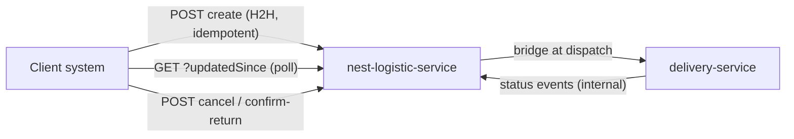

# Shipment API Integration (Client) — Context v1

> Purpose: the shared understanding of how this module works **today**. This is the doc an agent or new teammate reads before touching anything in the module. Keep it current — update it whenever a feature ships.

## Overview

This module is the **client-facing API product** for shipments: the surface a client's own system integrates against to create shipments, track them, and act on them (cancel, confirm returns) — without going through Dash ops or the back-office UI. It is the productization of what exists today as the `/integration/v1` endpoints plus the H2H (host-to-host) create path.

It is a sibling product to [shipment-multi-drop](../shipment-multi-drop/multidrop-context-v1.md): multi-drop defines *what* a shipment can be (types `docking`/`direct_2w`/`direct_4w`, authored routes, return leg); this module defines *how a client creates and follows* those shipments programmatically. The context doc records what integration surface exists today; the product scope lives in the PRD/TRD.

## Actors & roles

| Actor | Role | Identified by |
|---|---|---|
| Client system (H2H) | Machine-to-machine caller: creates shipments, polls changes, cancels, confirms returns | Bearer `h2hToken` (see auth notes below) |
| Client dev team | Integrates against the API; needs docs, sandbox, error contracts | — |
| Ops admin | Fallback for what the API doesn't cover (CSV upload, manual edits) | back-office JWT |
| nest-logistic-service | Owns the API and the shipment/item state machine | — |
| delivery-service | Downstream last-mile execution; source of many status changes clients poll for | service-to-service |

## Current behavior & flows

### Existing `/integration/v1` surface (collection: `Logistic Service/Integration`, bearer `{{h2hToken}}`)

| Endpoint | What it does |
|---|---|
| `GET /integration/v1/shipments/{waybill}` | Fetch one shipment by waybill (e.g. `DL123`) |
| `GET /integration/v1/shipments?updatedSince=…&limit=…` | **Polling** feed of changed shipments — the client's tracking mechanism today |
| `POST /integration/v1/shipments/{waybill}/cancel` | Cancel items on a shipment |
| `POST /integration/v1/shipments/{waybill}/items/{itemId}/confirm-return` | Client confirms receipt of a returned item (Retur H0 E3 flow) |

### Creation paths today

- **H2H create-shipments API**: one shipment per `(client_id, booking_id)`, idempotent under concurrent retries via partial unique index (`upload_shipment_id IS NULL`). Origin left null at create; set at hub inbound scan. Duplicate create returns EXISTS instead of an error.
- **CSV upload** (ops-assisted, `upload_shipments`): the non-API path; grouped per Booking ID.

### Tracking model today

**Poll, not push.** Clients call `List Changed Shipments` with `updatedSince`; there are no client-facing webhooks from logistic. (Inbound webhooks exist elsewhere in the platform — e.g. delivery-service events into logistic — but nothing outbound to clients.)

## Product use cases (target)

Two use cases define v1 of the product. **UC2 (tracking with history) is the build-first priority** — it has a decided spec behind it; UC1's contracts still have open PRD questions.

### UC1 — Create shipment: one field for *type*, three contracts for *shape*

Two orthogonal dimensions, deliberately not mixed:

- **`type`** (`DOCKING | DIRECT_2W | DIRECT_4W`) — how Dash executes it. A request field, default `DOCKING`.
- **Route shape** — how the client describes origins/destinations. The shape picks the **API contract**: three create endpoints, each with its own request DTO, all materializing into the same shipment + route + stops model (see [multidrop ERD](../shipment-multi-drop/multidrop-erd-v1.md)).

| # | Contract (proposed name) | Shape | `return_to_origin` |
|---|---|---|---|
| 1 | **Single drop** (a.k.a. point-to-point; final name open) | 1 origin → 1 destination | allowed (`true` → origin/destination/origin-return stops) |
| 2 | **Multi drop** | 1 origin → n destinations | allowed (final dropoff back at origin) |
| 3 | **Multi pickup** | n origins → 1 destination | **always `false`** — with many origins, "the origin" to return to is ambiguous, so the flag is rejected, not ignored |

Why three contracts instead of one generic routes payload: a single-drop client shouldn't have to learn the stops model to ship one parcel, and per-shape DTO validation (exactly one origin, at least two destinations, etc.) fails fast at the edge instead of deep in route materialization.

Shared mechanics across all three: booking-id idempotency (or its `Idempotency-Key` successor — open question), same waybill issuance, same shipment resource on the read side.

### UC2 — Track shipment with status history (**build first**)

Today's `GET /integration/v1/shipments/{waybill}` returns current state only; **there is no history endpoint** — a client cannot answer "when did it leave the hub, when was it rejected, when did the return arrive." This use case adds tracking with full status history.

The contract is already decided by **Status Model v2** (session decision 2026-07-27, supersedes the old target design — source: `06-STATUS-MODEL-V2.md`, currently outside the vault):

- **Client-exposable vocabulary is exactly** the v2 item statuses (`CREATED → VERIFIED_BY_HUB → VERIFIED_BY_RIDER → IN_DELIVERY → COMPLETED`, return branch `IN_RETURN → RETURNED_TO_HUB → RETURNED_TO_CLIENT`, terminals `CANCELLED`/`LOST`, plus the `condition = OK|DAMAGED` attribute) and the v2 shipment rollup statuses (`CREATED → AT_HUB → IN_DELIVERY → IN_DISPUTE → COMPLETED | RETURNED | CANCELLED | FAILED`). Never expose DS-internal statuses (26 values), batch/dispatch status, or pre-migration legacy values.
- **History is the source of truth**: responses read `shipment_status_history` + `item_status_history` rows (`from`, `to`, `changed_by`, `note`, `changed_at`). The v2 single-door rollup guarantees the history is complete — that same guarantee is the **prerequisite** for this API being trustworthy.
- **The timeline is not fixed to custody statuses** — stepper milestones interleave with them. Every stepper submission on a multi-drop route inserts a `shipment_milestone_history` row carrying the stepper's name and its emitted `tracking_status` (e.g. *Gate In* → `PICKING_UP`). The tracking response merges both into one timeline, with the event type kept explicit (custody `STATUS` vs. stepper `MILESTONE`) so a config-defined `PICKING_UP` is never mistaken for a guarded custody state. Configure different steppers → clients see a different, richer timeline; no API change needed.
- **Milestone entries include the proof images, labelled per form field.** POP/POD attachments ride on the timeline entry (and the future webhook — one payload format for both transports) as `{key, label, images: [{url, capturedAt, lat?, long?}]}` groups: `key` is the stable machine identifier from the dynamic form (`KEY_PASS`), `label` the human name ("Gate Pass"), and **each image carries its own capture timestamp and nullable coordinates** — photo time can differ from submission time in offline flows, and the capture location is evidence in disputes. Bare "POP/POD" labelling was rejected: one form can carry gate pass + package photo + signature, and the client must be able to tell them apart. Attachments are composed at send time from the proof's stored values + the stop's frozen form snapshot.
- **Milestone vocabulary is a curated template** (`tracking_statuses` reference table): coded entries with client-facing labels, description templates with placeholders, and `is_final` markers — steppers pick from the list, never type it. Industry reference: [Shipper's external status list](https://logistics-docs.shipper.id/docs/shipper-external-status) (coded statuses `1000`–`3000`, templated copy like `"Paket sedang dijemput driver [driver_name]"`, explicit FINAL flags) — ours uses stable text codes instead of numbers, but the same contract discipline: the set of values a client can ever receive is enumerable and documented.
- **Per-item legs**: the response carries each item's `legs[]` (from the planned `item_delivery_legs` table — `seq`, `type` `LAST_MILE|RETURN_TO_HUB|RETURN_TO_CLIENT`, `deliveryUid`, `deliveryStatus`) and a convenience `activeLeg`, so retry counts ("3rd delivery attempt") and return journeys are readable without the client reverse-engineering anything. The v2 doc §9 has a full example response (`itemsSummary.byStatus`, `statusHistory[]`, `retur` block with reason + weight).
- **Webhooks are the sequel, not this use case**: outgoing push (Dash → client) is triggered per *history row insert* (not per status change) and routed via DS → webhook-service per decision W-K1. The tracking API must expose the same vocabulary the webhook will later push — one contract, two transports. The v2 doc's webhook-debt warning applies to anything new here: no unsigned payloads, include an idempotency key, respect sandbox.

Incoming client actions (cancel from `CREATED`/`VERIFIED_BY_HUB` only; confirm-return from `RETURNED_TO_HUB` only) already exist as endpoints and map onto v2's incoming-webhook table — they become guard-checked writes through the same single door.

## Data owned by this module

None in the current draft — this module is an **API surface over shipment-owned data** (`shipments`, `items`, and the multi-drop entities once they land). Likely additions the PRD/TRD must decide (and add to the ERD if they land):

- API credential / client-app entity (if `h2hToken` moves to per-client keys with rotation).
- Webhook subscription + delivery-attempt log (if tracking moves from poll to push) — the platform's `schedule_wa_messages` / `item_media` idempotency patterns are the template.
- API request audit/idempotency-key store (if create adopts explicit `Idempotency-Key` headers instead of the booking-id-based dedup).

## APIs & integrations

- Collection ground truth: `dash-api-collections/collections/Development/Logistic Service/Integration/` (bearer auth at folder level, `{{h2hToken}}`). Per vault rules, any TRD endpoint change updates the collection `.yml` in the same work.
- Related internal surface: `Logistic Service/Internal` (back-office) — not client-facing, out of this module's scope.
- Downstream: delivery-service (bridge at dispatch), core-service masters (client identity).

## Known constraints & gotchas

- **Waybill is the public identifier.** All integration endpoints key on waybill (`DL123`), not UUIDs. Multi-drop's open question "one AWB per booking or per drop" directly shapes this API's URL space.
- **Idempotency is booking-id-based, not header-based.** Create dedups on `(client_id, booking_id)`; there is no generic `Idempotency-Key` mechanism. Retries of a *different* payload with the same booking id return EXISTS — silently ignoring the differences.
- **Polling puts the freshness burden on the client.** `updatedSince` + `limit` means a slow poller misses nothing but sees it late; there is no push. Client-perceived latency of status changes = their poll interval.
- **One bearer token per environment (`h2hToken`).** No per-client key rotation/scoping visible in the collection — a product-level gap if this becomes self-serve.
- **Multi-drop will strain the current response shape.** Today's shipment payload assumes one destination; routes/stops/proofs (see [multidrop ERD](../shipment-multi-drop/multidrop-erd-v1.md)) need either a versioned expansion of the shipment resource or new sub-resources.
- **Status Model v2 is decided but not built.** The tracking API's vocabulary (UC2) assumes the v2 statuses, the single-door rollup, and the `item_delivery_legs` table — none of which exist in code yet. Building UC2 against *today's* statuses (`HUB_SCANNED`, `DISPATCHED`, …) would ship legacy values into a client contract and force a breaking migration later; the v2 doc's old→new mapping (§8) exists precisely to avoid that.
- **The v2 source doc lives outside the vault** (`06-STATUS-MODEL-V2.md` in a local series with `03`/`04` siblings). Per vault rules it should be brought in before the TRD cites it as spec.
- The empty `docs/modules/client-integration/` folder predates this module — consolidate or delete it so the vault has one home for this product.

## Glossary

| Term | Meaning |
|---|---|
| H2H | Host-to-host: the client's system calling Dash APIs directly, no human in the loop |
| Integration API | The client-facing `/integration/v1/*` endpoints on nest-logistic-service |
| Waybill / AWB | Public shipment identifier (`DL…`) used in integration URLs |
| Polling feed | `GET /shipments?updatedSince=…` — how clients learn about changes today |
| `h2hToken` | Bearer token authenticating client H2H calls (env-level secret in the collection) |
| Webhook (outbound) | Push notification to a client URL on status change — does **not** exist yet; will trigger per history-row insert (Status Model v2 §5) |
| Single drop | Create contract #1: 1 origin → 1 destination (name not final; a.k.a. point-to-point) |
| Multi drop | Create contract #2: 1 origin → n destinations |
| Multi pickup | Create contract #3: n origins → 1 destination; `return_to_origin` always false |
| Status Model v2 | Decided item/shipment status vocabulary + rollup rules (2026-07-27) — the only *custody* statuses clients may see |
| Milestone | Stepper-emitted timeline entry (name + `tracking_status`, e.g. Gate In → `PICKING_UP`); curated `tracking_statuses` template, merged into tracking alongside custody statuses |
| `tracking_statuses` | BE-owned milestone template (code, label, description template, `is_final`) — the enumerable set of milestone values a client can receive; Shipper external-status pattern |
| Leg / `activeLeg` | One DS delivery journey of an item (`LAST_MILE`, `RETURN_TO_HUB`, `RETURN_TO_CLIENT`); `activeLeg` = the one currently running |

## Open questions

- Final name for create contract #1: "single drop"? "point-to-point"? "standard"? (Must read well next to multi drop / multi pickup.)
- Multi pickup: is the destination always exactly 1, and does one shipment/waybill cover all n pickups? Do the n pickup stops share one stepper or each get their own?
- Can single drop and multi drop both carry `return_to_origin`, or is the return flag multi-drop-only in the client API?
- ~~Endpoint style for the three create contracts~~ — decided (eng review): three explicit per-shape endpoints under the existing namespace — `POST /integration/v1/shipments/single-drop` (contract drafted in the TRD), `/multi-drop` and `/multi-pickup` to follow. Idempotency also decided: bookingId dedup + canonical payload fingerprint (identical retry → 200 replay, changed payload → 409) — replaces silent-EXISTS for these endpoints.
- Does UC2 tracking ship only after Status Model v2 lands in code, or does it launch with a translation layer over today's statuses (v2 doc §8 mapping)?
- ~~Which stepper/proof data appears in the tracking response~~ — decided: POP/POD images ride on milestone entries as `{key, label, urls[]}` attachment groups (same format on the webhook). Remaining: are the GCS URLs public/signed/expiring, and do TEXT/NUMBER form values also appear or images only?
- Tracking: history endpoint now, outbound webhooks later (decided direction per v2 §5) — but when, and does webhook registration belong to this module or webhook-service?
- Auth: per-client API keys (issue/rotate/revoke, scoped per capability) vs. the current shared `h2hToken` model?
- Explicit `Idempotency-Key` header for create, or keep booking-id dedup? What should happen when a retry's payload *differs* from the original (today: silently EXISTS)?
- Does the client get proof artifacts (POP/POD from `stop_proofs`) through this API — and if so, URLs only or proxied media?
- Versioning strategy for the multi-drop response shape (`/integration/v2`? expand-in-place with optional fields?).
- Rate limits and a sandbox environment for client dev teams?
- Which clients are the launch integrators, and what do their systems expect (REST polling is fine? need callbacks?)?

## Changelog

- 2026-07-31 — created; documented the existing `/integration/v1` surface (get, changed-feed, cancel, confirm-return), H2H create path, and poll-based tracking as the baseline for the client API product.
- 2026-07-31 — added the two v1 use cases: UC1 create-shipment with three shape contracts (single drop / multi drop / multi pickup with `return_to_origin` always false) orthogonal to `type`; UC2 tracking with status history (build first), vocabulary and shape pinned to Status Model v2 (2026-07-27 decision).
- 2026-07-31 — UC2 timeline made stepper-aware: milestone entries (`shipment_milestone_history`, e.g. Gate In → `PICKING_UP`) merge with custody status history in the tracking response, typed distinctly.
- 2026-07-31 — milestone vocabulary curated into the `tracking_statuses` template (Shipper external-status reference); free-text tracking statuses ruled out.
- 2026-07-31 — timeline/webhook entries carry POP/POD image attachments grouped by form field `{key, label, urls[]}`; bare POP/POD-only labelling rejected.
- 2026-07-31 — attachments upgraded to per-image objects `{url, capturedAt, lat?, long?}` — every image shows its own capture time; coordinates nullable.
