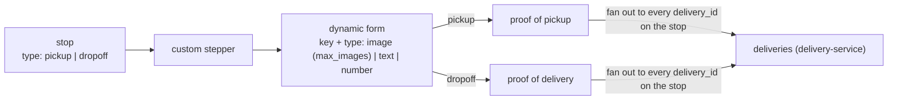
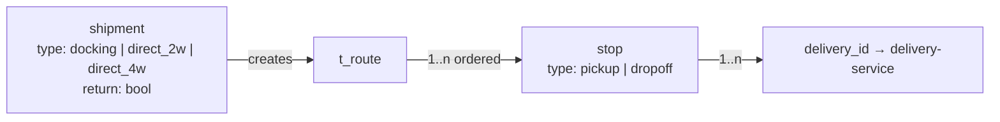

# Shipment Multi Drop — Context v1

> Purpose: the shared understanding of how this module works **today**. This is the doc an agent or new teammate reads before touching anything in the module. Keep it current — update it whenever a feature ships.

## Overview

"Shipment multi drop" introduces a new kind of shipment whose **route is authored, not derived**: operations or the client define the origins, destinations, and the route themselves, instead of the single origin→destination pair the current intake model imposes. A multi-drop shipment has a **type** — `docking`, `direct_2w`, or `direct_4w` — and an optional **return flag** meaning that after every stop is done, something must be brought back to the origin.

Creating the shipment materializes its **route** (`t_route`). A route is an ordered list of **stops**, each typed `pickup` or `dropoff`. A stop can carry **multiple deliveries** — the stop stores only `delivery_id` references; the delivery table itself lives in **delivery-service**. Because the return leg is just another stop, a route with 1 origin + 1 destination + return flag has three stops: origin (pickup) → destination (dropoff) → origin (dropoff).

Today the shipment model in `nest-logistic-service` supports none of this: a shipment (one AWB / Booking ID) has exactly one origin and one destination, and multi-drop only exists implicitly at dispatch level (`batch_stops` per rider trip). This doc records both the target model above and the single-drop baseline it must change.

## Actors & roles

| Actor | Role in multi drop | Identified by |
|---|---|---|
| Ops admin | Authors origins/destinations/routes for a shipment; runs the operation | back-office JWT |
| Client (pharma distributor etc.) | May author their own routes when self-serve; otherwise books via CSV / H2H as today | `client_id` (core-service master), JWT / API auth |
| Rider / driver (2W or 4W) | Executes the route stop by stop: pick up, drop off, return leg | `assigned_rider_code` / `assigned_rider_id` (nest-driver-service) |
| Hub operator (Hub App) | Inbound scan where the flow passes a hub (docking type) | JWT, `scanned_by` |
| delivery-service (DS) | Owns the `delivery` rows a stop references (`delivery_id`); last-mile execution | service-to-service |

## Current behavior & flows

### Today — single-drop baseline

1. **CSV upload** (`upload_shipments`): rows are grouped per Booking ID into one `shipments` row; each Item Name row becomes an `items` row. Dedup: `unique(client_id, booking_id, upload_shipment_id)`.
2. **H2H create API**: one shipment per `(client_id, booking_id)` via partial unique index. Origin set at inbound scan.
3. The shipment carries a single `destination_*`; items clone it verbatim (denormalized by design). Routes are never authored — the dispatch planner *derives* stops (`batch_stops`) by grouping scanned items by destination into rider trips.

### Multi-drop model

1. **Create shipment** with a `type` (`docking` | `direct_2w` | `direct_4w`) and a `return` flag. Ops or the client authors the origins, destinations, and the route — the route is input, not planner output.
2. Creating the shipment **creates the route** (`t_route`).
3. The route holds **ordered stops**, each with a stop type: `pickup` or `dropoff`.
4. Each stop holds **1..n deliveries** as `delivery_id` references (delivery rows live in delivery-service — no local copy).
5. If the `return` flag is set, the route ends with an extra **dropoff stop back at the origin** — the return leg is modeled as a normal stop, not a special case.
6. Each stop is completed through a **custom stepper** (see below); completing it captures **proof of pickup** (pickup stops) or **proof of delivery** (dropoff stops).

### Stop completion — stepper & dynamic form

- Every stop carries a **custom stepper** the executor walks through to complete the stop.
- The proof captured by the stepper is saved according to the stop type: `pickup` → **proof of pickup (POP)**, `dropoff` → **proof of delivery (POD)**.
- When a stop contains **multiple deliveries**, the captured proof is stored against **all** of them — one stepper completion fans out the POP/POD to every `delivery_id` on the stop (the executor does not repeat the form per delivery).
- **Each stepper submission writes a tracking milestone.** A stepper carries a client-facing `name` (e.g. *Gate In*) and a `tracking_status` it emits (e.g. `PICKING_UP`); when the stepper is done, a `shipment_milestone_history` row is inserted snapshotting both. The shipment's tracking timeline is therefore **defined by its steppers**, not by a fixed status list — configure different steppers, get a different timeline. Custody statuses (Status Model v2) remain a separate, guarded history.
- The stepper contains a **dynamic form**: an ordered set of fields defined as `key` (stable machine identifier, e.g. `KEY_PASS`) + `label` (human name, e.g. "Gate Pass") + value `type`, where type is one of `image`, `text`, `number`. Image fields carry a nullable `max_images` cap (1 = single photo) — there is no separate multi-image type. The form definition is configuration ("custom" per stepper), not hardcoded — different stops/flows can require different fields.
- **Proof images travel with the milestone**, grouped per form field as `{key, label, images: [{url, capturedAt, lat?, long?}]}` — the tracking timeline and the outgoing webhook share this payload format, so a client sees "Gate Pass photo, taken 10:02 at the client site", never an undifferentiated pile of POD images. Capture time is per image (offline flows submit later than they shoot); coordinates are nullable (GPS can be denied).

**Return-flag example** — 1 origin, 1 destination, `return = true`:

| # | Location | Stop type |
|---|---|---|
| 1 | origin | pickup |
| 2 | destination | dropoff |
| 3 | origin | dropoff (return leg) |

## Data owned by this module

Planned entities — drafted in [multidrop-erd-v1.md](./multidrop-erd-v1.md) (scoped ERD; fold into [`erd.mermaid`](../erd/erd.mermaid) when the TRD ships):

- **shipment** — gains/carries `type` (`docking` | `direct_2w` | `direct_4w`) and a `return` flag. Whether this is the existing `shipments` table extended or a new entity is an open question.
- **`t_route`** — the authored route created by/with the shipment.
- **route stops** — ordered under the route; `stop_type` = `pickup` | `dropoff`; location fields.
- **stop deliveries** — join rows holding `delivery_id` only (delivery master is delivery-service's).
- **stepper / dynamic form definitions** — reusable reference tables `steppers` + `stepper_fields` (ordered `key` + `type`: `image` | `text` | `number`, with nullable `max_images` on image fields); a stop references its template via `stepper_id` and freezes the field list as a snapshot at route authoring.
- **stepper submissions (POP/POD)** — `stop_proofs` table, one row per submission attempt (redo = new row, history preserved like `ai_checker_logs`); latest row = current proof. Fan-out to deliveries is tracked per delivery via `stop_deliveries.pushed_proof_id` + `proof_pushed_at`, so a resubmission detectably invalidates stale pushes.

Reads from other modules: `addresses` (lane/geocode cache) for authored locations, core-service masters (clients, hubs), existing `shipments`/`items` if the multi-drop type coexists with the current intake model.

## APIs & integrations

- New route-authoring surface for ops (back-office) and possibly clients (self-serve / H2H) — endpoints TBD in the TRD, mirrored into `dash-api-collections`.
- **delivery-service**: stops reference `delivery_id`; the delivery lifecycle (assignment, POD, completion) stays in DS. Contract for creating/linking those deliveries is TBD.
- Existing dispatch/batch machinery: `direct_*` types presumably bypass hub batching; `docking` presumably passes a hub. To be confirmed in the TRD.

## Known constraints & gotchas

- **Route is input, not derived.** The whole current pipeline (planner COLLECT → `batch_stops`) assumes stops are computed from item destinations. Multi-drop inverts this — consumers that equate "stop" with `batch_stops` (dispatch, maps, docking-dashboard ETL) must not conflate the two.
- **Destination denormalization.** `items` clone `shipments.destination_*` today; an authored multi-stop route breaks the "one destination per shipment" assumption everywhere those columns are read.
- **Idempotency constraints assume 1 booking = 1 shipment = 1 destination.** CSV dedup key and the H2H partial unique index reject a second destination for a booking.
- **Return leg is a stop, not a status.** Unlike Retur H0 (item-level `IN_RETURN` on the *existing* model, reverse DE-2 delivery spawned in DS), the multi-drop return is planned upfront as the route's final dropoff stop. The two return mechanisms must not be confused.
- **`t_route` naming.** The `t_` prefix does not match this service's table conventions (plural snake_case, e.g. `batch_stops`); final table names to be settled in the TRD.
- **`addresses` lane cache is pairwise** (one origin+destination per row, precomputed `distance`); an n-stop route touches n legs.

## Glossary

| Term | Meaning |
|---|---|
| Shipment type | `docking` (via hub/dock), `direct_2w` (direct, 2-wheeler), `direct_4w` (direct, 4-wheeler) |
| Return flag | Shipment-level flag: after all stops are done, something goes back to the origin — appended as a final dropoff stop at origin |
| Route (`t_route`) | The authored, ordered plan of stops created with the shipment |
| Stop | One point on the route, typed `pickup` or `dropoff`; holds 1..n deliveries |
| Delivery | Delivery-service-owned execution row; stops store only `delivery_id` |
| Stepper | The custom step-by-step flow the executor completes at a stop; produces the stop's proof and emits its `tracking_status` as a timeline milestone |
| Milestone / `tracking_status` | Client-facing timeline entry emitted by a stepper submission (e.g. *Gate In* → `PICKING_UP`); picked from the curated `tracking_statuses` template, never free text; distinct from custody statuses |
| Dynamic form | The stepper's configurable fields: `key` + value type (`image` \| `text` \| `number`); image fields take an optional `max_images` cap |
| POP | Proof of pickup — stepper output of a `pickup` stop |
| POD | Proof of delivery — stepper output of a `dropoff` stop; stored to **all** deliveries on the stop |
| Drop / drop point | A `dropoff` stop |
| Batch stop | Dispatch-level derived stop on a rider trip (`batch_stops`) — the *old* multi-drop, not this module's authored stops |

## Open questions

- Is the multi-drop shipment the existing `shipments` table extended (new `type` + `return` columns) or a new entity alongside it? How do the existing single-drop CSV/H2H paths map onto the types?
- One route per shipment or can a shipment have several routes (`t_route` plural)?
- Who creates the DS `delivery` rows a stop references, and when — logistic at route creation, or DS on bridge/commit?
- What does the `return` leg physically carry (items? empty containers/documents?) and how is its content declared?
- How are riders/vehicles assigned — does `direct_2w`/`direct_4w` bypass the batch planner entirely, and does `docking` reuse hub inbound scan + batching?
- Stop-level and shipment-level status models (per-stop completion, partial failure mid-route, skipped stop)?
- AWB/tracking: one waybill for the whole route, or per delivery? What does the client see?
- Pricing/`distance`: per leg sum, or full-route quote?
- Sequencing: is stop order fixed as authored, or may ops/driver re-order mid-execution?
- Stepper templates are reusable tables (decided) — but scoped how: global, per client, or per shipment type? And who authors them, ops only or client self-serve?
- Are dynamic-form fields validatable (required/optional, max images, number ranges), and can the definition change after the route is created?
- POP/POD submissions live in logistic (`stop_proofs`, decided) and are pushed to delivery-service per `delivery_id` — but who owns the image files' GCS bucket, and does the driver app upload directly (URL-only in the proof values) or through logistic?
- Is a stepper completion atomic per stop (all fields at once) or progressive (step-by-step saves, resumable offline)? Resubmission is covered (new `stop_proofs` row); partial drafts are not yet modeled.

## Changelog

- 2026-07-31 — created; documented the current single-drop baseline ahead of the multi-drop PRD/TRD.
- 2026-07-31 — added the multi-drop model: shipment types (`docking`/`direct_2w`/`direct_4w`), return flag, authored routes (`t_route`) → typed stops (pickup/dropoff) → `delivery_id` refs to delivery-service; return leg = final dropoff stop at origin.
- 2026-07-31 — added stop completion: custom stepper per stop with dynamic form (`key` + `image`/`images`/`text`/`number`); pickup → POP, dropoff → POD, proof fanned out to every delivery on the stop.
- 2026-07-31 — eng review decided the data model (everything relational; origins/destinations JSONB snapshot; scalar mirror; `return_to_origin`; default `DOCKING`) — scoped ERD drafted in [multidrop-erd-v1.md](./multidrop-erd-v1.md).
- 2026-07-31 — eng review: proof submissions promoted to `stop_proofs` (row per attempt); `route_stops.proof` column dropped from the draft; fan-out gains `pushed_proof_id`.
- 2026-07-31 — dynamic form simplified: `images` type removed; `image` + nullable `max_images` covers single and multi-photo fields.
- 2026-07-31 — steppers now drive the tracking timeline: each carries a `tracking_status` (e.g. Gate In → `PICKING_UP`) and each accepted submission inserts a `shipment_milestone_history` row, separate from custody status history.
- 2026-07-31 — form fields gained `label` next to `key`; milestone/webhook payloads carry proof images grouped per field `{key, label, urls[]}`.
- 2026-07-31 — images upgraded to per-image objects `{url, capturedAt, lat?, long?}`: own capture timestamp, nullable coordinates.
