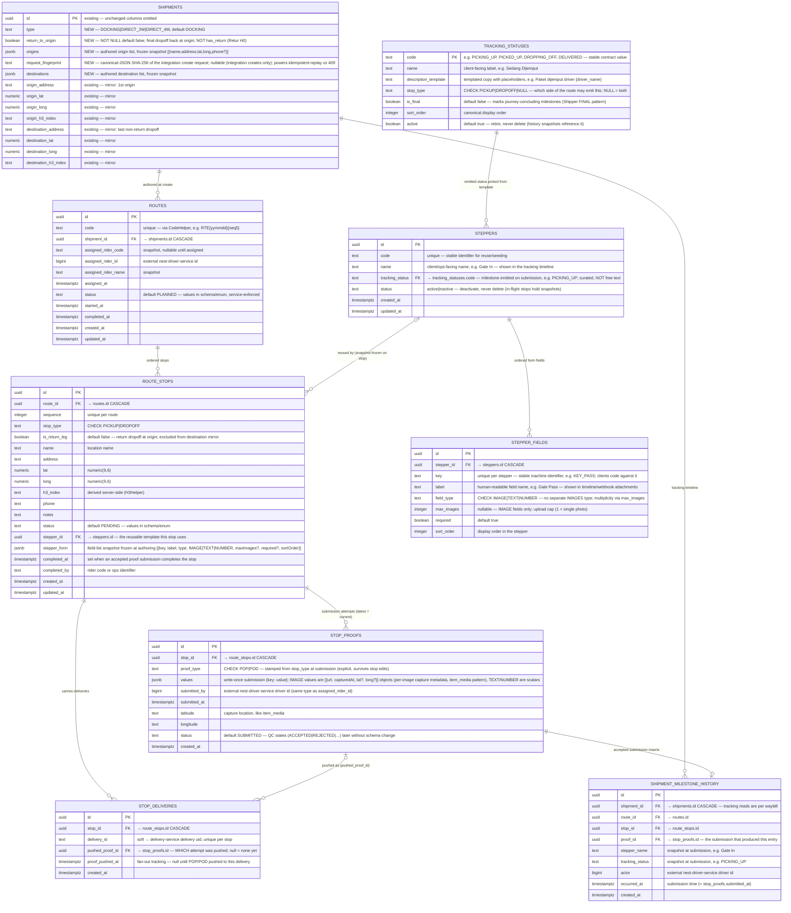

# Shipment Multi Drop — ERD v1 (scoped to modified + new tables)

Scope: only the tables this feature **modifies** (`shipments`) or **adds** (`routes`, `route_stops`, `stop_deliveries`, `stop_proofs`, `shipment_milestone_history`, `steppers`, `stepper_fields`, `tracking_statuses`). Unchanged tables live in the canonical [`erd.mermaid`](../erd/erd.mermaid), which must be updated with these entities in the same change as the TRD ships.

Decisions baked in (from eng review, 2026-07-31):

- **Everything relational.** Routes, stops, and stop-deliveries are tables, not JSONB — the route is live mutable state (stepper completions, driver assignment) and follows the `batches`/`batch_stops`/`batch_items` precedent. JSONB is reserved for write-once snapshots, per repo convention.
- **`origins`/`destinations` stay JSONB on `shipments`** as the frozen authored-input snapshot; operational truth is the stop rows.
- **Backward compat:** existing scalar `origin_*`/`destination_*` columns stay and mirror the 1st origin / last **non-return** dropoff (hence `is_return_leg`). Every existing consumer (dispatch, maps, ETL, search) keeps working untouched. Whatever writes or edits a route must update the mirror in the same transaction.
- **`return_to_origin boolean NOT NULL DEFAULT false`**, not `has_return` — that name is already taken by Retur H0. Default false: every existing row and every shipment that doesn't opt in has no return leg.
- Naming/casing per repo convention: no `t_` prefix; enum values UPPERCASE (`DOCKING | DIRECT_2W | DIRECT_4W`), default `DOCKING` (every existing shipment is the docking flow).
- **Steppers are reusable reference data** (`steppers` + `stepper_fields`), not per-stop JSONB blobs. A stop references its template via `stepper_id` **and** freezes the field list into `stepper_form` at route authoring — so editing a template later never changes the form of an in-flight route (same protect-history rationale as the `hub`/`client` snapshots).
- **Proof submissions are rows, not a column** (`stop_proofs`): one row per submission attempt, so a redo never overwrites the first attempt — same keep-every-attempt rationale as `ai_checker_logs`. The stop's current proof = latest row; `stop_deliveries.pushed_proof_id` records *which* attempt was fanned out to each delivery, so a resubmission visibly invalidates stale pushes.
- **Steppers drive the tracking timeline** (`shipment_milestone_history`): every stepper carries a `tracking_status` (e.g. `PICKING_UP`), and each accepted submission inserts one milestone-history row snapshotting the stepper's name + status at that moment (e.g. "Gate In → PICKING_UP"). This history is **deliberately separate** from `shipment_status_history`: custody statuses are a guarded state machine written through one door (Status Model v2), milestone statuses are per-stepper configuration. Same append-only, insert-triggers-webhook pattern; different vocabulary, different table. Template edits later never rewrite past timeline entries (snapshot columns).
- **Timeline entries carry the proof's images, grouped by form field.** The tracking API and the outgoing webhook share one payload format: a milestone entry includes its POP/POD attachments as `{key, label, images: [{url, capturedAt, lat?, long?}]}` per IMAGE field (e.g. `KEY_PASS` / "Gate Pass"), **derived at send time** from the linked proof's `values` + the stop's frozen `stepper_form` snapshot — never duplicated into a third table. `key` is the stable contract identifier; `label` is the human name. Each image carries its own capture timestamp (photo time ≠ submission time in offline flows) and nullable coordinates — the `item_media` pattern, applied per image inside the proof values.
- **Milestone vocabulary is a curated template, not free text** (`tracking_statuses`): a BE-owned reference table in the `reasons` mold — `code` PK, client-facing label, description template with placeholders, `is_final` flag. Steppers pick from it (`steppers.tracking_status` FK → `tracking_statuses.code`), so a typo can never reach a client's tracking view. Modeled after Shipper's external-status list (coded entries, templated descriptions like `[driver_name]`, explicit FINAL markers) — see the shipapi context doc for the reference link.

## Constraints & indexes

| Table | Constraint / index | Why |
|---|---|---|
| `shipments` | `type NOT NULL DEFAULT 'DOCKING'`; `return_to_origin NOT NULL DEFAULT false` | both metadata-only ALTERs on PG11+; existing rows read DOCKING / no return leg |
| `routes` | `code` unique; idx `(shipment_id)`; idx `(assigned_rider_id, status)` | driver-app "my routes" path, mirrors `batches_rider_status_idx` |
| `route_stops` | `unique(route_id, sequence)`; idx `(route_id)` | stable ordering; mirrors `batch_stops` |
| `stop_deliveries` | `unique(stop_id, delivery_id)`; idx `(delivery_id)` | dedup within stop; DS webhook lookup (same pattern as `items.external_delivery_uid`) |
| `stop_proofs` | `proof_type IN ('POP','POD')` check; idx `(stop_id, submitted_at DESC)` | latest-attempt lookup is the hot read; history preserved row-per-attempt |
| `stop_deliveries` | `pushed_proof_id` FK → `stop_proofs.id` (no cascade) | resubmission invalidates stale pushes detectably (`pushed_proof_id` ≠ latest proof id → re-push) |
| `shipment_milestone_history` | idx `(shipment_id, occurred_at)`; `unique(proof_id)` | tracking timeline read per waybill; append-only — a resubmitted proof inserts a new entry (its own proof_id), and readers pick latest per stop via proof linkage |
| `steppers` | `code` unique; `status IN ('active','inactive')` check; `tracking_status` FK → `tracking_statuses.code` | stable reuse/seed key; kill-switch pattern like `barriers.status`; emitted milestone must exist in the template |
| `tracking_statuses` | `code` PK; `stop_type IN ('PICKUP','DROPOFF')` check (NULL = both); seed via migration (like `reasons`) | BE-owned vocabulary — ops picks, never types; pickup statuses can't land on dropoff steppers; retire with `active=false` |
| `stepper_fields` | `unique(stepper_id, key)`; `field_type IN ('IMAGE','TEXT','NUMBER')` check; `max_images IS NULL OR (field_type = 'IMAGE' AND max_images > 0)` check; idx `(stepper_id)` | one value per key; DB-enforced value set; `max_images` can't leak onto non-image fields |
| `route_stops` | `stepper_id` FK → `steppers.id` (no cascade) | template deletion blocked while referenced; deactivate instead |

## Return-flag example (1 origin, 1 destination, `return_to_origin = true`)

| sequence | location | stop_type | is_return_leg |
|---|---|---|---|
| 1 | origin | PICKUP | false |
| 2 | destination | DROPOFF | false |
| 3 | origin | DROPOFF | **true** |

Mirror: `origin_*` = stop 1, `destination_*` = stop 2 (stop 3 excluded by `is_return_leg`).

## Example — stepper-driven tracking timeline (single drop, 2 steppers per stop)

Each accepted stepper submission = one `shipment_milestone_history` row = one timeline entry the client sees. The **name** says which step happened; the **code** says which phase it means. Both are snapshots.

| Stop | Stepper submitted (`stepper_name`) | `tracking_status` | Notes |
|---|---|---|---|
| origin (PICKUP) | Gate In | `PICKING_UP` | driver arrived at the client site |
| origin (PICKUP) | Loading Complete | `PICKED_UP` | POP captured; goods in custody |
| destination (DROPOFF) | Gate In | `DROPPING_OFF` | same *step name*, different phase — the code disambiguates |
| destination (DROPOFF) | Proof of Delivery | `DELIVERED` | `is_final = true`; POD captured |

Because it's all configuration, another client's flow can be 5 steppers per stop (Gate In → Docking → Unloading → Checking → Gate Out) emitting the same 4 phase codes — the timeline gets richer, the client-facing status vocabulary stays fixed.

## Open items for the TRD

- Exact `routes.status` / `route_stops.status` value sets.
- Fan-out retry design: who re-pushes proof when `proof_pushed_at` stays null (DS timeout on delivery 3 of 5)? Needs a retry job or reconciliation, otherwise a **silent** partial fan-out.
- Cross-shipment duplicate `delivery_id` guard (unique per stop only; global uniqueness is a service-layer question).
- Whether multi-drop shipments carry `items` rows or only `stop_deliveries` (affects docking flow reuse).
- Stepper template scoping: global, per client, or per shipment type? Who can author/edit templates (ops only, or client self-serve)?
- Is `stepper_id` required on every stop, or can a stop have no stepper (auto-complete)?
- `stop_proofs.status` value set and the QC flow (who rejects, does rejection reopen the stop, does an AI checker gate acceptance like invoices?). Related: does the milestone row insert on *submission* or on *acceptance*?
- ~~`tracking_status` vocabulary governance~~ — decided: curated `tracking_statuses` reference table (Shipper external-status pattern). Remaining: the actual seed list (which codes, labels, description templates), and whether descriptions are Indonesian-only or localized.
- Placeholder contract for `description_template` (`{driver_name}`, `{hub_name}`, …): which variables exist, and who resolves them (API at read time vs. snapshotted resolved text in history)?
- Media in `values`: are image URLs uploaded to GCS by the driver app first (URL-only in `values`, like `item_media.url`), or does logistic proxy the upload?

## Changelog

- 2026-07-31 — created from /plan-eng-review of the JSONB-vs-relational proposal; everything relational, origins/destinations JSONB kept as authored snapshot.
- 2026-07-31 — steppers promoted to reusable reference tables (`steppers` + `stepper_fields`); stops reference via `stepper_id` and freeze the field list into `stepper_form` at authoring.
- 2026-07-31 — proof submissions moved from `route_stops.proof` JSONB to a `stop_proofs` table (row per attempt, `ai_checker_logs` rationale); `stop_deliveries.pushed_proof_id` added for resubmission-aware fan-out.
- 2026-07-31 — `stop_proofs.submitted_by` changed from rider code (text) to driver id (bigint, matches `assigned_rider_id`).
- 2026-07-31 — `stepper_fields`: dropped the separate `IMAGES` type (`IMAGE|TEXT|NUMBER` only); added nullable `max_images` (IMAGE fields only, check-enforced) to carry multiplicity.
- 2026-07-31 — tracking timeline made stepper-driven: `steppers.tracking_status` added; new `shipment_milestone_history` (one row per accepted submission, snapshots stepper name + status, e.g. "Gate In → PICKING_UP") — separate from `shipment_status_history` so v2 custody guards stay intact.
- 2026-07-31 — milestone vocabulary curated: new `tracking_statuses` reference table (code, label, description template, `is_final`; Shipper external-status pattern); `steppers.tracking_status` became an FK into it.
- 2026-07-31 — `shipments.request_fingerprint` added (client API create idempotency: identical retry → replay, changed payload → 409; see shipapi TRD C2).
- 2026-07-31 — confirmed timeline entry = (stepper name, status code) pair; `tracking_statuses.stop_type` affinity added (PICKUP/DROPOFF/both) and worked example table added (Gate In appears on both sides, the code disambiguates the phase).
- 2026-07-31 — `stepper_fields.label` added (human field name next to the stable `key`); timeline/webhook entries carry POP/POD attachments as `{key, label, urls[]}` derived from proof values + form snapshot.
- 2026-07-31 — per-image metadata: IMAGE values in `stop_proofs.values` are `[{url, capturedAt, lat?, long?}]` objects (capture time ≠ submission time; coordinates nullable) — attachments in timeline/webhook expose them.
