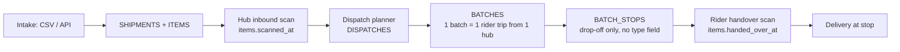

# Shipment Route — Context v1

> Purpose: the shared understanding of how this module works **today**. This is the doc an agent or new teammate reads before touching anything in the module. Keep it current — update it whenever a feature ships.

## Overview

The shipment-route module introduces a first-class **route** for logistic shipments: one route = one rider's journey, made of ordered stops typed `PICKUP` or `DROP_OFF`, where each stop serves **one or more shipments**. No such entity exists in `nest-logistic-service` today — this doc records how shipment movement is routed *now*, across two separate stacks, and the gap this module fills.

Today, a logistic shipment that needs a dedicated pickup and drop-off effectively gets **its own route**: the shipment is bridged to delivery-service as a single delivery (`items.external_delivery_uid`), and that delivery is a self-contained pickup→drop-off pair. There is no way to plan one rider's journey that serves several shipments across shared, interleaved pickup and drop-off stops. Meanwhile the docking flow plans **batches** — hub-origin rider trips whose stops are drop-off only (pickup is implicit in the hub handover scan) — so it cannot represent client-site pickups at all. If we served docking shipments with the current point-to-point bridge, each stop-worth of work would become a separate delivery per shipment, multiplying routes instead of sharing one.

A close precedent already exists in **trip-service** (the express stack): a trip is one driver plus typed `PICKUP`/`DROP_OFF` stops, and a stop carries 1+ *deliveries*. That model is the shape we want — but it lives in the express domain (delivery `uid` + `providerID`), not the logistic shipment domain. This module brings the same shape to shipments.

## Actors & roles

| Actor | Interaction | Auth |
|---|---|---|
| Dispatcher / hub ops (portal) | Plans routes, assigns the rider, monitors progress | Portal JWT (`providerTokenPortal`) |
| Rider | Executes the route stop by stop: gets today's list, starts the route, submits the `DIRECT_4W` gates, resolves stops (pickup scans, drop-off / POD, workflow milestones), ends the route — natively against logistic-service | Rider JWT (`driverToken`), accepted by logistic-service from this module on |
| Internal services / planner | Create routes programmatically (e.g. from dispatch output or single-drop intake) | Internal service token (`secretKey`) |
| Client | Indirect — sees shipment status changes driven by route events, via the client-integration module (webhooks / `List Changed Shipments`) | Client integration token |

## Current behavior & flows

### 1. Docking flow (hub-and-spoke) — `nest-logistic-service`

- A batch is already "one rider, one journey" — but its stops are **destination-only**. There is no stop `type`; pickup is implicit (the rider collects everything at the hub, recorded as the handover scan).
- Stops serve 1+ **items** via `BATCH_ITEMS` (item grain, not shipment grain).
- Batches/items are bridged onward (`batches.bridged_at`, `items.external_delivery_uid`, `items.bridged_at`).

### 2. Point-to-point flow (single-drop shipments)

- A client creates a single-drop shipment (`Logistic Service/Integration/Create Single Drop Shipment`).
- The shipment is bridged to **delivery-service** as one delivery; that delivery is its own pickup→drop-off pair.
- **This is the "route for 1 shipment only" condition:** one shipment = one delivery = one standalone route. Two shipments going out with the same rider are two unrelated deliveries — no shared plan, no interleaving, no shared capacity accounting.

### 3. Express stack precedent — `trip-service`

- `POST {{baseUrlTrip}}/internal/v1/trips`: trip = `driver` + `stops[]`; each stop has `type: PICKUP | DROP_OFF`, coordinates, and `deliveries[]` (1+ per stop). Supports `shouldOptimized`, route optimization metadata, `sequence` per stop (−1 until optimized).
- Driver surface: `Get Current Driver Trip`, `Start Trip`, `Get Stops By Trip ID`, `Resolve Stop`.
- Internal: `Add stops` to a live trip, `Optimize Trip Routes`, `Calculate Trip Routes`.
- Domain is express deliveries (`uid`, `providerID`, `weight`) — it does not know shipments, waybills, hubs, or items.

## Data owned by this module

**Today: none.** The module will own `ROUTES`, `ROUTE_STOPS`, and `ROUTE_STOP_SHIPMENTS` as specified in [route-prd-trd-v1.md](./route-prd-trd-v1.md) (added to `docs/modules/erd/erd.mermaid` in the same change, status draft). Nothing links a route to a delivery-service delivery — the legacy bridge stays a separate path (decided 2026-08-06).

Reads from other modules: `SHIPMENTS` (and possibly `ITEMS` — grain is an open question), rider/hub master data from core-service (snapshot pattern, no FK). It also **adds one column to `SHIPMENTS`** — `type` (`DOCKING`|`DIRECT_2W`|`DIRECT_4W`), set at intake; the route derives its own type from the shipments it serves rather than storing one (decided 2026-08-06).

## APIs & integrations

- **Exposed today: none.** Proposed contracts live in the PRD/TRD and in the collection at `Logistic Service/Internal/Route/`, at `/v1/routes` — one path serving internal services, portal admins and riders, separated by identity type rather than URL prefix (the pattern already shipped by `/v1/stop-workflows`).
- **Related existing collections:** `Trip Service/Trip` + `Trip Service/Stop` (the model precedent, and the shape the rider endpoints copy — `GET /driver/v1/trips/me?category=ACTIVE`, `POST /driver/v1/trips/:tripID/start`), `Logistic Service/Integration` (single-drop intake, shipment change feed), `Delivery Service` (current bridge target for point-to-point shipments), `Fleet/Handover` (owns vehicle custody today: `GET /v1/handovers/drivers/:driverID` returns a driver's active vehicle with its handover odometer — not called by this module, see the PRD/TRD open questions).
- **Rider surfaces that exist today:** `/driver/v1/*` on trip-service, delivery-service and the express base. Logistic-service has none — the m-app is already a multi-service client, so this module adds a fifth base URL rather than a new pattern.

## Known constraints & gotchas

- **Batches are drop-off only.** `BATCH_STOPS` has no `type` column; adding pickups to batches would be a schema+semantics change to a shipped flow. The route module is additive instead — coexistence with batches (and any eventual migration) must be decided explicitly.
- **Grain mismatch:** the docking flow assigns **items** to stops (`BATCH_ITEMS.item_id`); the route concept as requested works at **shipment** grain. A shipment's items can in principle split across riders today; a shipment-grain route forbids that within one route.
- **Trip-service is a different domain.** Reusing it for shipments would mean teaching it waybills/hubs or maintaining a mapping layer; duplicating its shape in logistic-service means two stop-resolution engines. Either way, the rider app currently executes trips/deliveries — not logistic-service entities directly.
- **Client-integration is status-driven.** Shipment status transitions feed the client change feed and webhooks; route events (picked up, delivered, failed) must map onto the shipment status vocabulary without breaking the decided client contract.
- **Docking-dashboard ETL reads items/batches/dispatches.** Work executed via routes would be invisible to hub metrics until the ETL is extended — acceptable for v1 but must be a conscious call.
- **External masters stay external.** Riders, hubs, clients live in core-service; the vault pattern is id + JSONB snapshot, never a DB FK.
- **Vehicle custody lives in Fleet, not here.** Fleet owns vehicles, driver↔vehicle handovers (with an odometer at handover) and a return flow whose reasons include `VEHICLE_SWAP`. The route module's `DIRECT_4W` checks photograph a vehicle and record an odometer without recording *which* vehicle — a deliberate v1 gap, and the reason the odometer-regression rule enforces a continuity nothing stores.
- **logistic-service becomes rider-critical.** Once riders execute routes here, an outage blocks them mid-journey — they cannot resolve a stop or submit an end check. Previously only trip-service and delivery-service carried that exposure.

## Glossary

| Term | Meaning |
|---|---|
| Route | One rider's planned journey: ordered, typed stops serving 1+ shipments (this module) |
| Stop | One location visit on a route, typed `PICKUP` or `DROP_OFF` |
| Shipment | A waybill-level consignment in `nest-logistic-service` (`SHIPMENTS`) |
| Item | A package row within a shipment (`ITEMS`) — the docking flow's assignment unit |
| Batch | Hub-origin rider trip from the dispatch planner; drop-off stops only |
| Delivery | Delivery-service entity; today the bridge target for point-to-point shipments (one per shipment) |
| Trip | Trip-service entity (express stack): one driver + typed stops serving 1+ deliveries |
| Single-drop shipment | Point-to-point shipment created via the Integration API, no hub docking |
| Hub | Pitstop facility (core-service master data) |
| Rider | The courier executing routes; core-service master, snapshotted |

## Open questions

- ~~Where do routes execute?~~ **Resolved 2026-08-05:** natively in logistic-service at `/v1/routes` with a rider JWT — no trip-service bridge. The bridge would have needed trip-service to know about `route_stops.workflow` and the vehicle checks, or to proxy every rider action; the m-app already talks to four base URLs, so a fifth is cheaper than a sync problem. See [route-prd-trd-v1.md](./route-prd-trd-v1.md) Key decisions.
- Shipment grain vs item grain for stop assignment (`ROUTE_STOP_SHIPMENTS` vs a `ROUTE_STOP_ITEMS` level below it).
- Do routes eventually replace batches, or do the two coexist permanently (batches for hub drop-off waves, routes for pickup-bearing journeys)?
- For hub-origin shipments on a route: is the hub handover scan the pickup, or does the route carry an explicit hub `PICKUP` stop?
- Exact mapping from route/stop events to shipment statuses (and to the client-integration change feed).

## Changelog

- 2026-08-06 — `shipment_type` recorded as a new `SHIPMENTS` column (route type is derived, not stored); `external_shift_id` / `external_trip_id` / `route_stops.leg_polyline` dropped from the route model; route `status` / `cancelled_at` / `cancellation_reason` dropped — status derives from `started_at`/`completed_at` and routes cannot be cancelled
- 2026-08-06 — `ROUTE_STOP_DELIVERIES` removed from the owned-data list (user decision): routes carry no link to delivery-service deliveries; the legacy point-to-point bridge stays a fully separate path
- 2026-08-05 — execution-surface question resolved (CEO review): riders execute routes natively in logistic-service at `/v1/routes` with a rider JWT, no trip-service bridge; recorded the existing `/driver/v1/*` surfaces the m-app already consumes, Fleet's ownership of vehicle custody (`GET /v1/handovers/drivers/:driverID`), and logistic-service's new rider-critical exposure
- 2026-08-04 — created (v1): recorded current routing behavior across docking batches, the single-shipment delivery bridge, and the trip-service precedent; framed the gap the route module fills
- 2026-08-04 — added `ROUTE_STOP_DELIVERIES` to the owned-data list (legacy delivery-service link table, per prd-trd v1) *(reverted 2026-08-06)*
