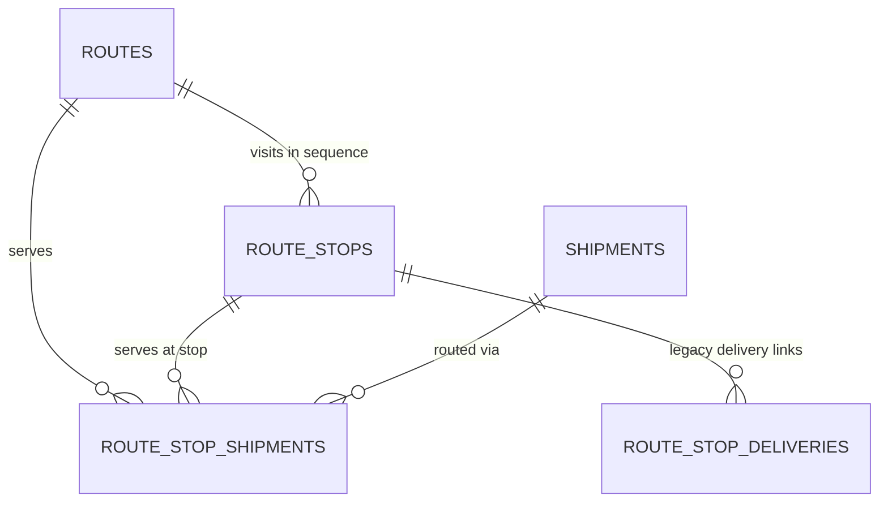

# Shipment Routes — PRD/TRD v1

---

# Part 1 — Product Requirements (PRD)

## Problem

A logistic shipment that needs a dedicated pickup and drop-off currently gets **its own standalone route**: it is bridged to delivery-service as one delivery, which is a self-contained pickup→drop-off pair. One rider serving five such shipments is five unrelated deliveries — no shared plan, no interleaved stops, no shared capacity view. The docking flow's batches don't help: batch stops are drop-off only (pickup is the implicit hub handover), so any shipment requiring a client-site pickup cannot ride a batch. Serving docking shipments through the current point-to-point bridge would multiply routes — one per shipment (or per delivery) — instead of letting stops share one rider's journey. Evidence: the current bridge (`items.external_delivery_uid`, one delivery per shipment), the `BATCH_STOPS` schema (no stop type), and the trip-service collection showing this exact multi-stop shape already proven for express deliveries.

## Context

See [route-context-v1.md](./route-context-v1.md) for how routing works today. Why now: docking shipments are the growth flow, and the moment they need pickups (returns, client-site collection, point-to-point rounds) there is no entity to plan them on. Trip-service proves the shape works operationally for express; this brings it to the shipment domain.

## Users & jobs

| User | Job |
|---|---|
| Dispatcher / hub ops (portal) | Plan one rider's journey serving many shipments; see every stop, its type, and what it serves; reassign or cancel before departure |
| Rider | Work an ordered stop list: pick up shipments, drop them off, report failures — one journey, not N disconnected deliveries |
| Internal planner / services | Create routes programmatically from dispatch output or single-drop intake |
| Client (indirect) | Receive accurate shipment status transitions as route stops resolve |

## Scope

### In scope
- `ROUTES`, `ROUTE_STOPS`, `ROUTE_STOP_SHIPMENTS` tables in `nest-logistic-service`, at shipment grain.
- `ROUTE_STOP_DELIVERIES` legacy link table — stop id ↔ delivery-service delivery uid, maintained for the existing delivery-service integration.
- One route = exactly one rider; ordered stops typed `PICKUP` | `DROP_OFF`; each stop serves 1+ shipments.
- Invariant enforcement: pickup-before-drop-off per shipment, one active route per shipment, one `IN_PROGRESS` route per rider, drop-off blocked until pickup completes.
- API at `/v1/routes` serving three identity types off one path — internal service, portal admin (WEB), and **rider** — split at the auth-guard and usecase level, never by URL prefix (collection: `Logistic Service/Internal/Route/`).
- **Rider execution surface (native):** the rider gets their route list, opens one, starts it, submits the `DIRECT_4W` gates, works the stops, and ends the route — all against logistic-service with a rider JWT. No trip-service bridge.
- Route/stop status lifecycles with an auditable transition trail.
- Route `shipment_type`: `DOCKING` (default) | `DIRECT_2W` | `DIRECT_4W`, set at creation.
- `DIRECT_4W` route-start gates: a pre-trip checklist agreement (app-rendered, backend records agreement + checklist version + timestamp) and a fixed 8-item evidence form (selfie, vehicle front/back/left/right, inside box, odometer photo, odometer reading) required at route start and again at route end, gating stop execution and route completion.
- Structured error envelope across the whole service, so the rider app can route on a machine-readable `rule` rather than parsing prose.
- Optional route optimization pass (reuse the existing routing providers; snapshot polyline/distance/duration like batches do).

### Out of scope
- Replacing or migrating the dispatch/batch flow — routes are additive; batches keep running unchanged.
- Rider-app *implementation* — the m-app consumes the contract in this doc; its build is a separate train. Rider screens are not mocked up in this vault (product decision 2026-08-05).
- Portal UI (mockup ships with the version that adds the portal surface).
- Ops override for a failed vehicle check — the gate is hard, with no bypass (product decision 2026-08-05); the stuck-at-depot alert is the compensating control.
- Odometer validation (sanity band, regression override) — the reading is collected, not judged, in v1.
- Vehicle identity on the check — Fleet already exposes `GET {{baseUrlFleet}}/v1/handovers/drivers/:driverID`; wiring it is deferred (Open questions).
- Auto-planning/optimization algorithm changes — v1 accepts stops as given, with an opt-in ordering pass.
- Item-level split across stops (shipment is atomic per stop in v1).
- Changes to delivery-service or the existing single-shipment bridge.

## Requirements

1. A route is created with exactly one rider — `rider_id` (text) plus a `rider` JSONB snapshot `{id, code, name, phone_number}` — and cannot exist unassigned; the rider is changeable only while the route is `PLANNED`.
2. A route has ≥ 2 stops; every stop has `type` `PICKUP` or `DROP_OFF`, coordinates, address, and a unique `sequence` within the route.
3. A stop serves ≥ 1 shipments; a shipment appears on at most one `PICKUP` stop and at most one `DROP_OFF` stop per route.
4. Every shipment on a route has both a `PICKUP` and a `DROP_OFF` stop. (Hub-origin routes — hub attribution on the route and the hub handover acting as pickup — are deferred to v2; in v1 a hub collection is expressed as an ordinary `PICKUP` stop at the hub's address.)
5. For any shipment with both stop types on a route, `pickup.sequence < drop_off.sequence` — validated at create, add-stops, and any reorder.
6. A shipment can be on at most one active route (`PLANNED` or `IN_PROGRESS`) at a time; violating create/add-stops requests are rejected whole (no partial writes).
7. A `DROP_OFF` stop cannot resolve `COMPLETED` while any of its shipments' `PICKUP` stops are not `COMPLETED`.
8. A `PICKUP` stop resolving `FAILED` marks the dependent shipments' `DROP_OFF` assignments blocked; a drop-off stop whose shipments are all blocked resolves `SKIPPED`.
9. Route status: `PLANNED` → `IN_PROGRESS` (set **only** by the rider's explicit start action — never derived from a stop transition) → `COMPLETED` (derived: all stops terminal, plus the end check on `DIRECT_4W`) | `CANCELLED` (explicit, only actionable while un-departed stops remain). Resolving a stop on a `PLANNED` route is rejected `409 ROUTE_NOT_STARTED` — there is exactly one door into a journey.
10. Stop and route counts/totals (stop count, shipment count, weight, volume) are computed and stored server-side, never trusted from the caller.
11. Every stop status transition records who, when, and an optional reason, retrievable via the route detail endpoint.
12. Route creation is idempotent on a caller-supplied key (re-posting the same key returns the existing route, not a duplicate).
13. A stop may carry 0+ legacy delivery references (delivery-service delivery uids), stored verbatim in `ROUTE_STOP_DELIVERIES` — no cross-service validation in v1; links cascade-delete with their stop.
14. Every route has a `shipment_type`: `DOCKING` | `DIRECT_2W` | `DIRECT_4W`, defaulting to `DOCKING` when the caller omits it; changeable only while the route is `PLANNED` (same rule as the rider).
15. A `DIRECT_4W` route requires a **start vehicle check** before any stop can be resolved: selfie, vehicle front, back, left, right, inside the box/container, odometer photo (each exactly one image URL), plus the odometer reading (number). The check records when it was submitted (server-side clock); *who* is not carried in the payload — only the route's rider can submit it, so the actor is `routes.rider_id`. Resolving a stop before it is submitted is rejected (`422 VEHICLE_CHECK_REQUIRED`). **The gate is hard: there is no ops override and no partial save.** All 8 items arrive in one request or none are stored.
16. A `DIRECT_4W` route requires an **end vehicle check** (same 8 items) before it can derive `COMPLETED` (extends Req 9: all stops terminal AND end check present). The end odometer reading must be ≥ the start reading. End check is submittable only after the start check, while the route is `IN_PROGRESS`. Cancelled routes require no checks; submitted checks are immutable (append-only, enforced in the write path).
17. A `DIRECT_4W` route requires a **pre-trip checklist agreement** in the start call. The checklist items are rendered by the m-app; the service stores `{agreed: true, checklistVersion, agreedAt}` — the version pins *which* checklist was agreed to, so a later app release does not silently reinterpret history. `agreedBy` is not stored: only the route's rider can start it. A `DIRECT_4W` start without the agreement is rejected `422 CHECKLIST_REQUIRED`; a non-`DIRECT_4W` start that sends one is rejected `422 EXTRANEOUS_FIELD`.
18. A rider may hold any number of `PLANNED` routes but exactly **one `IN_PROGRESS` route** at a time. Starting a second is rejected `409 RIDER_ROUTE_IN_PROGRESS`, naming the running route. This keeps the `DIRECT_4W` odometer baseline unambiguous — one running route, one start reading, one vehicle.
19. Every route carries a `planned_date` (the day the rider works it, set at creation, defaulting to the creation date in `Asia/Jakarta`). The rider's list filters on it, so a route planned at 23:00 for a 06:00 start appears on the correct day.
20. Every rejection carries a machine-readable `rule` in a structured error envelope (see API contracts). The rider app selects its next screen from `rule`, never from message text.

## Edge cases & failure states

- **Shipment cancelled mid-route:** its stop assignments are marked cancelled; a stop left with zero live shipments auto-resolves `SKIPPED`; a route left with zero live shipments is `CANCELLED`.
- **Add stops to an `IN_PROGRESS` route:** allowed (trip-service precedent), but only at sequences after the last resolved stop; invariants re-validated over the whole route.
- **Same address, multiple shipments:** the caller decides stop granularity — the API does not auto-merge stops at equal coordinates in v1.
- **Reorder/optimize after partial execution:** only unresolved stops may reorder; pickup-before-drop-off re-validated.
- **Rider unavailable mid-route:** v1 has no mid-route reassignment; the route is cancelled and unserved shipments are re-planned onto a new route (their pickup state preserved — see Open questions on partial-progress carry-over).
- **Empty/invalid geometry:** stops require valid lat/long; H3 index derived server-side, same as shipments.
- **Permission boundary:** one path (`/v1/routes`) serves internal services, portal admins and riders, separated by identity type per endpoint plus a rider scope filter. Planning endpoints are never reachable with a rider token; a rider requesting another rider's route gets `404`, not `403`.
- **All stops done but no end check (`DIRECT_4W`):** the route stays `IN_PROGRESS` until the end check is submitted — completion is derived, never forced. Ops sees the gap as a stuck-in-progress route (required alert below).
- **Route cancelled mid-journey (`DIRECT_4W`):** no end check required; a submitted start check is retained.
- **Odometer lower at end than start:** rejected `422 ODOMETER_REGRESSION`. Note this is the one place the design rejects rather than collects, and it assumes vehicle continuity the model does not record — a legitimate mid-shift vehicle swap (a first-class flow in Fleet) blocks the rider from ending their route. Accepted for v1; see Open questions.
- **Odometer mistyped:** accepted as given. The photo is the evidence, the number is the index into it; no sanity band in v1 (product decision 2026-08-05).
- **Vehicle check resubmission:** rejected `409` — checks are append-only evidence, same rule as stop workflow submissions.
- **Vehicle check cannot be completed** (dead battery, broken camera, unlit depot, media host down): the rider cannot resolve any stop and the shipments do not move. There is no bypass by design. The only signal anyone gets is the stuck-at-depot alert, which is therefore required, not optional.
- **App killed part-way through the check:** nothing is stored; all 8 items are retaken. The m-app must hold the photos locally and retry the whole submission — it must never render a half-complete check.
- **Rider double-taps Start** (or retries after a signal drop): the second call returns `200` with the original `started_at`. A start by a different rider is `403`. Riders retry on bad connections; a `409` on a retry reads as a failure and sends them to support.
- **Rider taps End with stops still `PENDING`:** rejected `422 STOPS_INCOMPLETE`, naming the open stops. `end` is the rider's intent signal, never a status override.
- **Route cancelled by ops between the rider's read and their write:** rejected `409 ROUTE_CANCELLED`, nothing partially written.
- **Rider requests a route that is not theirs:** `404`, never `403` — a `403` confirms the id is real.
- **`DIRECT_4W` stop resolves `workflow: null`:** permitted (null is a first-class state — the m-app runs its static flow and the service gates nothing), but it means the expensive vehicle check ran while the door evidence did not. Every 4W fallback is an alert, not just a counter.

## Success criteria

- One rider serving N shipments produces exactly **1 route** (today: N deliveries) — verifiable in data for pilot journeys.
- A docking-style journey with client-site pickups is representable and executable end-to-end in the data model (pickup and drop-off stops resolved in order) — impossible today.
- Zero invariant violations in production data: no orphan drop-offs, no shipment on two active routes, no rider with two `IN_PROGRESS` routes, no drop-off completed before its pickup.
- A rider completes the seven-step journey on a `DIRECT_4W` route without ops intervention: list → select → start (checklist) → 8-item check → stops (all milestones) → end check → `COMPLETED`.
- Zero cross-rider data access: the authorization matrix test passes for all endpoints × all identity types, and no rider can read a route that is not theirs.
- Post-ship review can trace any shipment's route history from `ROUTE_STOP_SHIPMENTS` alone, and any 4W journey's custody evidence from `start_check` / `end_check` plus `WORKFLOW_SUBMISSIONS`.

---

# Part 2 — Technical Requirements (TRD)

## Summary

Add a self-contained route module to `nest-logistic-service`: four new tables (`routes`, `route_stops`, `route_stop_shipments`, `route_stop_deliveries`), a REST API at `/v1/routes` serving internal services, portal admins, and **riders** off one path, and invariant enforcement in the write path. The model mirrors trip-service's proven trip/stop/deliveries shape but at shipment grain, with the vault's snapshot pattern for the rider master and batch-style route-geometry snapshots.

Riders execute routes **natively** here — no trip-service bridge. The journey is: get today's routes → open one → start it (with the `DIRECT_4W` checklist agreement) → submit the 8-item vehicle check → work each stop, completing its workflow milestones → end the route with the same 8 items as proof. Every gate returns a machine-readable `rule` so the app can send the rider to the right screen.

Nothing existing changes: batches, the delivery bridge, and dispatch keep working as-is. The one change outside this module is the error envelope, standardized across logistic-service (see API contracts).

## Architecture

- **Owner:** `nest-logistic-service`, new `route` module (schema + usecases + controller), same layering as dispatch/invoice modules.
- **One path, three audiences.** `/v1/routes` — no `/internal` or `/driver` prefix, matching the shipped `/v1/stop-workflows` pattern. Authorization is a per-endpoint allowed-identity-type list (default deny) plus, for riders, a **mandatory scope filter applied in the repository layer** (`rider_id = <token identity>`), not an optional `where` in a usecase. A caller that forgets the scope gets an empty set, not the whole table. This is the security consequence of splitting on JWT instead of URL: authorization becomes code that can be forgotten, so it is built to fail closed and covered by an endpoint × identity matrix test.
- **Rider identity:** logistic-service validates driver-service-issued JWTs for the first time (`identity.type`). Bounded timeout on validation — a slow issuer must not hang a rider's request.
- **New operational exposure:** logistic-service becomes rider-critical. A rider mid-`DIRECT_4W`-route cannot submit their end check or resolve a stop while it is down. Trip-service and delivery-service already carry this posture; logistic-service now joins them.
- **Masters:** rider master stays in core-service; stored as `rider_id` (text) + `rider` JSONB snapshot `{id, code, name, phone_number}` (no FK). Hub attribution on routes is deferred to v2 — v1 routes carry no `hub_id`/`hub` columns.
- **Shipments:** `route_stop_shipments.shipment_id` is a real FK to `shipments.id` (same service, same DB).
- **Execution boundary (deferred):** whether riders execute routes natively or via a bridge into trip-service trips is explicitly out of v1; the model keeps `external_trip_id` nullable on `routes` to leave the bridge open without committing to it.
- **Optimization:** `shouldOptimize` delegates to the existing routing provider used by batches (Mapbox snapshot fields) — no new provider integration.

## API contracts

Collection: `Logistic Service/Internal/Route/` (added in this change). Base: `{{baseUrlLogistic}}`. Auth: bearer, with the allowed identity types declared **per endpoint** — an endpoint with no declared list is unreachable, not open.

```
                                                     INTERNAL  ADMIN  RIDER
POST   /v1/routes                                       ✓        ✓      —
GET    /v1/routes                                       ✓        ✓    ✓ scoped
GET    /v1/routes/:routeID                              ✓        ✓    ✓ owner
POST   /v1/routes/:routeID/stops                        ✓        ✓      —
POST   /v1/routes/:routeID/start                        —        —    ✓ owner
POST   /v1/routes/:routeID/end                          —        —    ✓ owner
PATCH  /v1/routes/:routeID/vehicle-check/:phase         —        —    ✓ owner   (start|end, DIRECT_4W only)
PATCH  /v1/routes/:routeID/stops/:stopID/resolve        ✓        —    ✓ owner
PATCH  /v1/routes/:routeID/stops/:stopID/milestones/:milestoneKey
                                                        ✓        —    ✓ owner   (owned by stop-workflow)
```

`RIDER scoped` = the list is filtered to the caller's own routes, unconditionally. `RIDER owner` = a route belonging to another rider returns **`404`**, never `403` — a `403` would confirm the id exists.

### Error envelope

One shape across the route and stop-workflow surfaces (product decision 2026-08-05 — the four shipped `/v1/stop-workflows` endpoints are migrated to it in the same release):

```jsonc
{
  "status": 422,
  "message": "Stop cannot complete: workflow milestones incomplete",
  "errors": [ { "rule": "WORKFLOW_INCOMPLETE", "pendingMilestones": ["handover"] } ]
}
```

The rider journey is a chain of gates and the app must pick its next screen from the rejection. HTTP status alone cannot carry that — `422` covers "check missing", "milestones incomplete" and "field invalid", and `409` covers "out of order", "already submitted" and "stop resolved". `rule` is the contract; `message` is for humans and may be reworded or translated freely. Context travels inside the error object (`expectedNext`, `pendingMilestones`, open stop ids) so the app can act without a second round-trip.

**Scope boundary.** The decision covers the surfaces whose consumers we own: the route module, and the four shipped `/v1/stop-workflows` endpoints (consumed only by the react-logistic-web Workflows UI). It does **not** extend to `Logistic Service/Integration/` (5 endpoints, `{status: "Failed", error}`) — those are the **client-facing** contract, parsed by third parties, and covered by the decided client-integration agreement. Converting them would be a breaking change to external partners, not a coordinated internal deploy. `Logistic Service/Internal/Dashboard/` (10 endpoints) is portal-facing and could follow later at low risk. Both are recorded as an open question rather than swept in here; the practical consequence is that logistic-service speaks two error dialects for a while, with the boundary drawn at "who consumes it" rather than left to accident.

Rules emitted by this module: `ROUTE_NOT_STARTED`, `ROUTE_ALREADY_STARTED`, `ROUTE_CANCELLED`, `RIDER_ROUTE_IN_PROGRESS`, `CHECKLIST_REQUIRED`, `EXTRANEOUS_FIELD`, `VEHICLE_CHECK_REQUIRED`, `VEHICLE_CHECK_NOT_APPLICABLE`, `VEHICLE_CHECK_ALREADY_SUBMITTED`, `START_CHECK_REQUIRED`, `ODOMETER_REGRESSION`, `UNTRUSTED_MEDIA_HOST`, `VALIDATION_FAILED`, `STOPS_INCOMPLETE`, `END_CHECK_REQUIRED`, `OUT_OF_ORDER`, `PICKUP_COMPLETED_BEFORE_DROP_OFF`. Each maps 1:1 to a named guard in the write path (see Architecture) so the contract stays structural rather than a set of hand-synced `throw`s.

**Create route** — `POST /v1/routes`

```jsonc
{
  "idempotencyKey": "rte-req-20260804-0001",
  "shipmentType": "DOCKING",            // DOCKING (default) | DIRECT_2W | DIRECT_4W
  "plannedDate": "2026-08-05",          // optional — the day the rider works it; defaults to today (Asia/Jakarta)
  "externalShiftID": 904202601,         // optional
  "rider": { "id": "456", "code": "RDR-0456", "name": "Budi Santoso", "phoneNumber": "+62815550456" },
  "shouldOptimize": false,
  "stops": [
    {
      "type": "PICKUP",
      "address": "Jl. Raya Masjid Al Hidayah No.14B, Ps. Minggu, Jakarta Selatan",
      "latitude": -6.277036,
      "longitude": 106.834822,
      "contactName": "Toko Hidayah",
      "contactPhone": "+62811111111",
      "shipments": [ { "id": "5f9c…uuid", "waybill": "DSH-2026-000123" } ]
    },
    {
      "type": "DROP_OFF",
      "address": "Jl. Rambutan No.46, Ps. Minggu, Jakarta Selatan",
      "latitude": -6.275665,
      "longitude": 106.836154,
      "shipments": [ { "id": "5f9c…uuid" } ],
      "deliveries": [ { "id": "del-20260804-0001" } ]   // optional — legacy delivery-service links
    }
  ]
}
```

Each stop accepts an optional `deliveries` array (create and add-stops alike): delivery-service delivery uids persisted to `ROUTE_STOP_DELIVERIES` as-is and echoed back on stop bodies in responses.

`plannedDate` is optional at creation and defaults to the creation date in `Asia/Jakarta` (Req 19).

Response `201`: the route with `code` (`RTE{yymmdd}{seq5}`), rider snapshot, sequenced stops (each with its shipments), server-computed totals, `status: "PLANNED"`, and `routeOptimization` metadata (nulls when not optimized). Errors: `404` unknown shipment; `409` shipment already on an active route / duplicate idempotency key with different payload; `422` invariant violation (drop-off without pickup, pickup after drop-off, empty stop). Validation failures reject the whole request.

**List routes** — `GET /v1/routes?riderID=&status=&shipmentType=&plannedDate=&category=&page=&pageSize=` → paged summaries (no stop bodies). (`hubID` filter arrives with hub attribution in v2.)

*Rider read (step 1 of the journey):* `riderID` is ignored and forced to the token identity; the default is **today's** routes by `planned_date` (`PLANNED` + `IN_PROGRESS`). `category` is reserved for history (`ACTIVE` | `TODAY` | `PAST`), mirroring trip-service's `GET /driver/v1/trips/me?category=ACTIVE`.

**Route detail** — `GET /v1/routes/:routeID` (step 2) → full route: stops in sequence, shipments per stop, the `workflow` snapshot per stop (nullable), transition history per stop, `arrivedAt`/`resolvedAt` execution timestamps, `preChecklistAgreement`, `startCheck`/`endCheck`, and per-stop leg geometry (`legPolyline`, `legDistanceM`, `legDurationSec` — null until the route geometry is computed) alongside the route-level `routeOptimization` snapshot.

**Add stops** — `POST /v1/routes/:routeID/stops` → same stop shape as create; only while `PLANNED`/`IN_PROGRESS`; appended after the last resolved stop; whole-route invariants re-validated. Returns the full updated stop list.

**Start route** — `POST /v1/routes/:routeID/start` (step 3; rider only, owner only)

```jsonc
{
  "preChecklistAgreement": {          // DIRECT_4W only — omit entirely for DOCKING / DIRECT_2W
    "agreed": true,
    "checklistVersion": "4w-2026-08"  // which checklist the app rendered
  }
}
```

Sets `status: IN_PROGRESS` and `started_at`; stores `{agreed, checklistVersion, agreedAt}` (server clock). Response `200`: `{ routeID, status, startedAt, preChecklistAgreement }`.

**Idempotent:** a repeat start by the same rider returns `200` with the original `started_at` — riders retry on bad signal, and a `409` on a retry reads as a failure. Errors: `409 ROUTE_ALREADY_STARTED` (already started by someone else) / `409 RIDER_ROUTE_IN_PROGRESS` (Req 18, names the running route) / `409 ROUTE_CANCELLED`; `422 CHECKLIST_REQUIRED` (4W without the agreement) / `422 EXTRANEOUS_FIELD` (non-4W sending one); `404` not this rider's route.

**End route** — `POST /v1/routes/:routeID/end` (step 7; rider only, owner only)

Declares the rider finished. Completion still *derives* — `end` never forces a status. Response `200`: the route with `status: COMPLETED` when the derivation passes. Errors: `422 STOPS_INCOMPLETE` with the open stop ids; `422 END_CHECK_REQUIRED` on a `DIRECT_4W` route whose end check is missing; `409 ROUTE_NOT_STARTED`.

**Resolve stop** — `PATCH /v1/routes/:routeID/stops/:stopID/resolve` (steps 5–6)

```jsonc
{ "status": "COMPLETED",              // COMPLETED | FAILED | SKIPPED
  "arrivedAt": "2026-08-04T03:01:12Z", // optional — when the rider arrived at the stop
  "reason": null }                     // required for FAILED / SKIPPED
```

`resolvedBy` is not carried in the payload — for a rider call the actor is the token identity, for an internal call it is the service. `arrivedAt` may be reported ahead of resolution; in v1 the resolve call carries it.

Guards, in order, each owning one `rule`: `ROUTE_NOT_STARTED` → `VEHICLE_CHECK_REQUIRED` (4W, Req 15) → `OUT_OF_ORDER` (earlier unresolved stop) → `PICKUP_COMPLETED_BEFORE_DROP_OFF` (Req 7) → `WORKFLOW_INCOMPLETE` (stop-workflow Req 9, with `pendingMilestones`). Side effects: shipment status transitions, dependent drop-off blocking (Req 7–8), route status derivation (Req 9 + Req 16).

**Submit vehicle check** — `PATCH /v1/routes/:routeID/vehicle-check/:phase` (`start` = step 4, `end` = step 7; `DIRECT_4W` routes only, rider only, owner only)

```jsonc
{
  "selfie": "https://media.dash.co/checks/rte…/selfie.jpg",
  "vehicleFront": "https://…/front.jpg",
  "vehicleBack": "https://…/back.jpg",
  "vehicleLeft": "https://…/left.jpg",
  "vehicleRight": "https://…/right.jpg",
  "vehicleBox": "https://…/box.jpg",          // inside the box / container
  "odometerPhoto": "https://…/odo.jpg",
  "odometerReading": 48211
}
```

All 8 items required in **one request** — no partial saves, no `submittedBy` (the actor is the route's rider). Image values are single URLs validated against the trusted media host allowlist, which is config rather than a regex and is unit-tested per field. An empty string is a validation failure, not a missing value — check explicitly, not by truthiness.

Response `200`: the stored check (+ `distanceKm` on the `end` phase: end minus start reading). Errors: `409 VEHICLE_CHECK_NOT_APPLICABLE` (not a `DIRECT_4W` route) / `409 VEHICLE_CHECK_ALREADY_SUBMITTED` / `409 START_CHECK_REQUIRED` (`end` before `start`) / `409` route not in a submittable state; `422 VALIDATION_FAILED` (missing item, empty string, wrong type) / `422 UNTRUSTED_MEDIA_HOST` / `422 ODOMETER_REGRESSION` (end < start).

## Data model

Four new tables (Drizzle schema + migration). ERD updated in this change — see `docs/modules/erd/erd.mermaid`.



- **`routes`** — id, unique `code`, unique nullable `idempotency_key`, `shipment_type` (`DOCKING`|`DIRECT_2W`|`DIRECT_4W`, default `DOCKING`), **`planned_date`** (date, the day the rider works this route — the rider list filters on it), `rider_id` (text) + `rider` JSONB snapshot `{id, code, name, phone_number}`, nullable `external_shift_id`, nullable `external_trip_id` (retained deliberately: the trip-service bridge was *not* taken, but a nullable column costs nothing and keeps the door open — see Key decisions; hub attribution deferred to v2, no hub columns in v1), server-maintained totals, `status` (`PLANNED`|`IN_PROGRESS`|`COMPLETED`|`CANCELLED`, default `PLANNED`), **`pre_checklist_agreement`** (JSONB, nullable — `{agreed, checklistVersion, agreedAt}`, `DIRECT_4W` only), `start_check` **and** `end_check` (JSONB, nullable — the `DIRECT_4W` 8-item vehicle-check evidence `{selfie, vehicleFront, vehicleBack, vehicleLeft, vehicleRight, vehicleBox, odometerPhoto, odometerReading, submittedAt}`; always null for other types), route-geometry snapshot (polyline/distance/duration/computed_at), `started_at`/`completed_at`/`cancelled_at`/`cancellation_reason`, timestamps.
  - **`start_check` and `end_check` stay two separate columns** — never consolidated into one `checks` document. Each phase is written once, independently, and reads for one phase must not deserialize the other.
  - Index `(rider_id, status)` for the rider list, and `(rider_id, planned_date)` for the "today" filter. A partial unique index on `rider_id` where `status = 'IN_PROGRESS'` is the database-level backstop for Req 18.
- **`route_stops`** — id, `route_id` FK CASCADE, `sequence` (unique per route), `type` (`PICKUP`|`DROP_OFF`), address/lat/long/h3, contact name/phone, per-stop totals, leg geometry snapshot (`leg_polyline`/`leg_distance_m`/`leg_duration_sec` — the provider leg *ending* at this stop, null until route geometry is computed; recomputed together with the route-level snapshot on reorder/add-stops), `status` (`PENDING`|`COMPLETED`|`FAILED`|`SKIPPED`, default `PENDING`), `arrived_at` (nullable — rider arrival at the stop; with `resolved_at` it splits stop time into travel time and dwell time), `resolved_at`/`resolved_by`/`resolution_reason`, timestamps.
- **`route_stop_shipments`** — id, denormalized `route_id` FK, `route_stop_id` FK CASCADE, `shipment_id` FK → `shipments.id`, weight/volume snapshot, `status` (`ACTIVE`|`BLOCKED`|`CANCELLED`, default `ACTIVE`), timestamps. Unique `(route_stop_id, shipment_id)`; partial unique index enforcing ≤ 1 active route per shipment (on `(shipment_id)` where route active — implemented via join table + route status, exact mechanism left to the engineer); the "≤ 1 stop per type per shipment per route" invariant enforced in the write path inside the transaction.
- **`route_stop_deliveries`** — id, `route_stop_id` FK CASCADE, `delivery_id` (text — external delivery-service delivery uid, **no FK**, matching the `items.external_delivery_uid` convention), `created_at`. Unique `(route_stop_id, delivery_id)`. A deliberately bare link table: delivery-service stays the source of truth for delivery state; this table only records which legacy deliveries a stop serves.

Backward compatibility: purely additive — no existing table changes, no backfill. In-flight shipments are unaffected until something creates a route for them.

## Cross-module impacts

- **Shipments (intake/docking):** route stop resolution drives shipment status transitions — the exact vocabulary mapping is an Open question and must be settled before implementation, because it feeds the next item.
- **Client-integration:** shipment status changes surface via `List Changed Shipments` and webhooks; route-driven transitions must stay within the decided client contract (no new client-facing statuses in v1).
- **Dispatch/batches:** untouched; a shipment routed via a route must not also be batch-assigned — the one-active-route invariant covers routes, and dispatch's exclusion of route-held shipments is listed as an open question.
- **Docking-dashboard:** ETL does not read routes; route-executed work is invisible to hub metrics in v1 (conscious gap, noted in the context doc).
- **Delivery-service (legacy):** no API calls in v1, but `ROUTE_STOP_DELIVERIES` keeps stops linked to the legacy deliveries the existing integration still creates and maintains — link data only, delivery state stays in delivery-service.
- **Trip-service:** no calls in v1; `external_trip_id` reserves the bridge, which this version explicitly declined to take.
- **Stop-workflow:** its Increment 2 (execution — `route_stops.workflow`, resolution, submit endpoint, resolve gate) and this module's rider surface are **one shippable unit**. Step 6 of the rider journey does not exist without it, and shipping the rider surface alone means riders complete stops with no door evidence at all. Its submit endpoint moves to `/v1/routes/:routeID/stops/:stopID/milestones/:milestoneKey` with the same auth matrix as resolve.
- **Portal (react-logistic-web):** the Workflows UI under Master → Workflows parses the current `{status: "Failed", error}` envelope. The envelope migration is a breaking change to those four endpoints and must deploy in the same release as the portal update. Their only consumer is this UI, so it is one coordinated deploy, not a migration.
- **m-app (rider surface):** consumes the nine endpoints above. Two requirements flow from decisions in this doc: the vehicle check has **no partial state**, so the app holds all 8 items locally and retries the whole submission rather than rendering a half-complete check; and between "Start pressed" and "check submitted" the route is `IN_PROGRESS` but no stop can be worked, so that blocked-but-started state must read as deliberate, not as a loading failure.
- **Driver-service:** logistic-service now validates its JWTs. New dependency on the token issuer.
- **Fleet:** no calls in v1. `GET {{baseUrlFleet}}/v1/handovers/drivers/:driverID` would supply the vehicle id, plate and handover odometer that the checks currently lack — deliberately deferred (Open questions).
- **ERD:** `docs/modules/erd/erd.mermaid` updated in this change.

## Failure modes & observability

- All create/add/resolve writes are single transactions; invariant violation anywhere rejects the whole request (no partial routes).
- Idempotent creation via `idempotency_key` (unique, replay-safe); resolve is naturally idempotent (re-resolving to the same terminal status returns `200` unchanged, different status → `409`).
- Optimization provider failure degrades gracefully: route is created unoptimized (`routeOptimization.isOptimized: false`), never blocks creation.
- Log every stop transition (route code, stop id, from→to, actor). Metrics: routes created/day, stops resolved by status, invariant-rejection count by rule. Alert candidates: spike in `FAILED` pickups; any invariant violation detected by a nightly consistency check (drop-off completed with incomplete pickup would indicate a write-path bug).
- **Analytics derivable from stored timestamps** (compute-on-read, matching the docking-dashboard house style — velocity in sec/unit, 7-day moving averages, volume always shown as context): route duration actual vs planned (`started_at`→`completed_at` vs `route_duration_sec`), plan-to-start lag (`created_at`→`started_at`), stop dwell time (`arrived_at`→`resolved_at`), actual leg travel time (previous stop `resolved_at`→`arrived_at`) vs planned `leg_duration_sec`, first-attempt success rate per stop type, cancellation rate with reasons, velocity as sec/stop and sec/shipment for cross-rider comparison, and on-time-vs-promise via join to `shipments.priority_time_window`. For `DIRECT_4W`, the odometer delta (`end_check.odometerReading − start_check.odometerReading`) gives **actual distance ridden** vs the planned `route_distance_m` — partially resolving the previously deferred actual-distance metric without GPS. No derived metric is stored.
- Free timings, no new columns: `started_at → start_check.submittedAt` is how long the check itself takes (so photo time never contaminates driving time); `start_check.submittedAt → first stop arrived_at` is true first-leg travel; `created_at → started_at` is plan-to-start lag.

### Required signals (not candidates)

Two decisions in this version — hard gate with no override, odometer collected without validation — move weight onto instrumentation. These are part of Increment 2, not follow-up work:

| Signal | Why required |
|---|---|
| `DIRECT_4W` route `IN_PROGRESS` > N min with no `start_check` | **The only signal that a rider is stuck at the depot.** With no override, nobody else finds out. |
| Same, with all stops terminal and no `end_check` | Rider has finished and cannot close out. |
| Workflow fallback (`workflow: null`) on a `DIRECT_4W` stop | 4W routes are expected to carry a workflow; a null means the expensive check ran and the door evidence did not. Alert, not just a counter. |
| `ODOMETER_REGRESSION` rejection count | With no override, each one is a rider who cannot end their route — a stuck-rider signal as well as a fleet data-quality one. |
| Odometer delta vs `route_distance_m` ratio | The reading is not validated, but measuring the distribution costs nothing and shows later whether the number is worth trusting. |
| Auth denials by identity type × endpoint | A spike of rider-token denials on a planning endpoint is either a bug or a probe. |
| Vehicle-check submissions by outcome; time from route creation to start check | Baseline operability. |

### Known silent failures (accepted)

Two paths fail with no error, no log, and no user-visible signal. Both are conscious v1 positions, recorded so they are not mistaken for oversights:

- **Odometer typo** — `482110` for `48211` is stored as given and becomes hundreds of thousands of kilometres of "distance ridden". The photo is the evidence; the derived distance metric is advisory until the ratio distribution above says otherwise.
- **Dead media URL** — URLs are checked against the host allowlist but never fetched, so a URL pointing at a failed upload stores cleanly and surfaces months later in a dispute. A nightly evidence-integrity sweep is the cheap mitigation if this proves real (Open questions).

## Security & permissions

Moving the trust boundary from the URL into the code is the security story of this version. Under `/internal/v1/*`, reaching the path *was* the authorization. Under `/v1/routes` with three identity types, the only thing between a rider and every route in the company is a branch in a usecase.

**Broken object-level access is the top threat** (High likelihood, High impact). A missed scope filter on `GET /v1/routes` exposes every stop's address, latitude/longitude, `contactName`, `contactPhone`, shipment waybills and the `client` snapshot — a customer address book with phone numbers, readable from any phone holding a rider token. Mitigations, all required:

- Rider scoping is a **mandatory filter in the repository layer**, not an optional `where` in a usecase. Forgetting it yields an empty set, not the whole table — it fails closed.
- Foreign or unknown route id on a rider call → `404`, never `403`.
- An authorization matrix test: every endpoint × every identity type (internal, admin, rider-owner, rider-other), table-driven, so adding endpoint ten is a one-row diff and an immediate red build if its scope is missing.

**Identity-type confusion** (Med/High): the per-endpoint allowed-type list is the control, so it is declared explicitly and defaults to deny. A rider token must never reach `POST /v1/routes` or `/stops`.

**Media URLs are now untrusted input** — riders supply them directly from a phone, not an internal service. The allowlist is config rather than a regex buried in a validator; it is enforced on all 7 image fields and every workflow `IMAGE` value; and there is a unit test per field asserting an off-host URL is rejected. Nothing fetches these URLs, so there is no SSRF surface today — that changes if the integrity sweep lands.

**Other:**
- Stop payloads carry PII (addresses, contact phones) — same handling rules as shipments.
- Vehicle-check evidence includes a worker's selfie. **Retention is undecided** and currently unbounded; see Open questions.
- Free-text `reason` / `resolutionReason` is rendered in the portal — escaping is the portal's responsibility, named here because this module is the source.
- Input validation at the DTO boundary: enum-checked types/statuses, lat/long ranges, `sequence` integrity, shipment UUIDs must exist and belong to the caller's scope. Empty strings are validation failures, not absent values.
- Driver JWT validation runs under a bounded timeout — a slow issuer must not hang a rider's request.

## Rollout

1. **Increment 1 (safely deployable alone):** migration + tables + `POST/GET /v1/routes` behind an env feature flag (`ENABLE_ROUTE_MODULE`); no producers, no consumers. **Same release:** the structured error envelope across logistic-service, including the four shipped `/v1/stop-workflows` endpoints, deployed together with the react-logistic-web Workflows UI that consumes them.
2. **Increment 2:** the rider surface — `DRIVER` identity type, repository-layer scope filter, start / end / vehicle-check, resolve + add-stops + shipment-status side effects (needs the status-mapping open question resolved). **Ships together with stop-workflow Increment 2**, which supplies step 6. The authorization matrix test gates this increment. The stuck-at-depot alert must be live *before* the first `DIRECT_4W` route runs — with no override, it is the only way anyone learns a rider is blocked.
3. **Increment 3 (separate PRD/TRD version):** portal planning UI. Rider screens are the m-app's own train, built against the contract in this doc.

**Deploy-time risk window:** during the envelope release, old and new code run together and the portal may briefly receive either shape. Either the UI tolerates both for the window or the two deploy in lockstep. This is the one moment the breaking change is actually breaking.

**Kill switch:** `ENABLE_ROUTE_MODULE` gates **creation only**. Reads, starts, checks, resolves and completion stay live unconditionally for in-flight routes — a flag that stranded riders mid-journey would cause the outage it exists to contain. Rollback = stop creating routes, let in-flight ones drain, revert. No backfill; tables are inert without traffic. The envelope change is not covered by the flag and should be treated as a one-way door.

**Post-deploy verification (first hour):** one `DIRECT_4W` route end to end on staging from a real device — start with the checklist, 8 items, one stop with milestones, end check. Then the authorization matrix against staging with a real rider token. Then confirm the stuck-at-depot alert actually fires by starting a route and deliberately not submitting the check.

## Testing strategy

- **Unit:** invariant validators (pickup-before-drop-off incl. add-stops and reorder, one-active-route-per-shipment, one-`IN_PROGRESS`-route-per-rider, pickup-and-drop-off-required-per-shipment, blocked-drop-off derivation), route status derivation, totals computation, dwell/leg-time timestamp ordering (`arrived_at` ≤ `resolved_at`), each resolve guard independently with its `rule` string, checklist required/extraneous per `shipment_type`, media allowlist per image field, empty-string vs null on every check item.
- **Authorization matrix (the test that lets you ship on a Friday):** all 9 endpoints × 4 identities (internal, portal admin, rider-owner, rider-other), table-driven. Asserts `404` — not `403` — for rider-other on every route-scoped endpoint. This is the highest-value test in the change because the bugs it catches are missing lines, which fail quietly rather than loudly.
- **Integration:** the full seven-step `DIRECT_4W` journey; create→resolve happy path P,D,P,D and P,P,D,D orderings; failed-pickup → blocked/skipped drop-off cascade; mid-route shipment cancellation; idempotent replay of create *and* start; concurrent create racing the same shipment (unique-index backstop); second `IN_PROGRESS` route rejected; resolve on a `PLANNED` route rejected; end with pending stops rejected; end check before start rejected.
- **Adversarial:** rider token against another rider's route on every endpoint; resolve a stop on a route never started; submit the end check with no start check; double-tap start on a flaky connection; off-allowlist host on each of the 7 image fields.
- **Chaos:** media host down mid-check returns a clean `4xx`, never a `500`; slow driver JWT issuer times out rather than hanging; ops cancels a route between the rider's read and their resolve.
- **Flakiness watch:** freeze the clock for anything asserting server-set `submitted_at`; test the stuck-at-depot *query*, not the scheduler.
- **Contract:** responses match the collection examples in `Logistic Service/Internal/Route/` (success + failure per endpoint), in the structured envelope.
- **N/A — no LLM or prompt surface in this module.**

## Key decisions & deferred choices

- **Shipment grain, not item grain** (matches the product framing "stops serve shipments"; batches remain the item-grain tool). Deferred escape hatch: a `route_stop_items` child table can be added later without reshaping v1.
- **New tables in logistic-service, not trip-service reuse** — shipments, waybills, and hub semantics live here; trip-service stays the express engine. The nullable `external_trip_id` keeps the bridge option open at zero cost.
- **Riders execute natively, not via a trip-service bridge** (user decision, 2026-08-05, resolving the module's #1 open question). The bridge looked cheaper and was not: the milestone gate lives in `route_stops.workflow` and the vehicle check on `routes`, so trip-service would have to learn both or proxy every rider action — the native design with an extra network hop and a second source of stop state. Reinforcing the choice: the m-app is already a multi-base-URL client (trip, delivery, driver, express), so adding logistic-service is the fifth of a pattern, not a new one. The longer-term option of unifying express and logistic execution into one engine stays open; a native surface can be fronted later.
- **One path, split at auth and usecase, not by URL** (user decision, 2026-08-05): `/v1/routes`, never `/internal/v1/` or `/driver/v1/` — matching the shipped `/v1/stop-workflows`. The tradeoff is explicit: authorization stops being infrastructure and becomes code, which is why the scope filter lives in the repository layer and the matrix test is a release gate.
- **Route start is an explicit action, not a derivation** — Req 9's original "`IN_PROGRESS` on first stop transition" is removed. Two doors into a journey produce routes with resolved stops and a null `started_at`. Start is also where the `DIRECT_4W` checklist gate lives, so it has to be a call the rider makes.
- **End is explicit too, completion still derives** — the rider gets an End action matching their mental model, but it never forces a status: pressing End with open stops returns `422` naming them rather than marking a half-finished route done.
- **Checklist stores agreement + version + timestamp, not a bare boolean** (user decision, 2026-08-05): the app owns the item text, the backend pins *which* checklist was agreed to. `agreedBy` is omitted because the route has exactly one rider and only they can start it — the actor already exists in `rider_id`. Same reasoning removed `submittedBy` from the vehicle check and `resolvedBy` from resolve.
- **Vehicle checks stay JSONB on `routes`, not an append-only table** (user decision, 2026-08-05): checks are sparse — only `DIRECT_4W` routes have them — so nullable columns beat a table holding rows for a minority of routes. This knowingly differs from stop-workflow's evidence model (dedicated table, unique index, snapshot as rebuildable read model), which exists because *its* evidence is dense and per-stop. The residual risk is that a careless `UPDATE routes` rewrites check evidence with no trace; accepted, because the photo URLs point at immutable bucket objects.
- **Hard gate on the vehicle check, no override, no partial save** (user decision, 2026-08-05): evidence integrity over operability. The known cost is that a rider with a dead camera cannot move shipments and there is no audited bypass — waivers will happen verbally instead. The stuck-at-depot alert is the compensating control and is therefore required, not optional.
- **Odometer is collected, not judged** (user decision, 2026-08-05): no sanity band, no cross-check against planned distance. The photo plus the number is the record. Consequence: the "actual distance ridden" metric is advisory until the delta distribution is measured.
- **Structured error envelope service-wide** (user decision, 2026-08-05): the rider journey is a chain of gates and the app picks its next screen from the rejection, which a prose string cannot support without string-matching that breaks silently. Cost: a breaking change to four shipped endpoints, mitigated by their single consumer being a portal you deploy yourself.
- **One `IN_PROGRESS` route per rider** (user decision, 2026-08-05) — multiple `PLANNED` allowed. Keeps the odometer baseline unambiguous: one running route, one start reading, one vehicle.
- **No rider mockup in the vault** (user decision, 2026-08-05) — the m-app team owns the visual design; this doc owns the contract.
- **Additive to batches, not a replacement** — no migration risk to the shipped docking flow.
- **Rider required at creation** (per product decision "1 route is 1 rider") — there is no unassigned route state; deferred: whether planning tools need a pre-assignment draft state.
- **Caller-defined stop granularity** (no auto-merge by coordinates) — deferred to the engineer/agent implementing portal planning UX.
- **`route_stop_deliveries` is a bare link, not a snapshot** — the legacy delivery-service integration must keep working, so stops record the delivery uids they serve (stop_id + delivery_id only); no delivery state is copied because delivery-service remains its source of truth, and links are stored verbatim without cross-service validation in v1.
- **`shipment_type` lives on the route, not (yet) on shipments** — the behavior it drives (vehicle checks, and later vehicle-class planning) is route-level; the caller declares it at creation, defaulting to `DOCKING`. Whether `SHIPMENTS` also carries a type and whether route↔shipment types must agree is an open question, deliberately not blocking this.
- **Vehicle checks are a fixed product-defined form, not stop-workflow machinery** — the 8 items are the same for every client and every `DIRECT_4W` route, so there is no definition table to manage: two nullable JSONB columns on `routes` (`start_check`/`end_check`), append-only like all evidence. If the form ever becomes per-client, the stop-workflow module is the escape hatch.
- **Analytics capture reviewed 2026-08-04 (CEO review, selective):** `arrived_at` accepted into v1. Consciously deferred after review: per-stop planned ETA snapshot (`estimated_arrival_at`), structured failure-code enum (`resolution_code` — failure analysis stays free-text prose for now), and a `route_transitions` route-level audit table (rider-reassignment history is not persisted; route status timestamps cover the happy path). Also deferred: actual distance ridden (needs tracking-service GPS, an integration not a column).
- Left to the implementing engineer: exact unique-index mechanism for the one-active-route invariant, Drizzle schema details, pagination defaults — within the constraints stated above.

## Open questions

- **Vehicle identity.** The check photographs a vehicle and records nothing identifying it. Fleet already exposes `GET {{baseUrlFleet}}/v1/handovers/drivers/:driverID` (active handover with `vehicleID`, handover `odometer`, `unitEquipment`) — when do we snapshot vehicle id and plate onto the route? Until then the odometer number is uninterpretable and every 4W analytic inherits that.
- **Odometer regression is the one place the design rejects rather than collects.** `ODOMETER_REGRESSION` enforces vehicle continuity over an entity the model does not store, so a legitimate mid-shift swap (Fleet has `VEHICLE_SWAP` as a first-class return reason) hard-blocks the rider from ending their route. Override with a reason, or resolve via vehicle identity above?
- **Photo retention.** 14 images per `DIRECT_4W` route, per rider, per day, including a worker's selfie, with no stated lifetime. Evidence disputes have a natural window; retention should be that window plus a margin. Cheaper to decide before two years of images exist.
- **Media URL verification.** Allowlist only, no HEAD check — a URL pointing at a failed upload stores cleanly and surfaces in a dispute months later. Nightly evidence-integrity sweep, or accept?
- **Custody grain: route or shift?** The checks are vehicle-custody evidence attached to a route because that is where the rider is. A rider running three `DIRECT_4W` routes in one shift photographs the same van six times. `external_shift_id` exists and is unused.
- **Rider list history.** `category` is reserved (`ACTIVE` | `TODAY` | `PAST`) — how far back can a rider read their own completed routes, and does that change the PII exposure calculus?
- **Envelope migration mechanics.** Does the portal Workflows UI tolerate both envelope shapes during the deploy window, or do the two ship locked together?
- **Envelope beyond this boundary.** `Logistic Service/Integration/` (5 client-facing endpoints) and `Logistic Service/Internal/Dashboard/` (10 portal-facing) still emit `{status: "Failed", error}`. Dashboard is low-risk to convert whenever convenient. Integration is a **client contract** — converting it breaks third-party parsers and touches the decided client-integration agreement, so it needs its own decision and its own migration window, not a sweep. Until then, logistic-service speaks two dialects on purpose.
- **Execution surface — RESOLVED 2026-08-05:** native rider support in logistic-service (`/v1/routes`, rider JWT), not a trip-service bridge. See Key decisions.
- **Hub-origin pickup semantics (v2):** hub attribution on routes is deferred to v2 — when it lands, decide whether the hub handover scan is the pickup (no explicit stop) or a hub-origin route carries an explicit hub `PICKUP` stop as stop 1. In v1, hub collections are ordinary `PICKUP` stops at the hub address.
- **Shipment status mapping:** exact shipment status values for picked-up / out-for-delivery / delivered / failed on route events, and their effect on the client-integration change feed.
- **Dispatch exclusion:** should dispatch planning skip shipments held by an active route (and vice versa), and where is that enforced?
- **Partial-progress carry-over:** when a route is cancelled after some pickups completed, how do already-picked-up shipments transfer to a replacement route?
- **Docking-dashboard:** when (if ever) does the ETL learn about routes?
- **Legacy delivery links lifecycle:** `route_stop_deliveries` is write-through from the caller with no reconciliation — if a delivery is cancelled or reassigned inside delivery-service, the link goes stale. Acceptable for the legacy maintenance window, or does it need a sync/cleanup job?
- **Shipment-level typing:** should `SHIPMENTS` also carry `shipment_type` (set at intake), with route creation validating that a route only serves shipments of its own type? Today the route's type is caller-declared and unvalidated against its shipments.
- **`DIRECT_2W` checks:** 2W routes currently require nothing at start/end — should they get a lighter check (e.g. selfie + odometer) later? Note the current shape does not stretch: 7 fixed URL fields plus a number means a lighter check needs either nullable clutter or a second column.

## Changelog

- 2026-08-05 — **rider execution surface added (CEO review, hold scope)**. The module's #1 open question is resolved: riders execute routes **natively** in logistic-service, no trip-service bridge. All paths move `/internal/v1/routes` → `/v1/routes`, one path serving internal + portal admin + rider, split at the auth-guard and usecase level (user decision — matches the shipped `/v1/stop-workflows`). New endpoints `POST /start` and `POST /end`; `vehicle-check`, `resolve` and `milestones` gain rider access. Req 9 rewritten (`IN_PROGRESS` set only by the explicit start, never derived from a stop transition; resolve on a `PLANNED` route → `409 ROUTE_NOT_STARTED`). New Req 17 (`pre_checklist_agreement` — `{agreed, checklistVersion, agreedAt}`, `DIRECT_4W` gate at start), Req 18 (one `IN_PROGRESS` route per rider), Req 19 (`planned_date`, so a route planned at 23:00 for a 06:00 start lists on the right day), Req 20 (machine-readable `rule` on every rejection). Structured error envelope adopted service-wide, migrating the four shipped `/v1/stop-workflows` endpoints in the same release. `submittedBy`/`resolvedBy` dropped from payloads — the actor is the token identity. Vehicle check confirmed as two separate JSONB columns on `routes` (checks are sparse) with a hard gate, no override and no partial save; odometer collected without validation. Security section rewritten around the rider surface (repository-layer scope filter, `404` not `403`, endpoint × identity matrix test as a release gate). Observability signals promoted from candidates to required; two accepted silent failures documented. Rollout: stop-workflow Increment 2 merges into this module's Increment 2. Rider mockup declined — the m-app owns its visuals.
- 2026-08-04 — created (v1 draft): proposed routes/route_stops/route_stop_shipments model, internal API set, invariants, and rollout; ERD + `Logistic Service/Internal/Route/` collection added in the same change
- 2026-08-04 — added `route_stop_deliveries` legacy link table (stop_id + delivery-service delivery uid) to keep the existing delivery-service integration maintained; optional `deliveries` array on stop payloads (Req 13)
- 2026-08-04 — added per-stop leg polyline: `route_stops.leg_polyline` next to the existing leg distance/duration (provider leg ending at the stop, null until computed, recomputed with the route snapshot); exposed on the route detail contract
- 2026-08-04 — rider storage reshaped: `routes.rider_id` (text) + `routes.rider` JSONB snapshot `{id, code, name, phone_number}`, replacing the three flat `assigned_rider_*` columns
- 2026-08-04 — hub attribution removed from `routes` (no `hub_id`/`hub` columns, no `hubID` in contracts) — deferred to v2; Req 4 now requires an explicit `PICKUP` stop for every shipment, hub collections modeled as ordinary pickup stops
- 2026-08-04 — analytics capture (CEO review, selective): added `route_stops.arrived_at` (+ optional `arrivedAt` on resolve) enabling dwell time and actual leg time; documented the derivable metric set (compute-on-read); deferred planned-ETA snapshot, failure-code enum, and route-level transitions table as conscious skips
- 2026-08-04 — consistency pass for the consolidated draft: TRD summary corrected to four tables / rider-only master snapshot; stale hub-origin-exemption test case replaced; route detail contract notes execution timestamps
- 2026-08-04 — added route `shipment_type` (`DOCKING` default | `DIRECT_2W` | `DIRECT_4W`, Req 14) and `DIRECT_4W` vehicle checks: 8-item start/end evidence in `routes.start_check`/`end_check` JSONB gating stop execution and completion (Req 15–16), new `PATCH /internal/v1/routes/:routeID/vehicle-check/:phase` endpoint, odometer delta surfaced as actual distance in analytics
