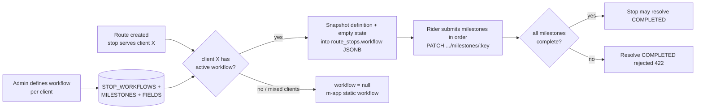

# Stop Workflow — Context v1

> Purpose: the shared understanding of how this module works **today**. This is the doc an agent or new teammate reads before touching anything in the module. Keep it current — update it whenever a feature ships.

## Overview

The stop-workflow module gives each client a **custom, form-like workflow** that riders complete at route stops: a workflow has one or more ordered **milestones**, and each milestone has one or more **fields** (image, text, number) — like a Google Form the rider fills at the door. Image fields can require an exact picture count (1, 3, 5, …) or accept an unbounded set. A stop cannot complete until every milestone in its workflow is submitted and complete. The stop detail API returns the workflow, its milestones, and its fields together with submission state.

Today no such entity exists. The rider app (m-app) ships a **static, hardcoded workflow** — the same evidence steps for every client — and client-specific proof requirements are handled downstream (e.g. the invoice module's AI checker validates POD images per SP type after the fact) rather than enforced at the stop. Clients differ in what they require at the door; the static workflow can't express that.

The module is designed against a hard product constraint: **the stop read path must stay light**. Workflow *definitions* are normalized (three small tables — workflow, milestones, fields) because they are edited rarely and read by admins, where joins are cheap. Workflow *execution* is denormalized: when a route stop is created, the resolved workflow (definition + empty submission state) is snapshotted into a **single nullable JSON field on the stop**, so the rider's hot read is one row with zero joins. A null snapshot means "no client workflow" — the m-app falls back to its static built-in workflow and the service enforces nothing.

## Actors & roles

| Actor | Interaction | Auth |
|---|---|---|
| Ops admin (portal) | Creates and edits per-client workflow definitions (milestones, fields, image counts) | Portal JWT (`providerTokenPortal`) — v1 exposes internal endpoints only; portal surface later |
| Rider (m-app) | Sees the stop's workflow, submits each milestone's fields in order; falls back to the app's static workflow when the stop carries none | Rider app surface via its backing service (internal token in v1) |
| Internal services | Resolve and snapshot workflows at route creation; submit milestones on behalf of the rider surface | Internal service token (`secretKey`) |
| Client (indirect) | Defines door-side evidence requirements; receives the resulting evidence through existing channels (POD, invoice checker) | N/A |

## Current behavior & flows

### Today (before this module)

- The m-app runs one **static workflow** for every stop, regardless of client.
- Client-specific evidence rules live in people's heads and in downstream validation (invoice AI checker expects certain images per SP type) — mismatches are caught after the visit, when re-collecting evidence is expensive or impossible.

### Target flow (specified in the PRD/TRD)

## Data owned by this module

**Today: none.** The module will own `STOP_WORKFLOWS`, `WORKFLOW_MILESTONES`, `WORKFLOW_FIELDS` (normalized definitions), `WORKFLOW_SUBMISSIONS` (append-only system of record for submitted milestone evidence), and the `workflow` JSONB column on `ROUTE_STOPS` (denormalized snapshot + submission state — the read model, rebuildable from the submissions table), as specified in [workflow-prd-trd-v1.md](./workflow-prd-trd-v1.md) and reflected in `docs/modules/erd/erd.mermaid`.

Reads from other modules: `ROUTE_STOP_SHIPMENTS` → `SHIPMENTS.client_id` at route creation (workflow resolution); client master stays in core-service (id only, no FK).

## APIs & integrations

- **Exposed today: none.** Proposed contracts live in the PRD/TRD and the collection at `Logistic Service/Internal/Workflow/`.
- **Changes contracts of:** shipment-route module — stop bodies in `Get Route by ID` gain a nullable `workflow` field; `Resolve Route Stop` gains a completion gate. See the PRD/TRD cross-module section.
- **Related:** invoice module (AI checker consumes POD images that these workflows will collect), m-app static workflow (the fallback).

## Known constraints & gotchas

- **The snapshot is the contract with the rider.** Once a stop is created, editing the client's workflow definition must not change what the rider sees mid-route — the snapshot is frozen at resolution time, by design.
- **Null means fallback, not error.** A stop with `workflow: null` is normal (client has no workflow, or the stop serves mixed clients in v1) — the m-app's static workflow applies and the service enforces no milestones on resolve.
- **Mixed-client stops fall back to static in v1.** A stop serving shipments from two clients gets no snapshot. This is a conscious v1 simplification — see Open questions.
- **Images are URLs, not binaries.** Fields store URLs produced by the existing media upload pipeline; this module never stores or serves image bytes.
- **One ACTIVE workflow per client (v1).** Resolution must be deterministic at route creation; versioning beyond active/inactive is deferred.
- **Submission state lives inside the same JSON field as the definition snapshot.** One column, one row lock per submit; fine for single-rider stops, revisit if stops ever get concurrent writers.

## Glossary

| Term | Meaning |
|---|---|
| Workflow | A client's door-side form: ordered milestones the rider completes at a stop |
| Milestone | One ordered step in a workflow; must be submitted for the stop to complete |
| Field | One input inside a milestone: `IMAGE`, `TEXT`, or `NUMBER` |
| Image count | For IMAGE fields: exact required number of pictures, or unbounded ("multiple") |
| Snapshot | The workflow definition + submission state frozen into `route_stops.workflow` at route creation |
| Static workflow | The m-app's built-in default steps, used whenever a stop's `workflow` is null |
| m-app | The rider's mobile app |
| Submission | A rider's completed milestone: field values + who/when |

## Open questions

- Mixed-client stops: fallback-to-static is the v1 behavior — long term, do we stack multiple clients' workflows on one stop?
- Milestone ordering is specced strict-sequential — revisit if riders hit real-world friction (receiver hands over items out of order).
- Portal surface for workflow authoring (v1 is internal-API only — who actually maintains definitions until then?).
- Media upload contract: which service issues the image URLs the rider submits, and are they validated?

## Changelog

- 2026-08-04 — created (v1): recorded the static m-app workflow baseline, the normalized-definitions / denormalized-snapshot design decision, and the null-fallback contract
