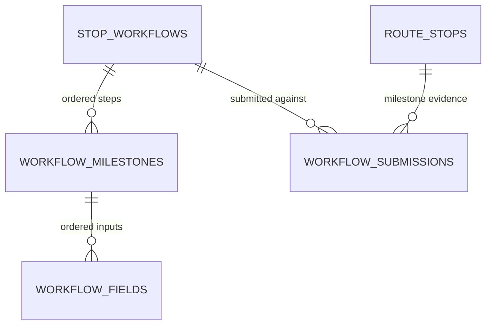

# Stop Workflows — PRD/TRD v1

---

# Part 1 — Product Requirements (PRD)

## Problem

Every client requires different proof at the door — one wants three photos of the goods at the outlet, another wants a receiver name and a quantity count — but the rider app runs one static, hardcoded workflow for all of them. Client-specific requirements are enforced only after the fact (e.g. the invoice AI checker rejecting POD images), when the rider has already left and the evidence can't be re-collected. There is no way to define, per client, what a rider must capture at a stop, and no way for the stop to refuse completion until that evidence exists.

## Context

See [workflow-context-v1.md](./workflow-context-v1.md). This module rides on the shipment-route module ([route-prd-trd-v1.md](../shipment-route/route-prd-trd-v1.md)): workflows attach to route stops and gate stop completion. Why now: routes give stops a first-class lifecycle for the first time — the natural moment to attach per-client door-side requirements to them.

## Users & jobs

| User | Job |
|---|---|
| Ops admin | Define a client's door-side form once: milestones in order, fields per milestone, image counts |
| Rider (m-app) | Open a stop, see exactly what this client requires, capture it step by step, complete the stop |
| Internal services | Resolve the right workflow onto each stop at route creation; validate submissions |
| Client (indirect) | Get consistent, complete evidence at every stop without training every rider on their rules |

## Scope

### In scope
- Normalized workflow definitions: `STOP_WORKFLOWS` → `WORKFLOW_MILESTONES` → `WORKFLOW_FIELDS` (three small tables; admin-side, cold path).
- Denormalized execution: a single nullable `workflow` JSONB column on `ROUTE_STOPS` — the resolved definition + submission state snapshotted at route creation. Zero joins on the rider's stop read.
- Null-fallback contract: `workflow: null` → the m-app uses its static built-in workflow; the service enforces no milestones.
- Field types `IMAGE` | `TEXT` | `NUMBER`; image fields with exact count (1/3/5/…) or unbounded multiple.
- Milestone submission API with sequential enforcement and field validation.
- Durable submission records: every completed milestone writes an append-only `WORKFLOW_SUBMISSIONS` row (the system of record for evidence), in the same transaction as the snapshot update.
- Stop-completion gate: a stop with a workflow cannot resolve `COMPLETED` until all milestones are complete.
- Internal CRUD API for definitions (collection: `Logistic Service/Internal/Workflow/`).

### Out of scope
- Portal authoring UI (v1 is internal-API only; mockup ships with the portal version).
- Rider-app implementation of rendering/submission (the m-app consumes the contract; its build is separate work).
- Additional field types (signature, barcode scan, geo-fence, boolean) — the `type` enum is extensible by design.
- Multi-workflow stacking on mixed-client stops (v1: mixed-client stops fall back to static — see Key decisions).
- Workflow versioning beyond active/inactive (one ACTIVE workflow per client in v1).
- Image upload/storage pipeline — fields store URLs from the existing media flow; bytes never touch this module.
- Analytics dashboards over milestone timings (timestamps are captured; reading them is a later feature).

## Requirements

1. A client has 0+ workflow definitions; every workflow targets exactly one `stopType` (`PICKUP` | `DROP_OFF`) — it gates pickup stops or drop-off stops, **never both** — and a client has at most **one ACTIVE workflow per stop type** at a time (so one pickup and one drop-off workflow may run side by side). A workflow has 1+ ordered milestones; a milestone has **0+** ordered fields — a milestone with no fields is a **confirmation-only checkpoint**: the rider slides to confirm and the submission records only the timestamp.
2. Field `type` is `IMAGE` | `TEXT` | `NUMBER`. `IMAGE` fields carry either an exact required count (`imageCount: N`) or unbounded multiple (`multiple: true`, min 1). `TEXT`/`NUMBER` may carry optional bounds (max length / min / max) in `config`.
3. At route creation (and add-stops), each stop resolves a workflow: if all shipments on the stop belong to one client and that client has an ACTIVE workflow **whose `stopType` matches the stop's type**, its full definition plus empty submission state is snapshotted into `route_stops.workflow`; otherwise `workflow` is `null`.
4. `workflow: null` means the m-app static workflow applies — the service enforces no milestone gate on that stop.
5. The snapshot is frozen: later edits to the definition never change in-flight stops.
6. Milestones are submitted in `sequence` order; submitting milestone N+1 while N is incomplete is rejected.
7. A submission is validated against the snapshot: all required fields present, types correct, image URLs count matches `imageCount` exactly (or ≥ 1 when `multiple`), bounds respected. Validation failures reject the whole submission. A fieldless milestone submits `values: {}` — there is nothing to validate, only the confirmation to record.
8. A completed milestone records `submittedAt` and `submittedBy` and cannot be resubmitted (`409`) — evidence is append-only in v1. Every accepted submission is durably persisted as a `WORKFLOW_SUBMISSIONS` row (stop, workflow, milestone key, values, who, when) in the same transaction as the snapshot update — the submissions table is the system of record; the snapshot is the read model. `submitted_at` is set **server-side** at acceptance (rider clocks are not trusted); for a fieldless milestone that row (empty `values`) *is* the evidence — proof the rider confirmed the checkpoint at that moment.
9. A stop with a non-null workflow cannot resolve `COMPLETED` while any milestone is incomplete (`422`); resolving `FAILED`/`SKIPPED` is allowed regardless, and partial submissions are retained for audit.
10. The stop detail (route detail stop body) returns the whole snapshot — workflow, milestones, fields, values, per-milestone status — in the same single read as the rest of the stop.
11. `IMAGE` values are URLs from the existing media pipeline; this module stores and returns URLs only.
12. Deleting is soft: workflows deactivate (`INACTIVE`), never hard-delete, so historical snapshots stay interpretable.

## Edge cases & failure states

- **Definition edited mid-route:** snapshot unaffected (Req 5); the next created route picks up the new definition.
- **Workflow deactivated mid-route:** same — snapshot unaffected; new routes resolve `null`.
- **Submit to a stop with `workflow: null`:** `404 MILESTONE_NOT_FOUND` — there is nothing to submit against.
- **Submit to an already-resolved stop:** `409` — evidence collection ends when the stop resolves.
- **Image count mismatch** (2 photos where 3 exact required): `422` with the failing field key; whole submission rejected, nothing partially stored.
- **Out-of-order submit** (milestone 2 before 1): `409` with the expected next milestone key.
- **Stop fails/skips with partial submissions:** submissions kept in the snapshot for audit; no completion gate applies.
- **Mixed-client stop:** `workflow: null` (v1) — falls back to static; flagged in Key decisions as revisitable.
- **Client with no workflow:** every stop resolves `null`; behavior identical to today.
- **Two milestone names (or two field labels in one milestone) that generate the same key:** rejected at definition create/update time (`422`), not at run time.

## Success criteria

- A pilot client's stops carry their workflow and their riders complete it: ≥ 95% of that client's `COMPLETED` stops have all milestones complete with valid evidence (by construction — the gate makes this structural).
- Evidence disputes for the pilot client ("photo missing", "no receiver name") drop measurably against the pre-launch baseline.
- Stop detail latency is unchanged: the read stays a single row, no new joins (verifiable in query plans).
- Zero in-flight-stop mutations from definition edits (spot-check: edit a definition while a route is active, snapshot unchanged).

---

# Part 2 — Technical Requirements (TRD)

## Summary

Three small normalized tables hold per-client workflow definitions (workflow → milestones → fields), written rarely by admins where joins cost nothing. At route creation, the resolved definition is flattened into one nullable JSONB column on `route_stops` together with empty submission state; from then on the rider's read is one row with zero joins and stop completion is gated on the snapshot. Milestone submissions are deliberately written twice in one transaction: an append-only `workflow_submissions` row (the durable, queryable system of record for evidence) and the snapshot state on the stop (the fast read model). Null snapshot = m-app static workflow, service enforces nothing. Definitions are cold and normalized; execution reads are hot and denormalized; evidence is durable. That's the whole design.

```
   ADMIN (cold, rare writes)                RIDER (hot, every stop)
   ─────────────────────────                ────────────────────────
   STOP_WORKFLOWS                           ROUTE_STOPS.workflow JSONB
     └─ WORKFLOW_MILESTONES    ──snapshot──▶  { definition + state }   ── 1 row, 0 joins
          └─ WORKFLOW_FIELDS   at route         │
   (3 tables, joins OK here)   creation         ├─ null → m-app static workflow
                                                └─ non-null → milestone gate on resolve
```

## Architecture

- **Owner:** `nest-logistic-service`, new `stop-workflow` module (schema + usecases + internal controller), same layering as route/dispatch modules.
- **Definition side:** normalized CRUD over three tables; atomic create/replace of the full nested definition in one transaction.
- **Execution side:** the shipment-route module calls workflow resolution during route create/add-stops (one indexed lookup by `client_id` + `status = ACTIVE`, then the nested definition read — cold-path joins). The result is written into `route_stops.workflow` in the same transaction that creates the stops.
- **Client master** stays in core-service: `client_id` integer, no FK (house pattern), plus a frozen `client` JSONB snapshot `{id,name}` so listing workflows never fans out to core-service and a later rename in the master doesn't rewrite history. Mirrors `shipments.client` / `addresses.client`.
- **Milestone submit** validates against the snapshot (not the live definition), then in one transaction: inserts the append-only `workflow_submissions` row and updates the stop's snapshot state. Either both happen or neither. The route module's resolve usecase checks the snapshot's completion before allowing `COMPLETED`.

## API contracts

Collection: `Logistic Service/Internal/Workflow/` (added in this change). Auth: bearer — internal service token or portal admin (WEB) JWT. Base: `{{baseUrlLogistic}}`.

```
POST  /v1/stop-workflows
GET   /v1/stop-workflows
GET   /v1/stop-workflows/:workflowID
PUT   /v1/stop-workflows/:workflowID
PATCH /internal/v1/routes/:routeID/stops/:stopID/milestones/:milestoneKey
```

**Create workflow** — `POST /v1/stop-workflows` (full nested definition, atomic):

```jsonc
{
  "clientID": 12,
  "name": "FORE outlet delivery",
  "stopType": "DROP_OFF",              // PICKUP | DROP_OFF — required, never both
  "status": "ACTIVE",
  "milestones": [
    {
      "name": "Arrival evidence",
      "sequence": 1,
      "fields": [
        { "label": "Outlet front photo", "type": "IMAGE", "required": true, "config": { "imageCount": 3 } },
        { "label": "Receiver name", "type": "TEXT", "required": true, "config": { "maxLength": 120 } }
      ]
    },
    {
      "name": "Handover",
      "sequence": 2,
      "fields": [
        { "label": "Goods photos", "type": "IMAGE", "required": true, "config": { "multiple": true } },
        { "label": "Quantity received", "type": "NUMBER", "required": true, "config": { "min": 0 } }
      ]
    }
  ]
}
```

A milestone's `fields` array is required but may be empty (`[]` = confirmation-only). Milestone and field **keys are system-generated** from `name`/`label` — spaces and symbols stripped, words joined camelCase ("Foto Depan Kendaraan" → `fotoDepanKendaraan`) — and echoed back in responses. Callers never supply keys; two names that collapse to the same key are rejected `422`. Renaming changes the key on the next save (definitions are cold; in-flight snapshots stay frozen).

Errors: `409` client already has an ACTIVE workflow **for that stop type** (deactivate first or send `status: "INACTIVE"`); `422` duplicate keys / empty milestones / invalid config (e.g. `imageCount` and `multiple` together).

**List** — `GET /v1/stop-workflows?clientID=&stopType=&status=` → summaries (with `client` snapshot, `milestoneCount`/`fieldCount`). All three filters are server-side and combinable; the portal's filter popover writes `clientID` + `stopType` to the URL in one atomic patch. **Detail** — `GET .../:workflowID` → full nested definition. **Update** — `PUT .../:workflowID` → full replace of the nested definition (same validation as create); in-flight snapshots unaffected.

**Submit milestone** — `PATCH /internal/v1/routes/:routeID/stops/:stopID/milestones/:milestoneKey`

```jsonc
{
  "values": {
    "outletFrontPhoto": ["https://media.dash.co/a.jpg", "https://media.dash.co/b.jpg", "https://media.dash.co/c.jpg"],
    "receiverName": "Ibu Sari"
  },
  "submittedBy": "svc-rider-bridge"
}
```

Response `200`: `submissionID` (the durable `workflow_submissions` row) plus the updated workflow snapshot (the same shape the stop detail returns). Errors: `404` stop has no workflow / unknown milestone key; `409` out-of-order (returns `expectedNext`), milestone already completed, stop already resolved; `422` field validation (missing required, wrong type, image count mismatch) with per-field errors.

**Changed contracts (shipment-route module):**
- `GET /internal/v1/routes/:routeID` — stop bodies gain `workflow` (nullable; full snapshot). Collection example updated in the same change.
- `PATCH .../stops/:stopID/resolve` — gains the completion gate: `422 WORKFLOW_INCOMPLETE` when resolving `COMPLETED` with incomplete milestones.

## Data model

Four new tables + one column on `route_stops`. ERD updated in this change — see `docs/modules/erd/erd.mermaid`.



- **`stop_workflows`** — id, `client_id` (integer, external core-service client, no FK) + `client` JSONB snapshot `{id,name}` (frozen at write time via `CoreService.getClientSnapshot`, nullable — a core-service outage must not block authoring; readers fall back to `client_id`), `name`, `stop_type` (`PICKUP`|`DROP_OFF` — the stop type this workflow gates), `status` (`ACTIVE`|`INACTIVE`, default `ACTIVE`; partial unique index: one ACTIVE per `(client_id, stop_type)`), timestamps.
- **`workflow_milestones`** — id, `workflow_id` FK CASCADE, `sequence` (unique per workflow), `key` (system-generated camelCase of `name`, unique per workflow), `name`, timestamps.
- **`workflow_fields`** — id, `milestone_id` FK CASCADE, `sequence` (unique per milestone), `key` (system-generated camelCase of `label`, unique per milestone), `label`, `type` (`IMAGE`|`TEXT`|`NUMBER`), `required` (bool, default true), `config` JSONB nullable (`{imageCount}` xor `{multiple}` for images; `{maxLength}`/`{min}`/`{max}` for text/number), timestamps.
- **`workflow_submissions`** — id, `route_stop_id` FK, `workflow_id` (soft reference — the definition is also frozen in the stop snapshot), `milestone_key`, `milestone_sequence`, `values` JSONB (`{fieldKey: value}` exactly as submitted), `submitted_by`, `submitted_at`. Unique `(route_stop_id, milestone_key)` — the constraint that makes evidence append-only. Insert-only; never updated or deleted. This is the system of record: evidence queries, client disputes, and future analytics read this table, not the stop rows.
- **`route_stops.workflow`** — JSONB, nullable (owned by this module, lives on the route module's table). The snapshot: definition + state in one document — the fast read model, rebuilt from `workflow_submissions` if ever corrupted —

```jsonc
{
  "workflowID": "…", "clientID": 12, "name": "FORE outlet delivery",
  "stopType": "DROP_OFF",
  "resolvedAt": "2026-08-04T02:15:00Z",
  "milestones": [
    { "key": "arrivalEvidence", "name": "Arrival evidence", "sequence": 1,
      "status": "COMPLETED",                    // PENDING | COMPLETED
      "submittedAt": "2026-08-04T03:04:10Z", "submittedBy": "svc-rider-bridge",
      "fields": [
        { "key": "outletFrontPhoto", "label": "Outlet front photo", "type": "IMAGE",
          "required": true, "config": { "imageCount": 3 },
          "value": ["https://…/a.jpg", "https://…/b.jpg", "https://…/c.jpg"] },
        { "key": "receiverName", "label": "Receiver name", "type": "TEXT",
          "required": true, "config": { "maxLength": 120 }, "value": "Ibu Sari" }
      ] },
    { "key": "handover", "sequence": 2, "status": "PENDING", "fields": [ /* values null */ ] }
  ]
}
```

Backward compatibility: additive — three new tables, one nullable column. Existing stops read `workflow: null` and behave exactly as today (static m-app workflow).

## Cross-module impacts

- **shipment-route:** the only consumer. Route create/add-stops call workflow resolution; `route_stops` gains the `workflow` column; stop detail and resolve contracts change as listed above. The route module's `Get Route by ID` collection example is updated with `workflow` in the same change.
- **Invoice / AI checker:** unchanged in v1, but the evidence these workflows collect is what the checker validates — a future version should align field definitions with checker expectations per SP type.
- **m-app (rider surface):** consumes the snapshot shape and the null-fallback contract; its implementation is out of scope here. Expected rendering: every milestone completes via a slide-to-confirm control — a milestone with fields requires them filled before the slide; a fieldless milestone is the slide alone (timestamp-only checkpoint).
- **Client-integration:** none — workflows are operational, not client-facing API surface.
- **ERD:** updated in this change.

## Failure modes & observability

| Codepath | Failure | Handling | Caller sees |
|---|---|---|---|
| Workflow resolution at route create | Definition read fails | Route creation proceeds with `workflow: null`, warn-logged | Route created; stop falls back to static |
| Milestone submit | Validation failure | Whole submission rejected, nothing stored | `422` with per-field errors |
| Milestone submit | Submission-row insert fails mid-transaction | Snapshot update rolls back with it — no half-saved evidence | `500`; retry-safe (unique index makes replays idempotent-safe: duplicate → `409`) |
| Milestone submit | Out-of-order / resubmit / resolved stop | Rejected | `409` with `expectedNext` / state |
| Stop resolve `COMPLETED` | Milestones incomplete | Rejected | `422 WORKFLOW_INCOMPLETE` with pending keys |
| Definition update | Duplicate keys, bad config | Transaction rolled back | `422` per-item errors |

- Metrics: stops resolved with vs without workflow (fallback rate — a rising fallback rate for a client that *has* a workflow means resolution is silently failing), submissions by outcome (ok / validation-fail / order-fail), milestone completion latency (`submittedAt` deltas — per-milestone dwell, feeds the route module's analytics style).
- Logs: every submit (route code, stop id, milestone key, outcome), every resolution decision at route create (client, workflow id or null-reason: `NO_WORKFLOW` | `MIXED_CLIENTS` | `RESOLUTION_ERROR`).
- Alert candidate: any `RESOLUTION_ERROR` — the fallback masks it from riders, so only the log/metric surfaces it. This is the one silent-failure risk in the design; the null-reason field exists precisely so it is loggable and countable.

## Security & permissions

- v1 endpoints are internal-token only.
- Submitted values are evidence (photos of premises, receiver names — PII); same handling rules as shipment PII. Image URLs must point at the trusted media host (validate host allowlist at submit) so the snapshot never stores arbitrary user-supplied URLs.
- Definition inputs validated at the DTO boundary: enum types, config schema per type, sequence integrity. Keys are never accepted from callers — they are generated server-side (camelCase of the name/label) and checked for collisions.

## Rollout

1. **Increment 1:** definitions — migration (3 tables) + CRUD endpoints at `/v1/stop-workflows`. Shipped without a feature flag (product decision 2026-08-05); the tables are inert without consumers. **Shipped 2026-08-05** together with the portal authoring UI (react-logistic-web, Master → Workflows), pulled forward from Increment 3.
2. **Increment 2:** execution — `route_stops.workflow` column + resolution at route create + submit endpoint + resolve gate. The route module's flag gates route creation itself, so this composes with `ENABLE_ROUTE_MODULE`. Resolution matches the stop's type against the client's ACTIVE workflow of that `stopType`.
3. **Increment 3 (separate version):** portal authoring UI + mockup; m-app rendering ships on the app's own train.

Rollback (Increment 1): the definition tables and endpoints are inert without the execution increment. No backfill anywhere.

## Testing strategy

- **Unit:** definition validation (duplicate keys, `imageCount` xor `multiple`, empty milestones), snapshot builder (definition → snapshot with empty state), submission validator per field type (required/missing, type mismatch, exact count, `multiple` min 1, bounds), sequential-order check, completion-gate derivation.
- **Integration:** create definition → create route for that client → snapshot present and frozen (edit definition, assert snapshot unchanged) → submit milestones in order (out-of-order rejected) → resolve blocked at `422` until complete → resolve `COMPLETED` passes. Mixed-client stop → `workflow: null`. Client without workflow → null. `FAILED` resolve with partial submissions retained.
- **Contract:** responses match the collection examples in `Logistic Service/Internal/Workflow/` and the updated `Get Route by ID` example (success + failure per endpoint).

## Key decisions & deferred choices

- **Normalized definitions, denormalized execution** (user decision, 2026-08-04): definitions in three tables where admin joins are cheap; execution as a single nullable JSONB snapshot on the stop so the rider's hot read is one row, zero joins.
- **Null = m-app static fallback** (user decision): absence of a workflow is a first-class state, not an error — makes rollout safe (everything starts null) and keeps mixed-client stops functional.
- **Mixed-client stops → null in v1** (default taken after review question was dismissed; revisitable): degrades to the static workflow rather than guessing which client's rules apply. Cost: a client's custom requirements are not enforced on shared stops until multi-workflow stacking lands.
- **Strict sequential milestones** (default taken after review question was dismissed; revisitable): matches "submitted and complete in order", one-comparison enforcement; loosen to any-order-all-required if field reality demands.
- **Submission state inside the snapshot document** — one column, one row-lock per submit; acceptable because exactly one rider works a stop. Revisit only if stops gain concurrent writers.
- **Dual-write for submissions** (user decision, 2026-08-04): the append-only `workflow_submissions` table is the durable system of record; the snapshot state is a read-model materialization of it. Both are written in one transaction, and the snapshot can be rebuilt from the table. Evidence never lives only inside a mutable stop row.
- **Append-only evidence** (no resubmission of completed milestones) — disputes need trustworthy evidence; edits would undermine it. A correction flow is a future feature, not an overwrite.
- Left to the implementing engineer: partial-unique-index mechanics for one-ACTIVE-per-client, Drizzle schema details, snapshot JSONB update strategy (full-document write vs `jsonb_set`) — within the constraints above.

## Open questions

- Multi-workflow stacking for mixed-client stops — product priority?
- Workflow authoring surface: portal UI timeline, and who maintains definitions via raw API until then?
- Media pipeline contract: which service issues image URLs, and should submit verify the URLs resolve (HEAD check) or trust the allowlist?
- Should milestone timings feed a dashboard (per-milestone dwell is capturable today from `submittedAt` deltas)?
- Field-type roadmap: signature and barcode-scan are the obvious next types — confirm before the m-app hardcodes assumptions.

## Changelog

- 2026-08-05 — added `stop_workflows.client` JSONB snapshot `{id,name}` (house pattern, fetched via `CoreService.getClientSnapshot` at create/update, nullable + best-effort) so the list shows client names without fanning out to core-service; portal list replaced the numeric Client ID column with the client name and gained a shipments-style filter popover (client + stop type, server-side, URL-persisted)
- 2026-08-05 — fieldless milestones (product decision): a milestone may have **0 fields** — a confirmation-only checkpoint the rider completes with a slide-to-confirm; the submission row (empty `values`) is the timestamp record, `submitted_at` set server-side (Req 1, 7, 8 updated; builder starts new milestones fieldless with a "confirmation only" banner)
- 2026-08-05 — keys are system-generated (product decision): callers no longer supply milestone/field keys; the service derives them from `name`/`label` as camelCase with spaces/symbols stripped ("Foto Depan Kendaraan" → `fotoDepanKendaraan`); name collisions reject `422`; collection examples updated
- 2026-08-05 — added `stopType` (`PICKUP` | `DROP_OFF`, required): a workflow gates exactly one stop type, never both; one-ACTIVE-per-client became one-ACTIVE-per-`(client, stop_type)`; resolution (Req 3) matches the stop's type; collection examples updated
- 2026-08-05 — Increment 1 implemented in `nest-logistic-service` + portal authoring UI in react-logistic-web (Master → Workflows): endpoints moved to `/v1/stop-workflows` (internal *and* portal admin JWT), `ENABLE_STOP_WORKFLOWS` flag dropped (both product decisions); collection failure examples aligned to the service envelope (`status: "Failed"`, `error` string)
- 2026-08-04 — created (v1 draft) after /plan-eng-review consult: normalized definitions (3 tables) + single nullable JSONB snapshot on `route_stops` with m-app static fallback (user decision); sequential milestones and mixed-client-null defaults flagged as revisitable; ERD + `Logistic Service/Internal/Workflow/` collection added in the same change
- 2026-08-04 — submitted data made durable (user decision): added append-only `WORKFLOW_SUBMISSIONS` table (unique per stop+milestone) as the system of record, written in the same transaction as the snapshot update; snapshot demoted to rebuildable read model (Req 8, Summary, Architecture, Data model updated)
