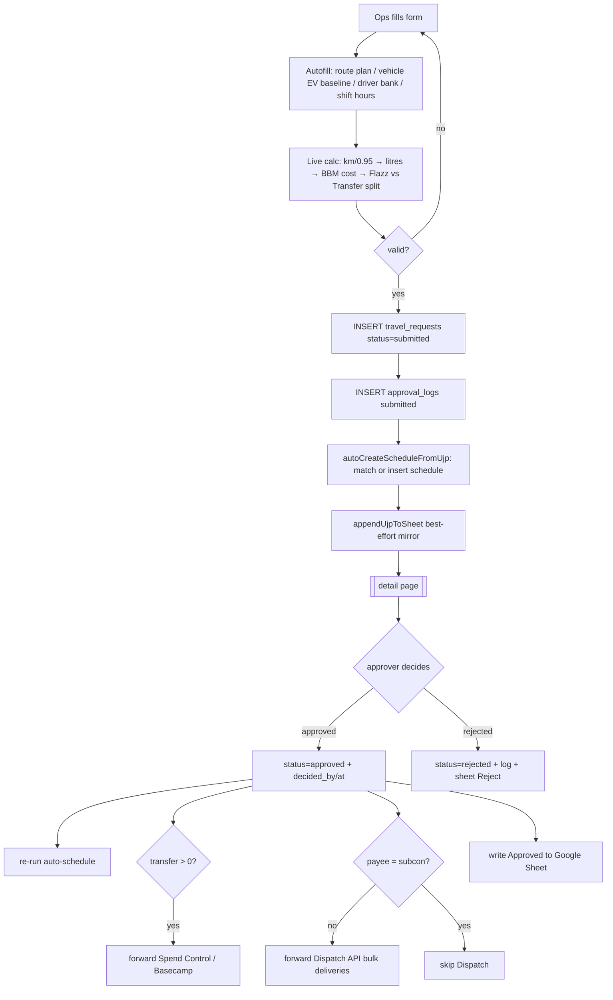

# UJP (Running-Cost Transport Request) — Context v1

> Purpose: the shared understanding of how **UJP creation** works **today** in `logisticdash`, so we can port it into `react-logistic-web` without re-deriving the money math or the side-effects. Read this before touching the PRD/TRD.

## Overview

**UJP** (*Usulan Jasa Pengangkutan*) is a per-trip **running-cost transport request**: an ops user proposes a single delivery trip and its cost (fuel, tolls, parking, loading, meal money, driver bank details, route, and cargo). Finance/manager approves it; on approval it fans out to Spend Control (Basecamp), the Dispatch API, and a Google-Sheet mirror. It is the document that authorizes a driver's *uang jalan* (trip cash) and books the trip's cost into the margin report.

UJP is owned today by **`logisticdash`** — a Lovable/Vite + **Supabase** app where the browser writes the database directly under RLS. There is **no dedicated `ujp` table**: a UJP is a row in the generic **`travel_requests`** table, which had ~40 "running-cost" columns bolted onto it. The `ujp_*` tables are only master/lookup data.

`react-logistic-web` (the main REST-based logistics console) currently only **consumes** UJP as a **CSV import** into the 4W shipment wizard (`CreateShipment4WModal.tsx` → `direct4wStops.ts`). It has no native UJP creation. This module exists to move UJP creation into that console — which means the write path and side-effects must move behind a REST backend (see the PRD/TRD).

## Actors & roles

| Actor | Interaction | Auth |
|---|---|---|
| Ops user (requester) | Fills the create form and submits a UJP; can edit/cancel while `submitted`/`draft` | Supabase auth; RLS ties inserts to `requester_id = auth.uid()` |
| Approver (finance / manager / owner) | Approves/rejects on the detail page; approval forwards to Spend Control + Dispatch | `canApproveUjp(roles)` = `owner \| manager \| finance` |
| Owner | Can revert an approved/rejected decision back to `submitted` | role `owner` |
| Driver / Subcon vendor | The payee of the *uang jalan* — bank details captured on the UJP | N/A (data only) |
| Downstream systems | Spend Control (Basecamp), Dispatch API (`api.dashelectric`), Google Sheets | service creds |

## Current behavior & flows

The create screen is **one long scrolling form** (`src/routes/ujp.pengajuan.new.tsx`, ~2,700 lines) — not a wizard — with heavy cross-field autofill and a live running-cost recompute. Sections, in order: Informasi Pengajuan → Pilih Rute (route plan / master routes) → Kendaraan & Driver (Driver | Subcon toggle) → Layanan & Shift → Rute & Jarak (map picker, multidrop) → Ring (conditional) → Biaya Operasional → Detail Pengiriman → Total, plus an optional **Combine** that saves a second linked request.



### The running-cost formula (source of truth: `src/lib/ujp-calculations.ts`)

```
totalKmWithMargin = kmYangDiajukan / 0.95          # 5% margin buffer
estimasiBbmLiter  = baseline > 0 ? round((totalKmWithMargin / baseline) * 10) / 10 : 0
computedBbmCost   = round(estimasiBbmLiter * hargaBbm)
totalBbmCost      = bbmFixOverride !== null ? bbmFixOverride : computedBbmCost

flazzComponent    = totalBbmCost + tollFlazz + parkirTapMachine
manualComponent   = parkirManual + biayaBongkarMuat + biayaLainLain + uangMakan

if eMoney.trim().toLowerCase() === "no":
    totalUangJalanFlazz    = 0
    totalUangJalanTransfer = flazzComponent + manualComponent
else:
    totalUangJalanFlazz    = flazzComponent
    totalUangJalanTransfer = manualComponent
```

- **`bbmFixOverride`**: a route-plan destination with `is_flexible_bbm = false` locks BBM to its `bbm_fix_amount`; else ICE with a positive `route_cost_configs.bbm` uses that; else `null` (compute from km × baseline × harga).
- **EV**: `baseline = 1 / konsumsi_per_km`, `hargaBbm = harga_energi` (from `vehicle_cost_configs`).
- **Subcon**: 100% manual transfer — `totalUangJalanFlazz = 0`, `totalUangJalanTransfer = nominalTransfer`.
- `estimatedAmount = subcon ? nominalTransfer : flazz + transfer`.

### Two side-effects fire at **create** time (before approval)

1. `autoCreateScheduleFromUjp()` — idempotent: match an existing unlinked `schedules` row by driver+date+shift and patch it, else insert one linked by `ujp_id`. Subcon skips driver matching and stamps `subcon_vendor_id`/`subcon_body_type`. Ring is guessed via `suggestRingIdForClient` for PER_RING clients.
2. `appendUjpToSheet()` — best-effort Google-Sheet mirror, gated by an app setting.

Dispatch API and Spend Control forwards fire only at **approve** time.

## Data owned by this module

**Today (in `logisticdash`):**

- **`travel_requests`** — the UJP record (generic base + running-cost columns): identity (`reference_id`, `tanggal_delivery`, `nama_ops_team`, `nama_project_client`), unit/payee (`plat_nomor`, `jenis_unit`, `e_money`, `payee_type` `driver|subcon`, `subcon_vendor_id`, `nama_driver`, bank details), service (`tipe_layanan`, `tipe_pengiriman`, `shift`, `jam_mulai/selesai`), route/geo (`origin`, `destination`, `*_address/lat/lng`, `origin_is_depot`), km/cost (`km_yang_diajukan`, `km_antaran`, `baseline`, `harga_bbm`, `total_km_with_margin`, `estimasi_bbm_liter`, `total_bbm_cost`, `toll_flazz`, `parkir_tap_machine`, `parkir_manual`, `biaya_bongkar_muat`, `biaya_lain_lain`, `uang_makan`, `total_uang_jalan_flazz/transfer`), cargo (`sender_*`, `receiver_*`, `item_*`, `bobot`, `service_type`), `ring_id`, `combine_of_request_id`, plus `delivery_legs jsonb` and `extra_drops jsonb`.
- **`approval_logs`** — append-only audit: `{ travel_request_id, actor_id, action(submitted|approved|rejected), note, created_at }`.
- **Status enum** `travel_request_status`: `draft | submitted | approved | rejected | dibatalkan`.

**Master/lookup tables:** `ujp_ops_teams`, `ujp_project_clients`, `ujp_emoney_options`, `ujp_service_types`, `ujp_delivery_types`, `ujp_shifts`, `ujp_route_plans` (+ `ujp_route_destinations`, `..._vehicles`, `..._drivers`).

**Read from other modules:** `clients`, `routes` + `route_cost_configs`, `vehicles` + `vehicle_cost_configs`, `drivers`, `subcon_vendors`, `client_tariff_configs` + `tarif_ring` (decides whether a ring is required), and it writes `schedules`.

## APIs & integrations

- **Exposed today: none as REST** — the FE talks straight to Supabase (`supabase.from("travel_requests")…`) under RLS. See `src/hooks/useUjp.ts` (`useCreateRequest`, `useDecideRequest`, `useRevertRequest`, `useCancelRequest`) and `src/hooks/useUjpMaster.ts` (all master lookups + date-effective cost-config resolution).
- **Server functions** (`src/lib/ujp-sheet.functions.ts`): `appendUjpToSheet`, `upsertUjpToSheet`, `updateUjpSheetDecision` → Google-Sheets connector, gated by `ujp_sheet_mirror_enabled`.
- **External forwards on approve:** `sendUjpToSpendControl` → Basecamp; `sendUjpToDispatch` → `api.dashelectric` bulk deliveries (**skipped for subcon**).
- **Maps:** Mapbox server fns (`getDrivingDistance`, `getMultiDrivingDistance`) for the picker + multidrop legs.

## Known constraints & gotchas

- **A UJP is physically `travel_requests`.** A clean reimplementation should model a real `ujp` entity (+ normalized `ujp_extra_drops` / `ujp_delivery_legs` if desired, currently JSONB).
- **The money formula must match exactly.** Numbers reconcile against existing UJPs and the Google Sheet; any drift breaks the margin report. Port `ujp-calculations.ts` verbatim.
- **Side-effects run client-side today.** In a REST world they must move server-side (schedule, sheet, dispatch, spend-control) — the FE cannot be trusted to orchestrate money.
- **Ring is conditional.** The ring picker appears only if the client has an **active `PER_RING` `client_tariff_configs`** row on the delivery date; when shown it is required. `suggestRingId` (in `src/lib/ring-match.ts`) guesses from the destination address via a keyword map and **returns null when ambiguous** — it never guesses.
- **e-money `"no"` inverts the split** — the entire Flazz component moves to Transfer. Easy to miss.
- **Combine** creates a *second* `travel_requests` row linked by `combine_of_request_id`.

## Glossary

| Term | Meaning |
|---|---|
| UJP | Usulan Jasa Pengangkutan — a per-trip running-cost transport request |
| Uang jalan | Trip cash advanced to the driver, split into Flazz + Transfer |
| Flazz | e-money card component (BBM + toll + tap-machine parking) |
| Transfer | manually-transferred component (manual parking + loading + misc + meal) |
| Baseline | fuel/energy efficiency — km/L (ICE) or km/kWh (EV) |
| Ring | client tariff zone; billing rate per ring/trip for PER_RING clients |
| Payee | who receives the uang jalan — `driver` (internal) or `subcon` (vendor) |
| Combine | a second linked trip created from one submission |

## Open questions

- Where does the UJP entity live in the REST world — a native `nest-logistic-service` module, or Supabase-behind-a-gateway for Phase 0? (Resolved in the PRD/TRD as gate **G1**.)
- Migrate historical `travel_requests` UJPs, or keep them read-only in `logisticdash`? (Gate **G2**.)
- Keep the Google-Sheet mirror once native list/detail exist? (Gate **G3**.)

## Changelog

- 2026-09-01 — created; captured the `logisticdash` UJP creation flow, formula, and side-effects ahead of the react-logistic-web port.
