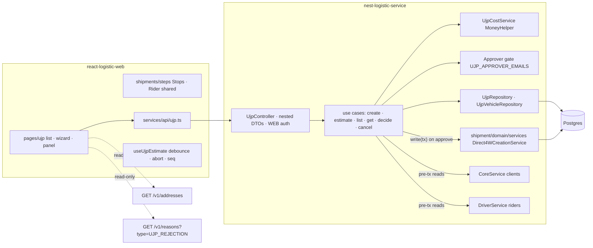
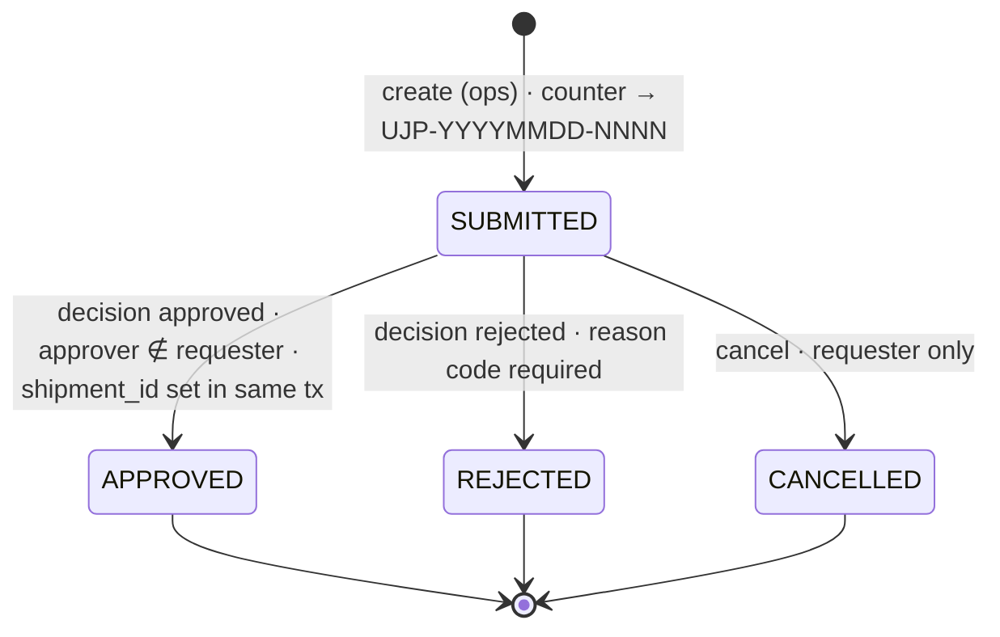
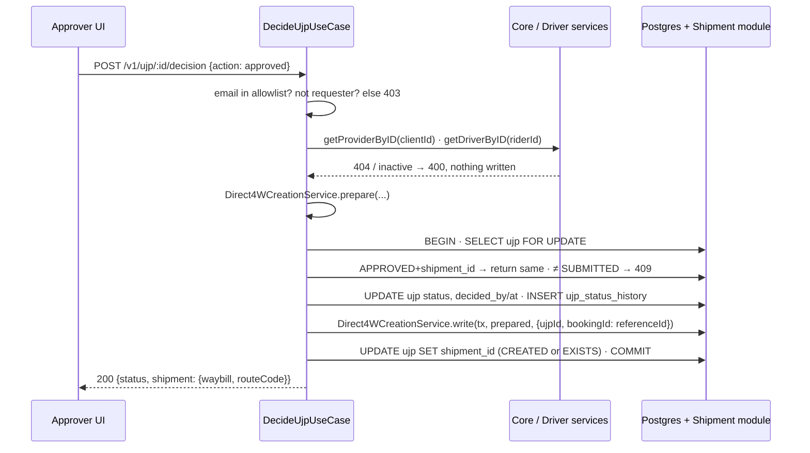

# UJP Native in react-logistic-web — PRD/TRD v2

> Port the **UJP** (*Usulan Jasa Pengangkutan*, the per-trip running-cost request that authorizes a driver's *uang jalan*) from the Supabase app `logisticdash` into the logistics console. **Approving a UJP creates the DIRECT_4W shipment in the same transaction.** This version replaces v1 after the engineering and design reviews; what changed is listed in the changelog. Background stays in [ujp-context-v1.md](./ujp-context-v1.md); architecture diagrams live in [ujp-hld-v1.html](./ujp-hld-v1.html); the UI is demonstrated in [ujp-flow-simulation-v1.html](./ujp-flow-simulation-v1.html) and [ujp-prototype-v1.html](./ujp-prototype-v1.html).

---

# Part 1 — Product Requirements (PRD)

## Problem

Ops creates UJPs in a separate Supabase app, then hand-carries the approved result into the console as a CSV import for the 4W shipment wizard. The round-trip is slow and lossy (client and coordinates are dropped, dates re-parsed), the money math and reference numbering run in the browser, the list silently caps at 1,000 rows, and approval forwards to a Google Sheet, Basecamp and the old two-wheel dispatch API. There is no single place to see a request's cost, approval trail and the shipment it became.

## Context

The console is the system of record for shipments, routes and dispatch. In this stack the shipment *is* the dispatch and the route *is* the schedule, so most of the old app's side-effect scaffolding has nothing left to do. The 4W creation path already exists, is transactional and idempotent, and already accepts an (unpersisted) "imported from UJP" flag and a "dari UJP" vehicle block.

## Users and jobs

| User | Job | Sees |
|---|---|---|
| Ops requester | Propose one trip and its cost; know when it is approved | Queue of their requests with age; a 5-step wizard with a live total; the panel with "Menunggu persetujuan finance" |
| Finance approver (allowlisted) | Authorize the cash and, by the same click, the trip | Money first, then the shipment that approval will create, full bank details, Setujui & buat shipment / Tolak |
| Other ops user | Look up a request | Same panel, account number masked, total hidden, no actions |
| Driver (via driver app) | Run the route | The DIRECT_4W route created on approve; nothing UJP-specific |

## Scope

### In scope (Phase 1, one release train)
- **Create** a UJP: Info → Rute → Biaya → Driver → Review, with a server-computed live estimate.
- **Queue list** with status tabs and counts, age chips, URL-backed filters, server-side search and pagination.
- **Detail / approval panel** with approve, reject (reason code required), cancel (requester only), audit history, masking for non-parties.
- **Approve creates the DIRECT_4W shipment** (shipment, route, stops, links) in the decision transaction, and links it back (`shipments.ujp_id`).
- **Masters reused, not rebuilt:** clients (core service), drivers (driver service), lanes read-only from `addresses`, reasons (`type = UJP_REJECTION`). One new master: `ujp_vehicles` (SQL-seeded).
- Deprecation banner on the existing CSV UJP import in the 4W wizard.

### Out of scope (with the reason)
- Google Sheet mirror: the native list/detail replaces it; revisit only if finance asks after a month.
- Basecamp / Spend-Control forward: separate integration with its own credentials.
- Schedule auto-create: the route created on approve is the schedule.
- Combine (second linked UJP): multi-drop stops cover the common case.
- Revert of a decision: a live shipment exists after approve; reversal is shipment cancellation with reason codes.
- Edit after submit: cancel and "Buat ulang dari UJP ini" keep the audit trail honest.
- Ring / PER_RING tariff: billing-side; no tariff tables in this service.
- Route-plan master and per-lane cost presets: lanes come from `addresses`; presets are a follow-up once cost typos are observed.
- Subcon vendor master, vehicle admin UI, JWT role for approvers, historical import from `logisticdash`, CSV-import removal, dark theme: recorded follow-ups.

## Requirements

### Create
1. A signed-in console user can submit a UJP; it persists as `SUBMITTED` with a history row and a **server-assigned** reference `UJP-YYYYMMDD-NNNN` (daily counter, gap-free, unique).
2. The wizard has five steps with **forward-only dependencies**: Info (client, tanggal kirim, tim ops, layanan, tipe pengiriman, shift, jam) → Rute (lanes → stops, km) → Biaya (payee, vehicle, e-money, cost lines) → Driver (rider, rekening, cargo) → Review.
3. **Rute:** lanes are searched from `addresses` for the chosen client; multi-drop allows several lanes sharing one origin; selected lanes become one pickup and N drops with default workflows; `distance_km_calculated` = lane distance (single) or sum of lane distances labelled "estimasi" (multi); `km_yang_diajukan` is prefilled from it, editable, required. Manual stop edits show a banner and a "Reset dari lane" action. Empty search offers "Tambah di Alamat" and "Isi manual".
4. **Biaya:** picking a plate fills baseline and energy price from `ujp_vehicles`, locked until edited (then tagged "diubah manual"); "Override BBM" is a switch that reveals a fixed-BBM field. Money inputs use a `MoneyInput` (Rp adornment, id-ID separators, integer rupiah, empty → 0 on blur); km uses `KmInput` (1 decimal). Biaya lain-lain > 0 requires a justification.
5. **Subcon payee:** the vehicle-cost and cost-line block is disabled in place with the text "Tidak dipakai untuk subcon"; `nominal_transfer` becomes the single required money field; typed values are preserved when toggling back; plate and unit stay required.
6. **Live estimate** comes only from `POST /v1/ujp/estimate` (debounced 300 ms, previous request aborted, out-of-order responses discarded). While pending the amount dims; when inputs changed after the last answer it shows "Estimasi belum diperbarui"; on failure "Estimasi gagal" with "Coba lagi" and Lanjut/Ajukan disabled. The Review step re-checks once and gates Ajukan on a fresh answer.
7. **Driver:** rider search is limited to active DRIVER talent; a unique exact match auto-selects; bank fields prefill from the driver record (or are typed for subcon, titled "Rekening subcon").
8. **Review:** hairline sections with an "Ubah" link per step, exactly one Flazz/Transfer tile row, total at display size, a "Kelengkapan" text line.
9. Submit closes the modal, shows a toast with the reference and "Lihat", switches the queue to Menunggu and opens the panel on the new row. Double-submit is impossible (button disabled while pending).

### Queue
10. Tabs Menunggu · Disetujui · Ditolak · Dibatalkan · Semua with counts, default Menunggu; columns Ref (mono) · Client · Tgl kirim · Rute · Driver · Total (tabular) · Status · Umur; Umur chip amber > 2 days, red > 5. Filters (status, client, date range, search, page) round-trip through the URL.
11. Search covers reference, client, driver, plate, origin and destination, server-side.
12. Empty: "Belum ada pengajuan UJP" + Buat UJP; filtered-empty: "Tidak ada UJP untuk “{q}”" + Hapus filter; error: "Gagal memuat" + Coba lagi.

### Detail and decision
13. Panel order: header (mono reference + status badge; client · tanggal · diajukan oleh · umur) → Flazz/Transfer tiles + total → **"Dibuat saat disetujui"** one-line shipment preview (Direct 4W · n stops · origin → destination · Driver · plate) with "Belum dibuat", becoming a waybill link after approve → rincian biaya → rekening → stops → riwayat.
14. Footer: primary **"Setujui & buat shipment"** and outline-danger **"Tolak"** for an allowlisted approver who is not the requester; ghost **"Batalkan pengajuan"** for the requester while SUBMITTED; nothing for others.
15. **Reject** requires a reason from `GET /v1/reasons?type=UJP_REJECTION` (BIAYA_TIDAK_WAJAR, RUTE_TIDAK_SESUAI, DRIVER_TIDAK_SESUAI, DATA_TIDAK_LENGKAP, LAINNYA with mandatory note) plus an optional note; the primary is disabled until a reason is chosen.
16. **Approve** shows a loading state ("Menyetujui…", panel not closable), then a toast "UJP-… disetujui · Shipment {waybill} dibuat" with "Lihat shipment"; the panel re-fetches. A 409 (already decided) shows "Sudah diputuskan oleh {name}" and re-fetches.
17. A rejected request shows the reason and note prominently; the requester gets **"Buat ulang dari UJP ini"** which opens the wizard prefilled (new reference on submit).
18. **Masking:** anyone who is neither an allowlisted approver nor the requester sees the account number as `•••• 1234` with a lock icon and tooltip, and the nominal as "Disembunyikan". Approver and requester see the full number with "Salin".

### Cross-cutting
19. Indonesian copy set is fixed in one constants file (see §UI contract).
20. Responsive: below `sm` the step indicator becomes "Langkah n/5 · {name}" with a progress rule, the footer stacks with the estimate strip full-width above the buttons (44 px targets), the Biaya grid is one column, the map is shorter, the panel is full-width with a sticky footer.
21. Accessibility: DOM order equals visual order; Enter never advances or submits; first empty required field is focused on step entry; every input is labelled; the estimate total is an `aria-live="polite"` region; stale/error states carry text, not only color; panel has `aria-labelledby`; step indicator exposes `aria-current="step"`; axe assertions in tests.
22. Light theme only, house palette; Flazz rendered in the emerald data tone, Transfer in the accent tone.

## Edge cases and failure states

| Case | Behaviour |
|---|---|
| Two approvers click within a second | Row lock; second gets 409 "sudah diputuskan", panel re-fetches |
| Approver double-clicks | Idempotent: APPROVED with `shipment_id` returns the same result |
| Client deactivated or rider gone between submit and approve | Pre-transaction re-fetch fails → 400 with an Indonesian message; UJP stays SUBMITTED |
| Shipment write fails inside the transaction | Full rollback; UJP stays SUBMITTED; toast with message; retry works |
| Shipment with the same booking id already exists | Linked (EXISTS), never duplicated |
| Approver not allowlisted, or is the requester, or token lacks email | 403; buttons hidden client-side as a courtesy only |
| Approver allowlist empty | Fail closed: nobody can approve; startup warning |
| Delivery date before today (WIB) | Blocked at create; at approve only a warning |
| Estimate responses arrive out of order | Sequence check; an older total never overwrites a newer one |
| Estimate API down | Last good total with a stale marker; Ajukan blocked at the Review re-check |
| No lane matches the client | Empty state with "Tambah di Alamat" and "Isi manual" |
| Multi-drop lane sum over-counts the real chain | Labelled "estimasi"; km editable and required |
| Reference counter at 23:59 WIB | Day computed inside the transaction on the server |
| Client-sent totals in the payload | Ignored; server recomputes |

## Success criteria

- Ops creates UJPs in the console with **zero CSV round-trips** for onboarded 4W clients.
- A fixture of 30 real UJPs reconciles **to the rupiah** with the old app's totals.
- Approve → shipment visible in the shipments list and the driver app, end to end, for one live client without manual database edits.
- Finance's default view (all statuses, by date, searched by driver) answers in < 500 ms at 10k rows.

## UI contract

- **Anchor:** a persistent estimate strip in the wizard footer (eyebrow "Estimasi total", mono amount, Flazz/Transfer chips, stale chip), shown from Rute onward and hidden on Biaya and Review where the breakdown/tiles carry the total.
- **Components:** `FormModal size="2xl"` + `StepIndicator` (+ compact prop) · `SegmentedControl` · `SearchSelect` · `Tag` · `Switch` · `DatePicker` · `MoneyInput` / `KmInput` (new, co-located) · shared `Direct4WStopsStep` / `Direct4WRiderStep` · `RouteStopsMap` · `Hint` · `InformationBanner` · `Badge` · `Button` (primary / outline-danger / ghost / white, loading) · `SideBarModal position="right" width="md"` · `Modal width="sm" iconTone="danger"` · `TableData` + `Paginator` + hairline tabs · `EmptyState` · `Skeleton` · sonner toaster · eyebrow labels · `font-mono tabular-nums` for ids and rupiah.
- **Copy set (constants file):** Buat Pengajuan UJP · Uang jalan 4W: info, rute, biaya, driver, lalu review. · Info · Rute · Biaya · Driver · Review · Kembali · Batal · Lanjut · Ajukan UJP · Estimasi total · Flazz · Transfer · Estimasi belum diperbarui · Estimasi gagal · Coba lagi · Dihitung server · Payee & kendaraan · Biaya operasional (uang jalan) · Rincian estimasi · Tidak dipakai untuk subcon · Override BBM · dari kendaraan · diubah manual · Jarak lane (estimasi) · KM diajukan · Jumlah jarak lane, bukan rute berantai · Stops diubah manual; lane tidak lagi mengisi otomatis · Reset dari lane · Lane tidak ditemukan untuk {client} · Tambah di Alamat · Isi manual · Lane harus dari origin yang sama · Logistic · UJP · Pengajuan UJP · Buat UJP · Menunggu · Disetujui · Ditolak · Dibatalkan · Semua · Belum ada pengajuan UJP · Tidak ada UJP untuk “{q}” · Hapus filter · Gagal memuat · Menunggu persetujuan · Menunggu persetujuan finance · Dibuat saat disetujui · Belum dibuat · Lihat shipment {waybill} · Rincian biaya · Rekening driver · Rekening subcon · Salin · Disembunyikan · Hanya requester & approver dapat melihat · Stops · Riwayat · Setujui & buat shipment · Tolak · Tolak UJP · Batalkan pengajuan · Buat ulang dari UJP ini · Ubah · UJP-{ref} diajukan · UJP-{ref} disetujui · Shipment {waybill} dibuat · UJP-{ref} ditolak · Pengajuan dibatalkan · Nomor rekening disalin · Sudah diputuskan oleh {name} · UJP tidak ditemukan · Alasan belum dikonfigurasi.

---

# Part 2 — Technical Requirements (TRD)

## Summary

A native `ujp` module in **nest-logistic-service** owns the entity, numbering, money, authorization and audit; its decision use case creates the shipment through a **shared domain service extracted from the existing 4W writer**, inside one transaction. **react-logistic-web** owns presentation and input only and asks the server what the inputs cost. Diagrams: [ujp-hld-v1.html](./ujp-hld-v1.html).

## Architecture



- The UJP module imports `ShipmentModule` (which exports `Direct4WCreationService` and `ShipmentRepository`), `ReasonModule` and the global `SharedModule`. It never imports `RouteModule` (existing `forwardRef` cycle) and never injects another module's use case.
- `Direct4WCreationService` is extracted from `CreateDirect4WUseCase` as `prepare(input)` (external reads: provider, workflow resolution) and `write(tx, prepared, {ujpId?, bookingId})` (the five DB steps). The existing `POST /v1/shipments/direct-4w` becomes a thin caller; its docstring no longer claims sole ownership of route creation.

## Lifecycle



No DRAFT (the old UI never wrote one). Any transition from a terminal state → 409. Re-approving an APPROVED request with a `shipment_id` returns the same result (idempotent double-click).

## Approve transaction



Any throw inside the transaction rolls everything back; the request stays SUBMITTED. External reads happen before the transaction so no row lock is held across a network call.

## API contract (`dash-api-collections` → `Logistic Service/UJP/`, frozen first as Lane 0)

| Endpoint | Auth | Contract |
|---|---|---|
| `POST /v1/ujp/estimate` | WEB | `{ vehicle, costs, payee: {type} }` → `{ totalKmWithMargin, estimasiBbmLiter, totalBbmCost, totalUangJalanFlazz, totalUangJalanTransfer, estimatedAmount }`. Pure. |
| `POST /v1/ujp` | WEB | `CreateUjpRequestDto { header, payee, vehicle, costs, cargo, stops: Direct4WStopDto[], rider: Direct4WRiderDto }` → `{ id, referenceId }`. Server numbers, recomputes money, snapshots client and rider, stores lane ids. |
| `GET /v1/ujp` | WEB | `status · clientId · deliveryFrom · deliveryTo · search · page · limit(≤200)` → `{ data: Row[], pagination: {size, page, lastPage, total} }`; linked shipment status via LEFT JOIN; masked per caller. |
| `GET /v1/ujp/:id` | WEB | Request + `history[]` + shipment summary; masked per caller. |
| `POST /v1/ujp/:id/decision` | Allowlisted | `{ action: 'approved'|'rejected', reasonCode?, note? }`. Approve creates the shipment. Reject requires a `UJP_REJECTION` reason. |
| `POST /v1/ujp/:id/cancel` | Requester | Only while SUBMITTED. |
| `GET /v1/ujp/masters/vehicles?search=` | WEB | Plate → unit, energy type, baseline, price. |
| reused | WEB | `GET /v1/addresses?clientIds&search&limit` · `GET /v1/reasons?type=UJP_REJECTION` · `GET /v3/drivers` · `GET /v1/stop-workflows` |

Errors keep the house envelope `{ status: 'Failed', error: <message> }`; the HTTP status carries the class (400 validation, 403 gate, 404, 409 terminal state).

## Data model (migration `0093_ujp_module`, snapshot renamed to match)

| Table / column | Purpose | Key fields and constraints |
|---|---|---|
| `ujp` | the request | `id uuid pk` · `reference_id text UNIQUE` · `status text` · `client_id int` + `client jsonb` · `delivery_date date` · header fields · `payee_type` (driver/subcon) + bank fields + `nominal_transfer numeric(14,2)` · vehicle snapshot (`plate_number, unit_type, energy_type, baseline numeric(10,3), energy_price numeric(14,2), e_money`) · `source_lane_ids uuid[]` · `distance_km_calculated numeric(10,2)` · cost inputs (`km_yang_diajukan numeric(10,2)`, `bbm_fix_override`, `toll_flazz`, `parkir_tap_machine`, `parkir_manual`, `biaya_bongkar_muat`, `biaya_lain_lain`, `justifikasi_biaya_lain_lain`, `uang_makan`) · cost outputs (`total_km_with_margin`, `estimasi_bbm_liter numeric(10,1)`, `total_bbm_cost`, `total_uang_jalan_flazz`, `total_uang_jalan_transfer`, `estimated_amount`) · cargo · `stops jsonb` · `rider jsonb` · `requester_email` · `decided_by/at` · `decision_note` · `reason_code` · `shipment_id uuid UNIQUE null` · `search_text` STORED · timestamps. Indexes: GIN trgm on `search_text`, `(status, created_at DESC)`, `(client_id, delivery_date)`, `(delivery_date)`. |
| `ujp_status_history` | append-only audit | `ujp_id fk · from_status · to_status · changed_by · note · reason_code · changed_at` (shape of `shipment_status_history`) |
| `ujp_daily_counters` | numbering | `day date pk · next int`; `INSERT … ON CONFLICT (day) DO UPDATE SET next = next + 1 RETURNING next` inside the create transaction; day in Asia/Jakarta |
| `ujp_vehicles` | master (SQL-seeded) | `plate_number text UNIQUE · unit_type · energy_type ICE|EV · baseline · energy_price · active` |
| `shipments.ujp_id` | the link | `uuid null references ujp(id)`, UNIQUE, indexed; `booking_id = ujp.reference_id` |
| `reasons` (existing) | reject reasons | new `ReasonType.UJP_REJECTION` (text column, no migration) + seed rows |
| `addresses` (existing) | lanes | read-only; not changed |

Money columns are `numeric(14,2)` handled as strings through `MoneyHelper`; never floats.

## Money

Ported from `logisticdash/src/lib/ujp-calculations.ts` plus the subcon branch that lived in its form (`ujp.pengajuan.new.tsx:968-970`). One implementation, `UjpCostService`, used by `/estimate` and by create. Oracle: a committed fixture of 30 real UJPs (inputs + persisted totals) with JavaScript half-up rounding reproduced on the litre and cost steps.

```
totalKmWithMargin = kmYangDiajukan / 0.95
estimasiBbmLiter  = baseline > 0 ? round1(totalKmWithMargin / baseline) : 0     # EV: baseline = 1 / konsumsiPerKm
computedBbmCost   = round(estimasiBbmLiter × energyPrice)
totalBbmCost      = bbmFixOverride ?? computedBbmCost
flazz  = totalBbmCost + tollFlazz + parkirTapMachine
manual = parkirManual + biayaBongkarMuat + biayaLainLain + uangMakan
if payee == subcon:               Flazz = 0     Transfer = nominalTransfer
elif eMoney.trim().lower == "no": Flazz = 0     Transfer = flazz + manual
else:                             Flazz = flazz Transfer = manual
estimatedAmount = Flazz + Transfer
```

## Security

- Approver gate: `UJP_APPROVER_EMAILS` (Joi-validated, lower-cased) checked against the JWT `email` claim (present in web user tokens from the core service); missing claim → 403; empty list fails closed with a startup warning; requester ≠ approver enforced server-side. The frontend mirrors the list only to hide buttons (`REACT_APP_UJP_APPROVER_EMAILS`, "UI affordance, not a security boundary").
- Masking in the response mapper for callers who are neither allowlisted nor the requester.
- Client-sent totals ignored; server recomputes.
- Every transition writes `ujp_status_history` with actor email.

## Performance and scale

- List: STORED `search_text` under a trigram GIN index; composite indexes on the finance access paths; one count + one rows query; page/limit ≤ 200; linked shipment via a single LEFT JOIN.
- Estimate: debounced, aborted, sequence-checked; the Review re-check is the last word.
- Approve: external reads pre-transaction; lock held only for local writes.
- Numbering: one atomic upsert per create; contention limited to today's counter row.

## Frontend structure

- `src/services/api/ujp.ts` · `src/config/ujp-permissions.ts` · `src/config/logistic-api.ts` (+ `/v1/ujp` prefix) · `src/pages/ujp/index.tsx` (list on `hooks/urlState`) · `components/CreateUjpModal.tsx` · `components/ujpWizard.ts` (pure validators, payload builder, lane → stops/km mapping) · `components/useUjpEstimate.ts` · `components/useLaneOptions.ts` · `components/MoneyInput.tsx` · `components/UjpDetailPanel.tsx` · `components/UjpDecisionModal.tsx` · `copy.ts` · router entry · Sidebar entry (hardcoded nav).
- `src/pages/shipments/components/steps/Direct4WStopsStep.tsx`, `Direct4WRiderStep.tsx`: lifted from `CreateShipment4WModal` behind a regression test committed first; stop rows gain visible column headers and `aria-label`s; the 4W modal consumes them unchanged and shows the CSV-import deprecation banner.
- `StepIndicator` gains a compact prop (documented in `CLAUDE.md` §4).

## Testing

- **Unit (nest):** `UjpCostService` matrix (ICE, EV, fix override, baseline 0, e-money variants, subcon, rounding, invalid inputs) against the 30-UJP oracle; every use case branch in the decision diagram (gate, 404/400, 409, EXISTS link, reason code, history); create (counter, day rollover with injected clock, ignored client totals); list envelope; masking mapper.
- **Integration (nest, new `test.yml` with a Postgres service container, `*.integration.spec.ts` jest project):** two concurrent approves → one shipment; rollback when the shipment write throws; 20 parallel creates → unique sequential references; `shipments.ujp_id` unique. Fake `CoreService`/`DriverService`, real database.
- **Regression (mandatory):** `create-direct4w.usecase.spec.ts` unchanged plus a delegation case after the extraction; `CreateShipment4WModal` snapshot + interaction test committed before the step extraction.
- **Unit (web):** API module URL/body/envelope tests; `useUjpEstimate` (out-of-order, abort, error → stale); wizard validators and lane mapping (single, multi sum, none); list URL round-trip, empty/error states; panel button visibility per persona, masked rendering, 409 banner; axe assertions.
- **CI:** nest `test.yml` on PR (unit + integration); web `test.yml` on PR running `npm run test:ci`.
- **QA plan:** `~/.gstack/projects/dash/*eng-review-test-plan*.md` (pages, interactions, edge cases, critical paths).

## Delivery lanes

| Lane | Steps | Depends on |
|---|---|---|
| 0 · Contract | API collection `Logistic Service/UJP/`; `ReasonType.UJP_REJECTION` + seed rows | runs first |
| 1 · Shipment refactor | Extract `Direct4WCreationService` + regression spec; then `DecideUjpUseCase` + integration specs | Lane 0; decision step after Lane 2 schema |
| 2 · UJP backend | Migration 0093, seeds, module skeleton, create/estimate/list/get/cancel/masters, masking mapper, config, `test.yml` | Lane 0 |
| 3 · Web foundation | 4W modal regression test → extract steps → CSV banner → web `test.yml` | — |
| 4 · Web UJP | API module, permissions, lane hook, MoneyInput, list, wizard, panel, decision modal, router, sidebar, copy | Lane 0 contract, Lane 3 steps |
| 5 · Docs | This document, ERD update | — |

Launch Lane 0, then 1, 2, 3, 5 in parallel; Lane 1's decision step merges after Lane 2's schema; Lane 4 after Lane 3. Migration number 0093 is claimed once, by Lane 2.

## Decisions register

| # | Decision |
|---|---|
| D1 | Vertical slice, not parity with the old app |
| D2 | Shipment created on approve, inside the decision transaction; APPROVED is terminal |
| D3 | Extract `Direct4WCreationService`; both the 4W endpoint and the UJP decision call it |
| D4 | Daily counter for `UJP-YYYYMMDD-NNNN` |
| D5 | Money computed server-only; the browser uses `/estimate` (reverses v1 D1) |
| D6 | Email allowlist approver gate, server-enforced; self-approval blocked; fail closed |
| D7 | `ujp_vehicles` master, SQL-seeded, autofill with per-UJP override |
| D8 | Lift the 4W modal's Stops and Rider steps into shared components first |
| D9 | Full state machine: row lock, idempotent re-approve, pre-tx re-validation, reason codes, no DRAFT |
| D10 | Nested DTOs mirroring wizard steps; stops/rider reuse the 4W DTOs |
| D11 | Postgres service container + integration specs in a PR workflow |
| D12 | `search_text` + trigram GIN + composite indexes; LEFT JOIN shipment |
| D13 | Estimate hook: debounce, abort, sequence, stale state, Review re-check |
| D14 | Kept approve → shipment coupling after outside-voice challenge |
| D15 | Server-side masking of bank account and nominal for non-parties |
| D16 | Lanes read-only from `addresses`; no route-plan table |
| D17 | Multi-drop km = sum of lane distances as an editable, labelled estimate |
| DD1–DD14 | Footer estimate anchor · 5 forward-only steps · money-first panel with honest button copy · full state table · masking UI · queue-shaped list with age and "Buat ulang" · hairline Review and labelled stop rows · MoneyInput/KmInput · subcon disable-in-place · lane chips with same-origin rule · responsive · a11y · copy set · light only |

## Follow-ups (recorded in the dash workspace `TODOS.md`)

Retire the CSV UJP import once native UJP is adopted (TODO-20) · JWT role for approvers (TODO-21) · vehicle admin page (TODO-22) · fate of historical UJPs in `logisticdash` (TODO-23) · exception filter forwards machine-readable codes (TODO-24) · per-lane cost presets (TODO-25) · designer mockups from the sketch (TODO-26).

## Open questions

None blocking. v1's gates resolved: G1 native module (yes); G2 historical data (TODO-23, finance decides before cutover); G3 Sheet mirror (dropped, revisit on request); G4 masters (reuse existing; only `ujp_vehicles` is new).

## Changelog

- 2026-09-11 — v2 after engineering review (2026-09-10) and design review (2026-09-11). Changes from v1: scope narrowed to a vertical slice (D1); shipment link moved from Phase 3 into Phase 1 and made transactional on approve (D2/D3); formula ownership moved server-only, `/estimate` mandatory (D5, reverses v1 D1); `ujp_*` master replication replaced by existing masters plus one vehicle table (D7, D16); daily-counter numbering (D4); allowlist gate and masking (D6, D15); full UI contract added (DD1–DD14); v1 Phase 0 "Supabase behind a gateway" dropped.
- 2026-09-01 — v1 created (superseded).
