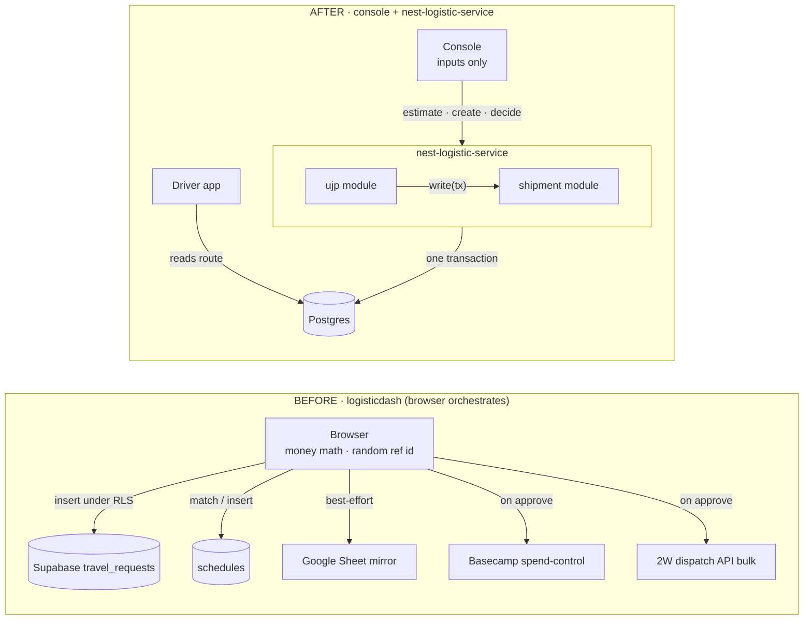
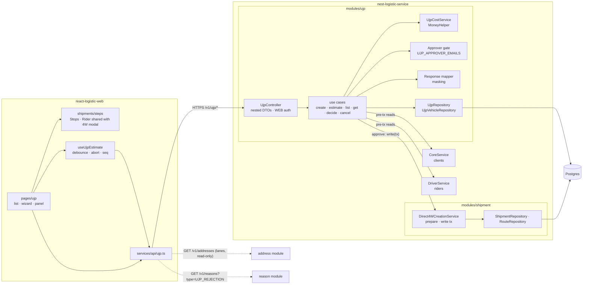
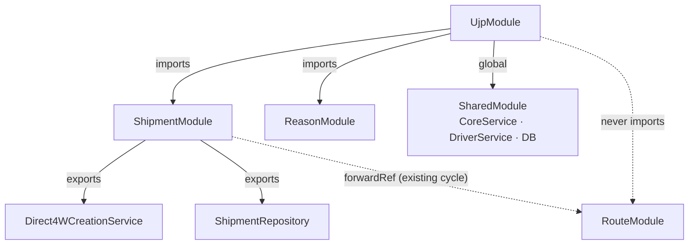
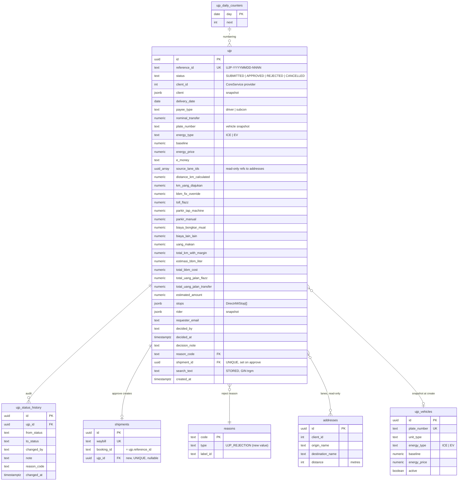
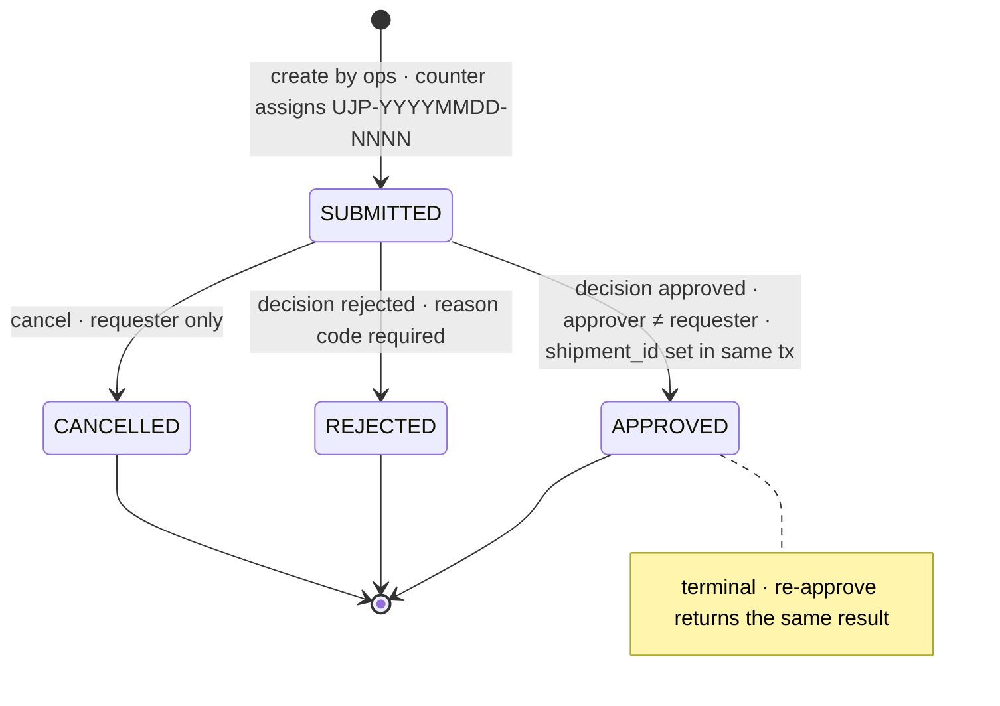
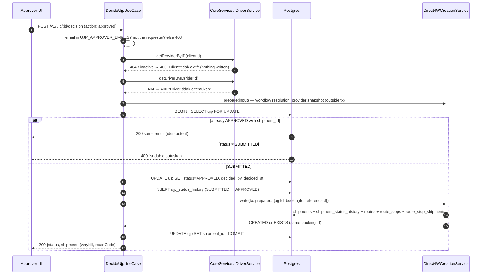
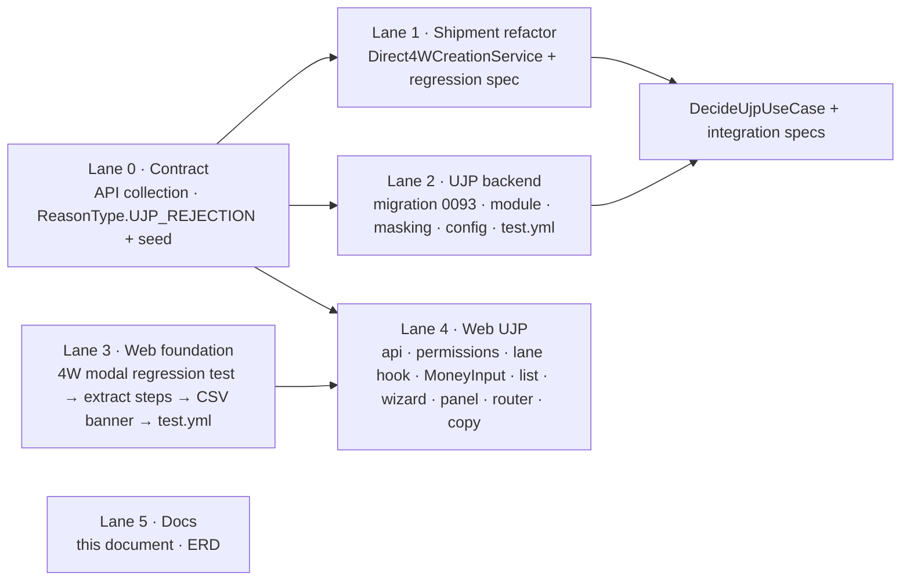

# UJP Native — TRD v2

> How the UJP (*Usulan Jasa Pengangkutan*, per-trip running-cost request) is built into **nest-logistic-service** and **react-logistic-web**, and how **approving a UJP creates the DIRECT_4W shipment in the same transaction**. Product requirements are in [ujp-prd-v2.md](./ujp-prd-v2.md). This document is the engineering contract; every diagram below renders on GitHub.

## 1. Summary

| | |
|---|---|
| Owns the entity, numbering, money, authorization, audit | `nest-logistic-service` → new module `ujp` |
| Creates the shipment | `shipment` module, through `Direct4WCreationService` extracted from the existing 4W writer, called inside the UJP decision transaction |
| Owns presentation and input only | `react-logistic-web` → `pages/ujp`, shared `Direct4WStopsStep` / `Direct4WRiderStep` |
| Money math | Server only (`UjpCostService`); the browser calls `POST /v1/ujp/estimate` |
| Masters | Clients (CoreService), riders (DriverService), lanes read-only from `addresses`, reasons (`type = UJP_REJECTION`); one new table `ujp_vehicles` |
| Numbering | `UJP-YYYYMMDD-NNNN` from `ujp_daily_counters`, atomic upsert in the create transaction |
| Authorization | `UJP_APPROVER_EMAILS` allowlist on the JWT email, server-enforced; masking for non-parties |

---

## 2. High-level design

### 2.1 Before and after



Five outbound integrations collapse into one service call. The dispatch forward becomes the in-process creation of a DIRECT_4W shipment, committed or rolled back together with the approve decision.

### 2.2 System context and components



### 2.3 Module dependency graph



Rule (repo `CLAUDE.md`): share repositories and domain services across modules, never another module's use case. `Direct4WCreationService` follows the existing precedent of `ShipmentTerminalTransitionService`.

### 2.4 Data model



Solid relations are keys or ownership; the counter relation is procedural (the create transaction upserts today's row and formats the number). Money columns are `numeric(14,2)` handled as strings through `MoneyHelper`; never floats.

### 2.5 Lifecycle



No `DRAFT` (the old UI never wrote one). Any transition from a terminal state answers 409. The decision use case takes `SELECT … FOR UPDATE` so two approvers cannot both pass the status check.

### 2.6 Approve transaction



Any throw inside the transaction rolls everything back and the request stays `SUBMITTED`. External reads happen before the transaction so no row lock is held across a network call. Idempotency is free: the shipment's booking id is the UJP reference, so a retried approve finds the existing shipment (`EXISTS`) and links it.

### 2.7 Estimate data flow

```mermaid
sequenceDiagram
  participant F as Wizard fields
  participant H as useUjpEstimate
  participant S as POST /v1/ujp/estimate
  F->>H: input change
  H->>H: debounce 300 ms · abort previous · seq++
  H->>S: {vehicle, costs, payee.type} (seq n)
  S-->>H: totals (seq n)
  H->>H: discard if seq < latest; status ok / stale / error
  H->>F: footer strip · breakdown · Review tiles
  Note over F,S: Review step fires one final estimate; Ajukan is enabled only when it matches the displayed totals
```

The browser never computes money. Create re-sends raw inputs; the server recomputes and ignores any client-sent totals.

---

## 3. API contract

Frozen first as Lane 0 in `dash-api-collections` → `Logistic Service/UJP/`.

| Endpoint | Auth | Contract |
|---|---|---|
| `POST /v1/ujp/estimate` | WEB | `{ vehicle, costs, payee: {type} }` → `{ totalKmWithMargin, estimasiBbmLiter, totalBbmCost, totalUangJalanFlazz, totalUangJalanTransfer, estimatedAmount }`. Pure; nothing written. |
| `POST /v1/ujp` | WEB | `CreateUjpRequestDto { header, payee, vehicle, costs, cargo, stops: Direct4WStopDto[], rider: Direct4WRiderDto }` → `{ id, referenceId }`. Server numbers, recomputes money, snapshots client and rider, stores lane ids. |
| `GET /v1/ujp` | WEB | `status · clientId · deliveryFrom · deliveryTo · search · page · limit (≤ 200)` → `{ data: Row[], pagination: { size, page, lastPage, total } }`. Linked shipment status via LEFT JOIN. Masked per caller. |
| `GET /v1/ujp/:id` | WEB | Request + `history[]` + shipment summary. Masked per caller. |
| `POST /v1/ujp/:id/decision` | Allowlisted | `{ action: 'approved' \| 'rejected', reasonCode?, note? }`. Approve creates the shipment (§2.6). Reject requires a `UJP_REJECTION` reason. |
| `POST /v1/ujp/:id/cancel` | Requester | Only while `SUBMITTED`. |
| `GET /v1/ujp/masters/vehicles?search=` | WEB | Plate → unit, energy type, baseline, price. |
| reused | WEB | `GET /v1/addresses?clientIds&search&limit` · `GET /v1/reasons?type=UJP_REJECTION` · `GET /v3/drivers` · `GET /v1/stop-workflows` |

Nested DTO groups mirror the wizard steps: `header` (clientId, deliveryDate, opsTeam, serviceType, deliveryType, shift, jamMulai, jamSelesai) · `payee` (type, bankName, accountNumber, accountHolder, nominalTransfer) · `vehicle` (plateNumber, unitType, energyType, baseline or konsumsiPerKm, energyPrice, eMoney) · `costs` (kmYangDiajukan, bbmFixOverride, tollFlazz, parkirTapMachine, parkirManual, biayaBongkarMuat, biayaLainLain, justifikasiBiayaLainLain, uangMakan) · `cargo` (senderName, receiverName, itemName, bobot) · `stops` and `rider` byte-identical to the 4W DTOs · `laneIds`.

Errors keep the house envelope `{ status: 'Failed', error: <message> }`; the HTTP status carries the class (400 validation, 403 gate, 404, 409 terminal state).

---

## 4. Data model details

Migration `0093_ujp_module` (drizzle-kit generate; rename `meta/0093_ujp_module_snapshot.json` to match the SQL).

| Table / column | Notes |
|---|---|
| `ujp` | Columns as drawn in §2.4. Indexes: `ujp_search_text_trgm_idx` (GIN, pg_trgm), `ujp_status_created_idx (status, created_at DESC)`, `ujp_client_delivery_idx (client_id, delivery_date)`, `ujp_delivery_date_idx`. `search_text` is a STORED generated column: lower(reference_id ‖ client name ‖ driver name ‖ plate ‖ origin ‖ destination). |
| `ujp_status_history` | Shape of `shipment_status_history` plus `reason_code`. Indexes on `ujp_id` and `changed_at DESC`. |
| `ujp_daily_counters` | `INSERT INTO ujp_daily_counters(day, next) VALUES (:day, 1) ON CONFLICT (day) DO UPDATE SET next = ujp_daily_counters.next + 1 RETURNING next`, executed inside the create transaction; `day` computed in Asia/Jakarta on the server. `reference_id` UNIQUE is the backstop. |
| `ujp_vehicles` | SQL-seeded (`src/database/seed-ujp-vehicles.sql`). Autofill only; the UJP row stores the values actually used. |
| `shipments.ujp_id` | `uuid` nullable, `references ujp(id)`, UNIQUE, indexed. Makes the existing unpersisted `importedFromUjp` flag derivable. |
| `reasons` | New `ReasonType.UJP_REJECTION` (text column, no migration) + seed rows: `BIAYA_TIDAK_WAJAR`, `RUTE_TIDAK_SESUAI`, `DRIVER_TIDAK_SESUAI`, `DATA_TIDAK_LENGKAP`, `LAINNYA` (requires note). `reasons.domain` is a liability rollup, not a filter. |
| `addresses` | Read-only; unchanged. |

---

## 5. Money

Ported from `logisticdash/src/lib/ujp-calculations.ts` plus the subcon branch that lived in its form (`ujp.pengajuan.new.tsx:968-970`). Exists once, in `UjpCostService`, used by `/estimate` and by create.

```
totalKmWithMargin = kmYangDiajukan / 0.95                       # 5% buffer
estimasiBbmLiter  = baseline > 0 ? round1(totalKmWithMargin / baseline) : 0   # EV: baseline = 1 / konsumsiPerKm
computedBbmCost   = round(estimasiBbmLiter × energyPrice)
totalBbmCost      = bbmFixOverride ?? computedBbmCost
flazz  = totalBbmCost + tollFlazz + parkirTapMachine
manual = parkirManual + biayaBongkarMuat + biayaLainLain + uangMakan
if payee == subcon:               Flazz = 0      Transfer = nominalTransfer
elif eMoney.trim().lower == "no": Flazz = 0      Transfer = flazz + manual
else:                             Flazz = flazz  Transfer = manual
estimatedAmount = Flazz + Transfer
```

Oracle: a committed fixture of 30 real UJPs (inputs + persisted totals) with JavaScript half-up rounding reproduced on the litre (1 dp) and cost (integer) steps. Money values travel as integer-rupiah strings (`MoneyHelper`).

---

## 6. Security

- **Approver gate, server-side.** `UJP_APPROVER_EMAILS` (Joi-validated, comma list, lower-cased) checked against the JWT `email` claim, which the core service puts in every web user token (`generateUserToken`). Missing claim → 403 with message; empty list fails closed with a startup warning. Requester ≠ approver enforced in the same use case. Frontend reads a mirror (`REACT_APP_UJP_APPROVER_EMAILS`) only to hide buttons.
- **Masking in the response mapper.** Callers who are neither allowlisted nor the requester get `accountNumber: "****1234"` and `nominal: null` with a `masked: true` flag; the UI renders the lock and "Disembunyikan".
- **Money never trusted from the client.** Totals in the payload are ignored.
- **Audit.** Every transition writes `ujp_status_history` with actor email, from/to, reason code, note.

---

## 7. Performance and scale

| Path | Design |
|---|---|
| List | One count + one rows query; `search_text` GIN; composite indexes on `(status, created_at DESC)`, `(client_id, delivery_date)`; tz-cast date range like `shipments`; page/limit ≤ 200; linked shipment status via one LEFT JOIN, never per row |
| Estimate | Debounced, aborted, sequence-checked in the browser; pure function on the server |
| Approve | External reads pre-transaction; row lock held only for local writes |
| Numbering | One atomic upsert per create; contention limited to one row per day |

Reference: the old list pulled every row and paginated in the browser, silently capped at 1,000 by PostgREST.

---

## 8. Frontend structure

| Area | Files |
|---|---|
| API and config | `src/services/api/ujp.ts` · `src/config/ujp-permissions.ts` · `src/config/logistic-api.ts` (+ `/v1/ujp` prefix) · `.env.example` |
| Pages | `src/pages/ujp/index.tsx` (list on `hooks/urlState`) · `components/CreateUjpModal.tsx` · `components/ujpWizard.ts` (validators, payload builder, lane → stops/km mapping) · `components/useUjpEstimate.ts` · `components/useLaneOptions.ts` · `components/MoneyInput.tsx` · `components/UjpDetailPanel.tsx` · `components/UjpDecisionModal.tsx` · `copy.ts` |
| Shared steps (Lane 3) | `src/pages/shipments/components/steps/Direct4WStopsStep.tsx`, `Direct4WRiderStep.tsx` lifted from `CreateShipment4WModal` behind a regression test; stop rows gain visible column headers and `aria-label`s; the 4W modal consumes them unchanged and shows the CSV-import deprecation banner |
| Kit extensions | `StepIndicator` compact prop (documented in `CLAUDE.md` §4); `MoneyInput` / `KmInput` co-located, lifted on second use |
| Wiring | `src/pages/index.ts` · `src/router/routes.tsx` · `src/components/layout/Sidebar.tsx` (hardcoded nav) |

Wizard: 5 steps with forward-only dependencies (Info → Rute → Biaya → Driver → Review); persistent estimate strip in the footer from Rute onward, hidden on Biaya and Review. Panel: `SideBarModal position="right" width="md"`, money first, shipment preview, breakdown, masked rekening, stops, history. Full UI contract and copy set: PRD §UI contract and the design decisions DD1–DD14.

---

## 9. Failure modes

| Code path | Failure | Test | Handling | User sees |
|---|---|---|---|---|
| decide: two approvers | race | integration spec | `FOR UPDATE` | "sudah diputuskan", panel re-fetches |
| decide: shipment insert throws | DB error | integration spec | full rollback | toast with message; UJP still SUBMITTED; retry works |
| decide: client inactive / CoreService down | 404 / timeout | unit spec | pre-tx 400 | "Client tidak aktif / layanan tidak tersedia" |
| decide: rider gone | 404 | unit spec | pre-tx 400 | "Driver tidak ditemukan" |
| decide: not allowlisted / self / no email claim | misuse or token drift | unit spec | 403 | buttons hidden; API message |
| decide: empty allowlist | misconfig | unit spec + startup log | fail closed | nobody can approve |
| decide: unknown reason code | stale FE list | unit spec | 400 | "Alasan tidak valid" |
| create: day rollover 23:59 WIB | two days' ids | unit spec (injected clock) | day computed in tx | sequential ids |
| create: client totals sent | tampering | unit spec | ignored | preview == persisted |
| read: non-party opens detail | exposure | mapper spec | masked | `•••• 1234`, "Disembunyikan" |
| estimate: out-of-order responses | slow network | hook test | abort + seq | never a stale total |
| estimate: API down | outage | hook test | last good + stale marker; Ajukan blocked at Review | "Estimasi gagal, coba lagi" |
| lanes: none for client | lane book incomplete | wizard test | manual entry via place picker | empty state + "Tambah di Alamat" |
| lanes: multi-drop sum over-counts | estimate semantics | wizard test | labelled "estimasi", km editable | hint text |
| list: 10k rows + search | scan | EXPLAIN in PR | GIN + composites | < 500 ms |
| 4W modal after extraction | regression | snapshot + interaction test first | — | identical behaviour |

Critical gaps (no test, no handling, silent): none.

---

## 10. Testing

| Layer | Coverage |
|---|---|
| Unit (nest) | `UjpCostService` matrix (ICE, EV, fix override, baseline 0, e-money variants, subcon, rounding, invalid inputs) against the 30-UJP oracle · every branch of §2.6 in `decide-ujp.usecase.spec.ts` · create (counter, day rollover with injected clock, ignored totals) · list envelope · masking mapper · POSITIVE/NEGATIVE naming, repositories mocked as plain `jest.fn()` objects |
| Integration (nest) | New `.github/workflows/test.yml` with a `postgres:16` service, `pnpm db:migrate`, jest `projects` with `*.integration.spec.ts`: two concurrent approves → one shipment; rollback when `write` throws; 20 parallel creates → unique sequential references; `shipments.ujp_id` unique. Fake `CoreService`/`DriverService`, real database |
| Regression (mandatory) | `create-direct4w.usecase.spec.ts` unchanged plus a delegation case after extraction · `CreateShipment4WModal` snapshot + interaction test committed before the step extraction |
| Unit (web) | API module URL/body/envelope · `useUjpEstimate` (out-of-order, abort, error → stale) · wizard validators and lane mapping (single, multi sum, none) · list URL round-trip and states · panel button visibility per persona, masked rendering, 409 banner · axe assertions |
| CI | nest `test.yml` on PR (unit + integration) · web `test.yml` on PR (`npm run test:ci`) |
| QA | test plan in `~/.gstack/projects/dash/*eng-review-test-plan*.md` (pages, interactions, edge cases, critical paths) |

---

## 11. Delivery lanes



Launch Lane 0 first, then Lanes 1, 2, 3 and 5 in parallel worktrees. Lane 1's decision step merges after Lane 2's schema; Lane 4 after Lane 3. Migration number 0093 is claimed once, by Lane 2. Conflict flag: Lane 1 and Lane 2 both touch `shipment.module.ts` / `shipment.table.ts`; keep Lane 2's change to the single `ujp_id` column and index so it rebases cleanly.

Tasks with effort estimates: `ASSESSMENT-UJP-PORT-4W.md` §12 and §14.8 in the dash workspace; task JSONL under `~/.gstack/projects/dash/`.

---

## 12. Decisions register

| # | Decision | Why |
|---|---|---|
| D1 | Vertical slice, not parity with the old app | The dropped pieces existed because the old app had no backend, no shipment, no native list |
| D2 | Shipment created on approve, in the decision transaction; APPROVED terminal | No shipment ever exists for unapproved cash; reject/cancel never touch shipment tables |
| D3 | Extract `Direct4WCreationService`; both callers share it | One shipment writer; repo rule forbids cross-module use-case injection |
| D4 | Daily counter for `UJP-YYYYMMDD-NNNN` | 4-digit random space collides at volume; finance reads the sequence |
| D5 | Money computed server-only; browser uses `/estimate` | Two implementations in two repos is the only way to drift |
| D6 | Email allowlist approver gate, server-enforced; self-approval blocked; fail closed | JWT carries only client roles today; RBAC is a follow-up |
| D7 | `ujp_vehicles` master, SQL-seeded, autofill with override | No vehicle table exists; baseline/price are the riskiest hand-typed inputs |
| D8 | Lift 4W modal Steps 2/3 into shared components first | One implementation of stops, workflows, map, rider auto-select |
| D9 | Full state machine: lock, idempotent re-approve, pre-tx re-validation, reason codes, no DRAFT | Every race and stale-reference case has a defined outcome |
| D10 | Nested DTOs mirroring wizard steps; stops/rider reuse 4W DTOs | One step = one DTO = one validation scope |
| D11 | Postgres service container + integration specs in a PR workflow | Lock, rollback and counter races cannot be proven with mocks |
| D12 | `search_text` + GIN + composite indexes; LEFT JOIN shipment | Proven pattern on `shipments` |
| D13 | Estimate hook: debounce, abort, sequence, stale state, Review re-check | Out-of-order responses must never leave an old total on screen |
| D14 | Kept approve → shipment coupling after outside-voice challenge | The hand-carry from UJP to shipment is the problem being removed |
| D15 | Server-side masking of bank account and nominal for non-parties | Parity-plus at near-zero cost |
| D16 | Lanes read-only from `addresses`; no route-plan table | Product-owner decision; addresses already hold names, coords, distance |
| D17 | Multi-drop km = sum of lane distances as an editable, labelled estimate | Existing data, no new integration; mirrors the source's calculated-vs-proposed split |
| DD1–DD14 | UI contract (footer anchor, 5 steps, money-first panel, state table, masking UI, queue list, hairline Review, MoneyInput, subcon disable-in-place, lane chips, responsive, a11y, copy, light only) | Design review 4/10 → 9/10 |

## 15. Change request CR-1 (2026-09-15)

Stakeholder review of the flow simulation asked for seven changes. Source-app audit (`logisticdash`): only the subcon rule is a port; the rest are new requirements (route plans there are unordered SQL-seeded pairs with no UI; the km margin is one hardcoded `/0.95`; QRIS appears nowhere; only EV has a dated price; no client "charged" config, only a per-request `origin_is_depot` checkbox; `harga_reverse` is stored but never read). All seven fold into Phase 1. **Supersedes D16/D17** (addresses lane picker) and amends D2, D5, D7.

| # | Decision |
|---|---|
| CR-D2 | **Saved routes.** `ujp_routes(id, client_id, name UNIQUE per client, stops jsonb ordered [{seq, role: POSITIONING \| PICKUP \| DROP_OFF \| RETURN, name, address, lat, lng, intent?}], legs jsonb [{seq, fromSeq, toSeq, km}], total_km, active, created_by, timestamps)`. Rute step = saved route for the client, or manual build (`UjpRouteBuilder`) with optional "Simpan sebagai rute tersimpan". Leg km from the browser's Google Distance Matrix, editable. UJP snapshots `route_id` + stops + legs. |
| CR-D3 | **Km margin** `totalKmWithMargin = km × (1 + pct/100)`, pct from `UJP_KM_MARGIN_PCT` (default 10), snapshotted as `ujp.km_margin_pct`. |
| CR-D4 | **E-money** `e_money ∈ {NONE, FLAZZ, QRIS, FLAZZ_QRIS}`; BBM → QRIS if available, else Flazz if available, else Transfer; toll + parkir tap → Flazz if available else Transfer; manual lines → Transfer; subcon → all Transfer. New `total_uang_jalan_qris`. |
| CR-D5 | **Fuel price master** `ujp_energy_prices(fuel_type ∈ SOLAR \| DEXLITE \| PERTALITE \| EV_KWH, price, effective_from)`; `ujp_vehicles.fuel_type` replaces per-vehicle price; price effective on the delivery date is filled, locked, editable; UJP snapshots fuel_type + energy_price. |
| CR-D6 | **Subcon** approve = APPROVED + history, **no shipment**. `ujp_subcon_vendors(id, name, city, bank_name, account_number, account_holder, pic_name, pic_phone, active)` seeded; wizard vendor select fills bank fields; rider optional; UJP stores `subcon_vendor_id`. |
| CR-D7 | **Client UJP config** `ujp_client_configs(client_id pk, charged_positioning bool, reverse_charge numeric(14,2), default_e_money?, notes, updated_by)`. `km_all_legs` = Σ legs; `km_charged` = legs not touching a POSITIONING/RETURN stop; `km_yang_diajukan` defaults to charged ? all : charged, editable. Approve (driver): shipment stops = all when charged, else without POSITIONING/RETURN stops. Web `/ujp/config` (edit for allowlisted approvers). |
| CR-D8 | **Reverse** `ujp.is_reverse`; when on and `reverse_charge > 0`, "Biaya reverse (client)" is added to Transfer and stored as `reverse_charge_applied`. |
| CR-D9 | **Route builder** is UJP-specific, sharing `direct4wStops.ts` helpers and the `CreateDirect4WStop` type; the extracted `Direct4WStopsStep` stays unchanged for the 4W modal. |

### 15.1 Formula v2
```
kmAllLegs = Σ legs.km · kmCharged = Σ legs.km where neither endpoint has role POSITIONING/RETURN
kmProposed = kmYangDiajukan (default: chargedPositioning ? kmAllLegs : kmCharged)
totalKmWithMargin = kmProposed × (1 + kmMarginPct/100)
baseline = EV ? 1/konsumsiPerKm : baseline · liters = round1(totalKmWithMargin / baseline)
bbm = bbmFixOverride ?? round(liters × energyPrice[fuel_type @ deliveryDate])
BBM → QRIS ∈ eMoney ? QRIS : FLAZZ ∈ eMoney ? FLAZZ : TRANSFER
toll, parkirTap → FLAZZ ∈ eMoney ? FLAZZ : TRANSFER · manual lines → TRANSFER
reverse → TRANSFER += reverseCharge when isReverse · subcon → Flazz = QRIS = 0, Transfer = nominalTransfer
estimatedAmount = Flazz + QRIS + Transfer
```

### 15.2 API deltas
`POST /v1/ujp/estimate` adds `header:{clientId, deliveryDate, isReverse}`, `vehicle.fuelType`, `route:{stops, legs}` → response adds `kmAllLegs, kmCharged, kmMarginPct, chargedPositioning, totalUangJalanQris, reverseChargeApplied`. `POST /v1/ujp` adds `header.isReverse`, `vehicle.fuelType`, `payee.subconVendorId?`, `route:{routeId?, stops, legs, saveAs?:{name}}` (replaces `lanes`). New: `GET/POST /v1/ujp/routes`, `PATCH /v1/ujp/routes/:id`, `GET /v1/ujp/client-configs`, `PUT /v1/ujp/client-configs/:clientId`, `GET /v1/ujp/masters/energy-prices?date=`, `GET /v1/ujp/masters/subcon-vendors?search=`. Decision for subcon returns `shipment: null, shipmentSkipped: 'SUBCON'`.

### 15.3 Data model deltas
New `ujp_routes`, `ujp_client_configs`, `ujp_energy_prices` (index (fuel_type, effective_from desc)), `ujp_subcon_vendors`; `ujp_vehicles.fuel_type`; `ujp` + `route_id, route jsonb, km_all_legs, km_charged, km_margin_pct, charged_positioning_applied, is_reverse, reverse_charge_applied, fuel_type, total_uang_jalan_qris, subcon_vendor_id`; drop `source_lane_ids`, `distance_km_calculated`.

## 13. Follow-ups and open questions

Recorded in the dash workspace `TODOS.md`: retire the CSV UJP import (TODO-20) · JWT role for approvers (TODO-21) · vehicle admin page (TODO-22) · historical UJPs in `logisticdash` (TODO-23, finance decides before cutover) · exception filter forwards machine-readable codes (TODO-24) · per-lane cost presets (TODO-25) · designer mockups (TODO-26). No blocking open questions.

## 14. Changelog

- 2026-09-17 — superseded by [TRD v3](./ujp-trd-v3.md) (CR-2: Route Planner as a Routes-module extension; `ujp_routes` → `route_plans`).

- 2026-09-15 — v2.1: change request CR-1 (§15) from the stakeholder simulation review; supersedes D16/D17, amends D2/D5/D7; ERD gains ujp_routes, ujp_client_configs, ujp_energy_prices, ujp_subcon_vendors.

- 2026-09-12 — v2 TRD split out of the combined `ujp-prd-trd-v2.md`; high-level design added as mermaid (before/after, components, module graph, ERD, lifecycle, approve sequence, estimate flow, lanes) so it renders on GitHub alongside [ujp-hld-v1.html](./ujp-hld-v1.html).
- 2026-09-11 — v2 decisions from the engineering review (2026-09-10) and design review (2026-09-11); supersedes v1's D1 (formula on both sides), Phase-3 shipment link and `ujp_*` master replication.
