# UJP Native — TRD v3

> How the UJP (*Usulan Jasa Pengangkutan*, per-trip running-cost request) is built into **nest-logistic-service** and **react-logistic-web**, how **approving a UJP creates the DIRECT_4W shipment in the same transaction**, and — from **CR-2** — how the route stops being built inside the wizard and becomes **`route_plans`**, a template sub-domain of the existing `route` module fed by the Addresses lane book. **CR-3** adds one endpoint and two columns: the requester may `PUT` a UJP while it is `SUBMITTED` or `REJECTED`, which bumps `ujp.version`, records a per-field change list in `ujp_status_history.changes`, and makes the decision endpoint reject a stale `expectedVersion`. **CR-4** adds the revenue side: a new **`tariff` module** (`tariff_configs` + config-scoped `tariff_rings`, `/v1/tariffs*`) the UJP imports; the UJP tags `tariff_config_id` + `ring_id` at create and **snapshots `revenue_amount` / `margin_amount` / `revenue_status` / `tariff`** at approve (migration `0097_tariff`), with the price fields **approver-only** through a field-tier response mapper. Product requirements are in [ujp-prd-v3.md](./ujp-prd-v3.md). This document is the engineering contract; every diagram below renders on GitHub.

## 1. Summary

| | |
|---|---|
| Owns the entity, numbering, money, authorization, audit | `nest-logistic-service` → module `ujp` |
| Owns the **route template** | `route` module → new sub-domain `route_plans` + `/v1/route-plans` (CR2-D2). A plan is the template of the `routes` row the driver later executes; `routes.route_plan_id` is the trace back |
| Owns the **tariff / revenue master** | `tariff` module (**new, CR4-D2**) → `tariff_configs` + config-scoped `tariff_rings` + `/v1/tariffs*`. Dated per client; the UJP imports `TariffRepository` (arrow `tariff ← ujp`, like `route ← ujp`). The revenue counterpart to the cost-side `ujp_client_configs` — two configs, no merge |
| Owns places and road distance | `address` module → `addresses` (lanes), `GET /v1/addresses/places` (CR2-D10), `RoadDistanceService` extracted from `AddressResolverService` (CR2-D13) with the `geocode_distance` H3 cache |
| Creates the shipment | `shipment` module, through `Direct4WCreationService` extracted from the existing 4W writer, called inside the UJP decision transaction; writes `routes.route_plan_id` when the stops came from a plan |
| Owns presentation and input only | `react-logistic-web` → `pages/route-planner` (builder + drawer), `pages/ujp`, shared `Direct4WStopsStep` / `Direct4WRiderStep` |
| Money math | Server only (`UjpCostService`); the browser calls `POST /v1/ujp/estimate` |
| Revenue / margin math | Server only (`tariff` module's `RevenueService`, **CR4-D3**): resolved at approve from the tariff effective on the delivery date, `margin = revenue − cost` on one approve-time basis, snapshotted onto the UJP. Never fabricated — `revenue_status` gates it (CR4-D10) |
| Distance math | Server only (`POST /v1/route-plans/legs`); the browser's Google Distance Matrix path (`useRouteLegs.ts`) is deleted — no Maps key in the wizard path |
| Masters | Clients (CoreService), riders (DriverService), places and lanes from `addresses`, reasons (`type = UJP_REJECTION`); `ujp_vehicles`, `ujp_energy_prices`, `ujp_subcon_vendors`, `ujp_client_configs` |
| Numbering | `UJP-YYYYMMDD-NNNN` from `ujp_daily_counters`, atomic upsert in the create transaction |
| Authorization | `UJP_APPROVER_EMAILS` allowlist on the JWT email for decisions, server-enforced; masking for non-parties. **Field-tier masking (CR4-D4):** cost tier = requester OR approver (as today); **price tier (revenue / margin / tariff) = allowlisted approver only** — the tariff page and its writes are approver-gated too. **Edit is requester-only** (`requester_email` = JWT email) and only while `SUBMITTED` or `REJECTED` (CR3-D1). Route plans: any authenticated web user, soft-deactivate only, actor email audited (CR2-D6) |
| Concurrency | Row-level `SELECT … FOR UPDATE` on both the decision and the edit; `ujp.version` is the optimistic token the approver's decision carries back as `expectedVersion` (CR3-D5) |

---

## 2. Architecture and high-level design

### 2.1 Before and after

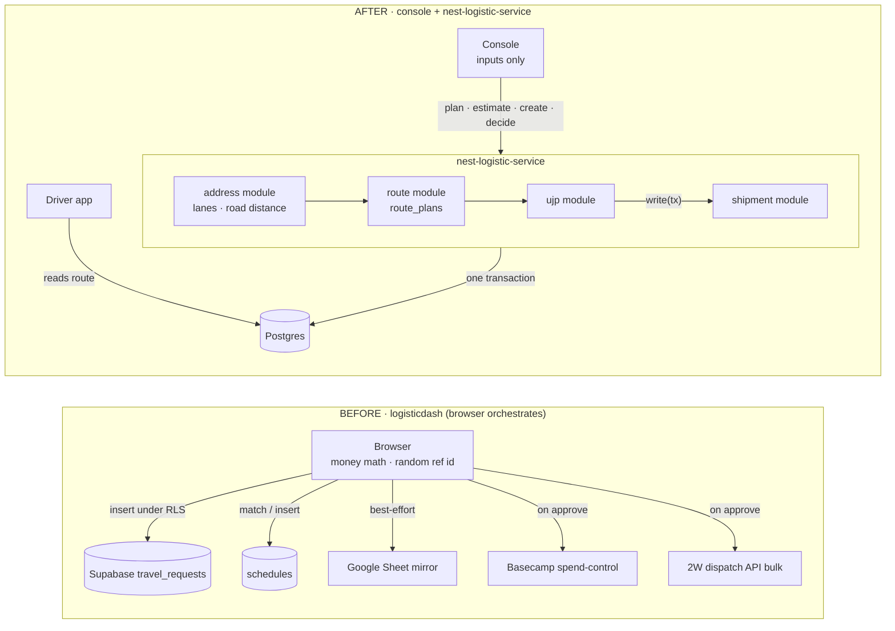

Five outbound integrations collapse into one service call. The dispatch forward becomes the in-process creation of a DIRECT_4W shipment, committed or rolled back together with the approve decision. CR-2 adds one hop *before* the request: the route is curated once in the planner, and both wizards read it.

### 2.2 System context and components

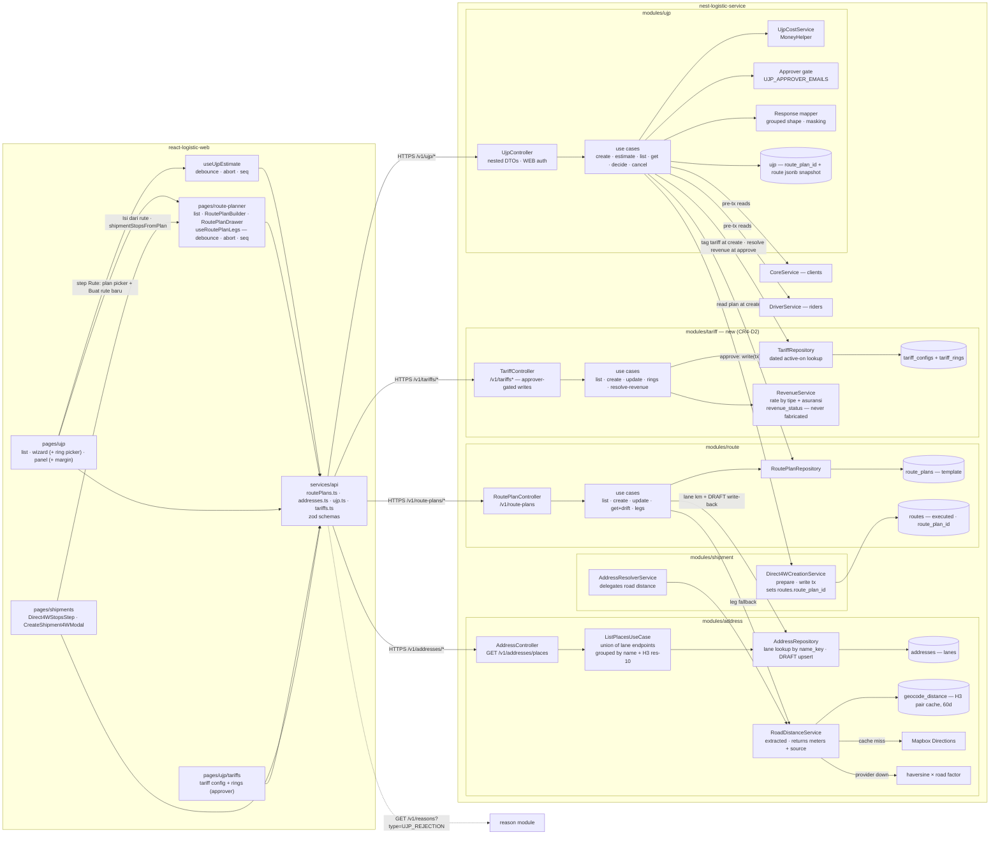

Three things to read off this diagram. First, **the route template lives next to the executed route**, not inside UJP: `route_plans` and `routes` are the same module, and `routes.route_plan_id` is the only link between them. Second, **distance is measured in exactly one place** — `RoadDistanceService` in the address module — which both the planner and the existing shipment resolver call; there is no `route → shipment` import for distance and no browser-side mapping provider. Third (CR-4), **price lives in its own `tariff` module**, not inside the cost-side `ujp_client_configs`: the UJP imports `TariffRepository` to tag a config at create and to resolve revenue at approve, exactly as it imports `RoutePlanRepository` — and `tariff` never imports `ujp`.

### 2.3 Module dependency graph

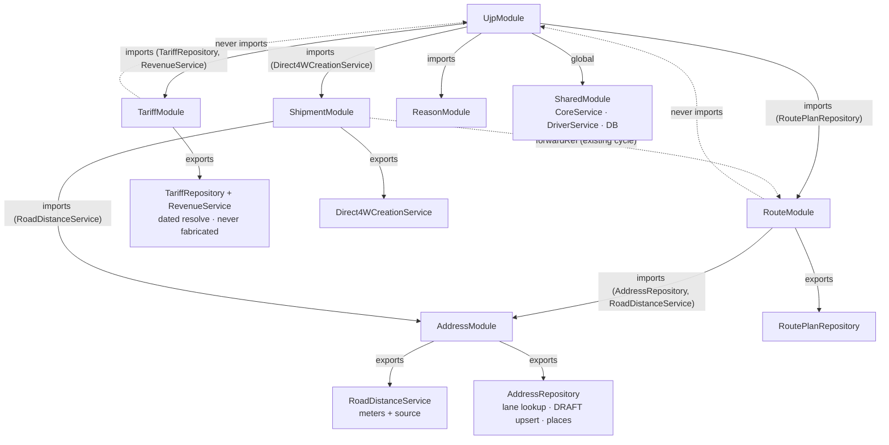

Dependency shape after CR-2: `address ← route ↔ shipment ← ujp`. **This reverses the v2 note "UjpModule never imports RouteModule"** — UJP now imports `RouteModule` for `RoutePlanRepository` only. The direction that stays forbidden is the opposite one: `route` must never import `ujp`, which is exactly why deactivating a plan does not check for live UJPs (CR2-D16). **CR-4 adds one more leaf on the same shape**: `ujp → tariff` for `TariffRepository`/`RevenueService`; `tariff` (like `route`) never imports `ujp`, so re-pricing a client's tariff never reaches into past UJPs — they carry their own approve-time snapshot (CR4-D6).

Rule (repo `CLAUDE.md`): share repositories and domain services across modules, never another module's use case. `Direct4WCreationService`, `RoadDistanceService` and `RoutePlanRepository` all follow the existing `ShipmentTerminalTransitionService` precedent.

### 2.4 Data model

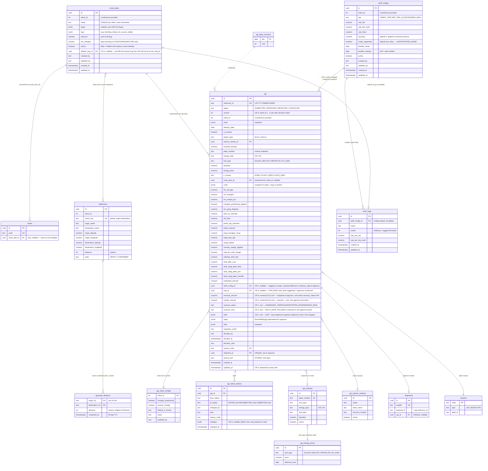

Solid relations are keys or ownership; the counter relation is procedural (the create transaction upserts today's row and formats the number). The `route_plans }o--o{ addresses` relation is a *pointer inside JSONB*, not a foreign key — the plan always carries a snapshot and the pointer only enables the drift badge and the future cost presets (TODO-25). Money columns are `numeric(14,2)` handled as strings through `MoneyHelper`; never floats. The canonical model is [`../erd/erd.mermaid`](../erd/erd.mermaid), updated in this same change.

### 2.5 Lifecycle

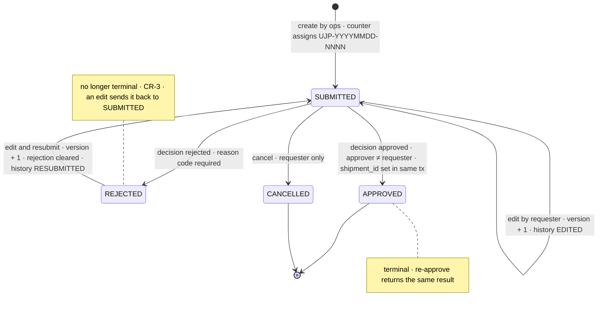

No `DRAFT` (the old UI never wrote one). **CR-3 changes the shape of this machine in one way only: `REJECTED` stops being terminal.** `APPROVED` and `CANCELLED` remain terminal, so an edit or a decision against either answers 409 (`"UJP sudah diputuskan"`). The decision use case takes `SELECT … FOR UPDATE` so two approvers cannot both pass the status check; the edit use case takes the same lock, so an edit and a decision serialize instead of interleaving (§11). A resubmit clears `reason_code`, `decision_note`, `decided_by` and `decided_at` on the row — the rejection survives only in `ujp_status_history`, which is what the panel renders (CR3-D3).

A route plan has no state machine of its own: it is `active` or not, and edits are in place (CR2-D17). Its only interaction with the UJP lifecycle is informational — the detail flags "rute nonaktif" and "rute diperbarui setelah pengajuan".

### 2.6 Approve transaction

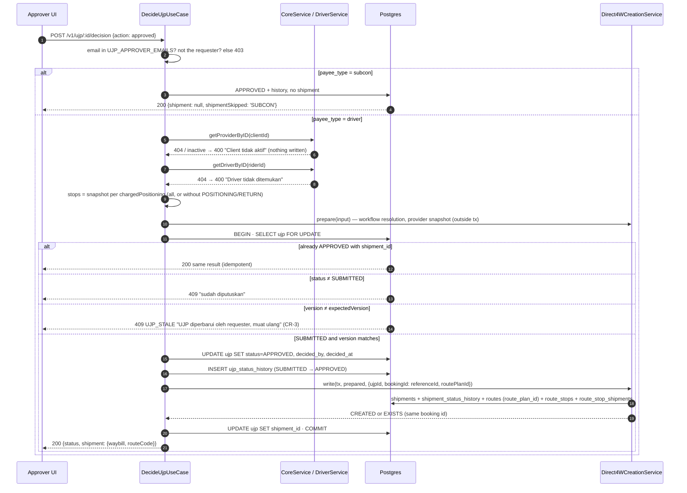

Any throw inside the transaction rolls everything back and the request stays `SUBMITTED`. External reads happen before the transaction so no row lock is held across a network call. Idempotency is free: the shipment's booking id is the UJP reference, so a retried approve finds the existing shipment (`EXISTS`) and links it. **Approve reads `ujp.route` (the snapshot), never `route_plans`** — a plan edited or deactivated after submission cannot change what gets shipped (CR2-D17). **CR-3 adds one branch and no new failure mode**: the `expectedVersion` check sits inside the same lock, *after* the idempotent re-approve check (so retrying a decision that already landed still returns its result) and before any write, so a stale decision costs a refetch and nothing else (§2.9, CR3-D5). **CR-4 adds one read and one write to the same transaction**: before the shipment write, the use case resolves revenue through `RevenueService` (§2.10) from the tariff effective on the delivery date, computes `margin = revenue − cost` on the recomputed cost, and — inside the lock — persists `revenue_amount`, `margin_amount`, `revenue_status`, `revenue_note` and the `tariff` snapshot; a subcon approve (no shipment) still resolves and snapshots revenue. A `revenue_status ≠ OK` never blocks the approve (CR4-D10); a known negative margin requires the approver's explicit confirm before the call is made (§2.10, CR4-D7).

### 2.7 Estimate data flow

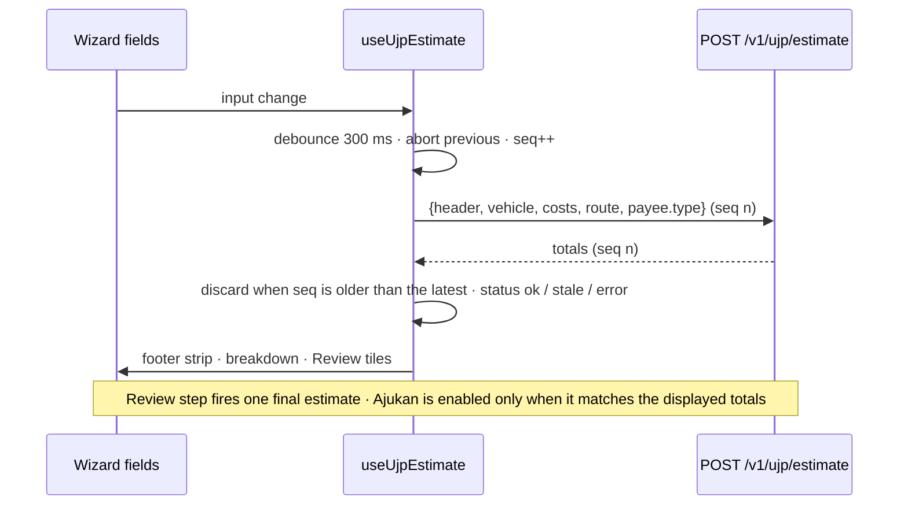

The browser never computes money. Create re-sends raw inputs; the server recomputes and ignores any client-sent totals.

### 2.8 Route-plan leg pipeline (CR-2)

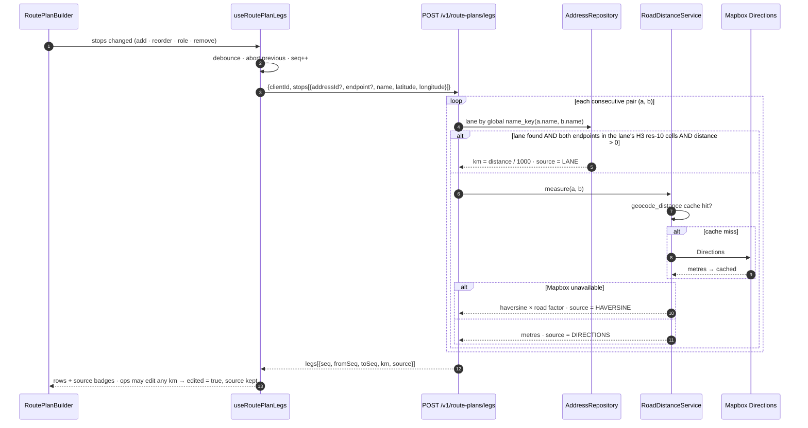

Precedence in one line — **LANE only on a coordinate match (CR2-D14), then measured, then flagged estimate**:

```
pair(a,b) ─▶ lane? global name_key(a.name,b.name) + both ends in the lane's H3 res-10 cells + distance > 0
                 ├─hit──▶ km = distance/1000 · source = LANE
                 └─miss─▶ RoadDistanceService ─▶ geocode_distance cache ─▶ Mapbox Directions · source = DIRECTIONS
                                               └─provider down──────────▶ haversine × road factor · source = HAVERSINE  (UI: "estimasi")
ops edits km ─▶ edited = true (source kept for audit; totals recomputed from the edited values)
```

A stored lane `distance` of 0 counts as a miss (bad CSV import) rather than a free zero-kilometre leg.

### 2.9 Edit and the stale-decision guard (CR-3)

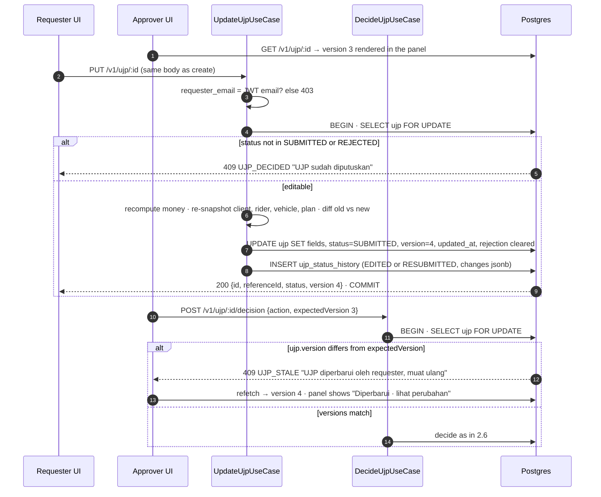

Two locks, one order. The edit and the decision both take `SELECT … FOR UPDATE` on the same row, so whichever commits first wins and the loser reads the committed state: a decision that arrives after an edit fails the version check (`409 UJP_STALE`, the approver refetches and decides again), and an edit that arrives after a decision fails the status check (`409 UJP_DECIDED`, the wizard closes onto the decided panel). The version check is *inside* the transaction, after the lock — checking it before would be the race it is meant to close. Nothing is ever partially written: both use cases are single transactions, and the edit holds no network call while locked (client, rider and vendor re-snapshots are read before `BEGIN`, exactly as create does).

### 2.10 Revenue resolution at approve (CR-4)

Revenue is resolved inside the approve transaction (§2.6) by `RevenueService`, from the tariff **effective on the delivery date**. The tree below is the whole contract: every leaf writes the same snapshot, and only the `OK` leaf carries a number — revenue is **never fabricated** (CR4-D10). `cost` is the same recomputed cost the shipment and the approver's breakdown use, so `margin` has one approve-time basis (CR4-D3).

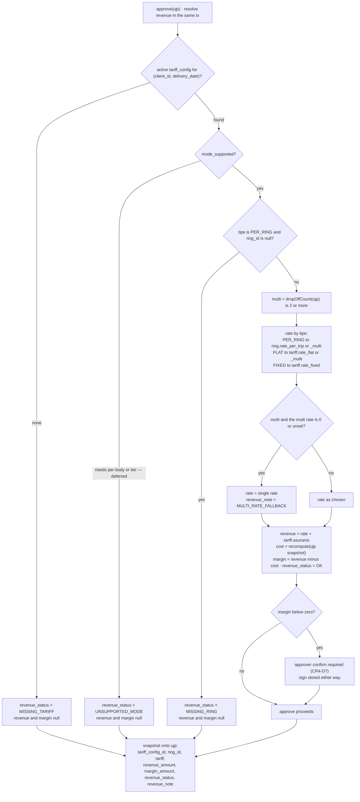

Ring↔config binding (§18.1): rings are **config-scoped** — `tariff_rings.tariff_config_id` FK → `tariff_configs.id` (mirrors the source `tarif_ring.tarif_id`). PER_RING resolution reads the ring row **under the UJP's snapshotted `tariff_config_id`**, so there is no standalone ring master with its own life. The detail response (§3.4) resolves the same tree as a **preview** while the request is `SUBMITTED` (so the approver sees a projected margin before deciding) and returns the stored **snapshot** once approved; both are approver-only.

---

## 3. API contract

Frozen first as Lane 0 in `dash-api-collections` → `Logistic/UJP/`, **new** `Logistic/Route Plans/` and `Logistic/Addresses/Places.yml`. Every request gets at least one success and one failure example; a jest contract test validates the web zod schemas against those examples (CR2-D11).

### 3.1 UJP

| Endpoint | Auth | Contract |
|---|---|---|
| `POST /v1/ujp/estimate` | WEB | `{ header: {clientId, deliveryDate, isReverse}, payee: {type}, vehicle: {fuelType, …}, costs, route: {stops, legs} }` → `{ kmAllLegs, kmCharged, kmMarginPct, chargedPositioning, totalKmWithMargin, estimasiBbmLiter, totalBbmCost, totalUangJalanFlazz, totalUangJalanQris, totalUangJalanTransfer, reverseChargeApplied, energyPriceSource, estimatedAmount }`. Pure; nothing written. |
| `POST /v1/ujp` | WEB | `CreateUjpRequestDto { header, payee, vehicle, costs, cargo, route: {routePlanId, stops, legs}, rider }` → `{ id, referenceId }`. Server numbers, recomputes money, snapshots client, rider, plan stops and legs. **`route.saveAs` is removed** — plans are created only through the planner (CR2-D2). **CR-4:** the body accepts `tariffConfigId?` and `ringId?` (tag at create); the server validates the ring belongs to the config and ignores any revenue in the payload — revenue is resolved at approve only (CR4-D3). |
| `PUT /v1/ujp/:id` | **Requester** | **CR-3.** Body is byte-identical to `POST /v1/ujp` (`CreateUjpRequestDto`, all groups) → **200** `{ id, referenceId, status, version }`. Allowed only while `SUBMITTED` or `REJECTED`; `REJECTED` resubmits (status → `SUBMITTED`, rejection fields cleared). The server recomputes money, re-snapshots client, rider, vendor and plan, and ignores client-sent totals exactly as create does; **`referenceId` never changes** and `version` is incremented. `403` when the caller is not `requester_email`; **`409 UJP_DECIDED`** when the status is `APPROVED` or `CANCELLED` ("UJP sudah diputuskan"); `400` on validation. The create endpoint's `409` duplicate-route-name case is **n/a here** — plan names are owned by `/v1/route-plans`, and an edit only references a plan id. Row-level `FOR UPDATE`, one transaction with the history insert (§2.9, CR3-D2/D3). |
| `GET /v1/ujp` | WEB | `status · clientId · deliveryFrom · deliveryTo · search · page · limit (≤ 200)` → `{ data: Row[], pagination: { size, page, lastPage, total } }`. Linked shipment status via LEFT JOIN. Masked per caller. |
| `GET /v1/ujp/:id` | WEB | Grouped response, §3.4. Masked per caller. |
| `POST /v1/ujp/:id/decision` | Allowlisted | `{ action: 'approved' \| 'rejected', reasonCode?, note?, expectedVersion, confirmNegativeMargin? }`. Approve creates the shipment (§2.6) **and resolves + snapshots revenue** (§2.10); subcon returns `shipment: null, shipmentSkipped: 'SUBCON'` but still snapshots revenue. Reject requires a `UJP_REJECTION` reason. **CR-3:** `expectedVersion` is the `version` the panel rendered; a mismatch inside the locked transaction answers **`409 UJP_STALE`** — `"UJP diperbarui oleh requester, muat ulang"` — and nothing is written (CR3-D5). The idempotent re-approve path (already `APPROVED` with a `shipment_id`) is checked first, so a retry of a decision that did land still returns the same result rather than a stale error. **CR-4:** the **approve response (approver only)** adds `revenueStatus`, and when `OK` also `revenueAmount`, `marginAmount`, `revenueNote`; when the resolved `revenueStatus === 'OK'` and `marginAmount < 0`, the approve is refused with **`409 UJP_MARGIN_NEGATIVE`** unless `confirmNegativeMargin: true` is sent (CR4-D7 — the panel turns the refusal into the "Margin negatif" confirm). |
| `POST /v1/ujp/:id/cancel` | Requester | Only while `SUBMITTED`. |
| `GET /v1/ujp/client-configs` · `PUT /v1/ujp/client-configs/:clientId` | WEB · allowlisted | Per-client `chargedPositioning`, `reverseCharge`, `defaultEMoney`, `notes`. |
| `GET /v1/ujp/masters/vehicles?search=` | WEB | Plate → unit, energy type, fuel type, baseline. |
| `GET /v1/ujp/masters/energy-prices?date=` | WEB | Price per fuel type effective on the date. |
| `GET /v1/ujp/masters/subcon-vendors?search=` | WEB | Vendor → bank block. |
| **Removed** | — | `GET/POST /v1/ujp/routes`, `PATCH /v1/ujp/routes/:id` (moved to `/v1/route-plans`); `route.saveAs`; `route.routeId` → **`route.routePlanId`**; the CR-1-era `laneIds` / `stops`-only body. |
| reused | WEB | `GET /v1/addresses` · `GET /v1/addresses/places` · `GET /v1/reasons?type=UJP_REJECTION` · `GET /v3/drivers` · `GET /v1/stop-workflows` |

Nested DTO groups mirror the wizard steps: `header` (clientId, deliveryDate, isReverse, opsTeam, serviceType, deliveryType, shift, jamMulai, jamSelesai) · `payee` (type, subconVendorId?, bankName, accountNumber, accountHolder, nominalTransfer) · `vehicle` (plateNumber, unitType, energyType, fuelType, baseline or konsumsiPerKm, energyPrice, eMoney) · `costs` (kmYangDiajukan, bbmFixOverride, tollFlazz, parkirTapMachine, parkirManual, biayaBongkarMuat, biayaLainLain, justifikasiBiayaLainLain, uangMakan) · `cargo` (senderName, receiverName, itemName, bobot) · `route` (routePlanId, stops, legs, **tariffConfigId?, ringId?** — the tariff tag rides with the route group, CR-4) · `rider` byte-identical to the 4W DTO.

The same nested groups are the edit body: `PUT /v1/ujp/:id` reuses `CreateUjpRequestDto` rather than a partial DTO, so there is one validation scope per step and an edit cannot leave a half-validated request behind (CR3-D2).

Errors keep the house envelope `{ status: 'Failed', error: <message> }`; the HTTP status carries the class (400 validation, 403 gate, 404, 409 terminal state or duplicate name). The two CR-3 conflicts are distinguished by a machine-readable code in the message payload — **`UJP_DECIDED`** (edit against a decided request) and **`UJP_STALE`** (decision against an older `version`) — because the web panel reacts differently to each: the first closes the wizard, the second refetches and re-renders the change list. **CR-4 adds a third** — **`UJP_MARGIN_NEGATIVE`** (approve of an `OK`-revenue UJP whose margin is below zero without `confirmNegativeMargin`), which the panel turns into the "Margin negatif" confirm rather than a dead toast. This is the first consumer of the code-forwarding work in TODO-24.

### 3.2 Route plans (new — `route` module)

Path is `/v1/route-plans`, **not** `/v1/routes/plans`, which would collide with the existing `/v1/routes/:id` (CR2-D2).

| Endpoint | Auth | Contract |
|---|---|---|
| `GET /v1/route-plans` | WEB | `clientId · search · active · page · limit (≤ 200)` → `{ data: PlanRow[], pagination }`. `PlanRow`: `id, clientId, name, stopCount, totalKm, kmCharged, active, updatedBy, updatedAt, originName, destinationName`. Ordered by `updated_at DESC`. |
| `POST /v1/route-plans` | WEB | `{ clientId, name, stops: Stop[], legs: Leg[] }` → **201** `{ plan, laneWriteBack }`. **409** `"Nama rute sudah dipakai"` on a case-insensitive duplicate within the client. Validation: ≥ 1 `PICKUP`, ≥ 1 `DROP_OFF`, `legs.length === stops.length - 1`, `fromSeq`/`toSeq` consecutive. |
| `PATCH /v1/route-plans/:id` | WEB | `{ name?, active?, stops?, legs? }` → 200 `{ plan, laneWriteBack }`. `active: false` is a plain hide — **never 409**, no live-UJP check (CR2-D16). Editing stops/legs recomputes `total_km` and `km_charged` and stamps `updated_by`/`updated_at`. |
| `GET /v1/route-plans/:id` | WEB | `{ plan, drift: Drift[] }` where `Drift = { seq, field: 'name' \| 'address' \| 'latitude' \| 'longitude', current }` — one entry per stop whose snapshot no longer matches the lane it points at (or whose lane is gone). Empty array when in sync. |
| `POST /v1/route-plans/legs` | WEB | `{ clientId, stops: [{ addressId?, endpoint?, name, latitude, longitude }] }` → `{ legs: [{ seq, fromSeq, toSeq, km, source }] }`. Pure; nothing written. `0` or `1` stop returns `{ legs: [] }`. Precedence per §2.8. |

```
Stop  = { seq, role: 'POSITIONING'|'PICKUP'|'DROP_OFF'|'RETURN', name, address,
          latitude, longitude, intent?, addressId: uuid|null, endpoint: 'origin'|'destination'|null }
Leg   = { seq, fromSeq, toSeq, km, source: 'LANE'|'DIRECTIONS'|'HAVERSINE', edited: boolean }
laneWriteBack = { written: number, failed: [{ seq, reason }] }
```

`RoutePlanStopRole` is a shared server enum (`database/schema/enum/route-plan-stop-role.enum.ts`) used by both `route` and `ujp` (CR2-D9).

### 3.3 Places (new — `address` module)

| Endpoint | Auth | Contract |
|---|---|---|
| `GET /v1/addresses/places` | WEB | `clientIds (csv, optional → all) · search · limit (≤ 50)` → `{ data: Place[] }`. `Place = { key, name, address, latitude, longitude, laneCount, state: 'DRAFT'\|'CONFIRMED', addressId, endpoint }`. |

The read model is the UNION of lane origins and destinations, grouped by **(normalized name, H3 res-10 cell)** so the same name at a different site stays a distinct place (CR2-D12); `CONFIRMED` wins when a group mixes states; `addressId` + `endpoint` is a representative pointer for the stop. Grouping happens in SQL, not in the browser — a big client's lane book would otherwise be truncated or deduplicated wrongly (CR2-D10).

### 3.4 Grouped `GET /v1/ujp/:id`

The detail response is regrouped to match what the web panel actually renders (the flat-versus-grouped mismatch found 2026-09-17 is the motivating bug for the contract test, CR2-D11):

```
{
  header:       { id, referenceId, status, version, clientId, client, deliveryDate, isReverse,
                  opsTeam, serviceType, deliveryType, shift, jamMulai, jamSelesai,
                  requesterEmail, createdAt, updatedAt, editedAfterSubmit, ageDays },
  payee:        { type, bankName, accountNumber, accountHolder, nominalTransfer },
  vehicle:      { plateNumber, unitType, energyType, fuelType, baseline, konsumsiPerKm,
                  energyPrice, energyPriceSource, eMoney },
  costs:        { kmYangDiajukan, bbmFixOverride, tollFlazz, parkirTapMachine, parkirManual,
                  biayaBongkarMuat, biayaLainLain, justifikasiBiayaLainLain, uangMakan },
  cargo:        { senderName, receiverName, itemName, bobot },
  route:        { routePlanId, routePlanName, routePlanActive, routePlanUpdatedAfterSubmit,
                  tariffConfigId, ringId, ringName,
                  stops: Stop[], legs: Leg[], kmAllLegs, kmCharged, chargedPositioningApplied },
  rider:        { id, name, phoneNumber, code } | null,
  vendor:       { id, name, city, bankName, accountNumber, accountHolder, picName, picPhone } | null,
  totals:       { totalKmWithMargin, kmMarginPct, estimasiBbmLiter, totalBbmCost,
                  totalUangJalanFlazz, totalUangJalanQris, totalUangJalanTransfer,
                  reverseChargeApplied, estimatedAmount },
  revenue:      { amount, margin, status, note, tariff } | null,   // CR-4 · APPROVER ONLY (absent/null otherwise)
  estimate:     { computedAt, stale: boolean },
  rejection:    { reasonCode, reasonLabel, note, decidedBy, decidedAt } | null,
  masked:       boolean,
  history:      [{ fromStatus, toStatus, changedBy, note, reasonCode, changedAt,
                   changes?: [{ field, from, to }] }],
  shipment:     { id, waybill, routeCode, status } | null,
  shipmentSkipped: 'SUBCON' | null,
  viewer:       { isRequester, isApprover, canApprove, canCancel, canEdit, isPriceViewer },  // isPriceViewer = isApprover (CR-4)
  clientConfig: { chargedPositioning, reverseCharge }
}
```

`route.routePlanActive === false` drives the "Rute nonaktif" flag and `route.routePlanUpdatedAfterSubmit` drives "Rute diperbarui setelah pengajuan" (CR2-D16/D17). **CR-3 changes its right-hand side** from `ujp.created_at` to `ujp.updated_at`: the comparison is `route_plans.updated_at > ujp.updated_at`, so a plan the requester just re-picked during an edit is not reported as drifted, while a plan edited after that edit still is (CR3-D7). When `masked` is true, `payee.accountNumber` is `"****1234"` and `payee.nominalTransfer` / `totals.*` are `null`.

**CR-3 additions to this shape.** `header.version` is the token the panel sends back as the decision's `expectedVersion`; `header.editedAfterSubmit` (`version > 1`) drives the "Diperbarui · lihat perubahan" badge; `viewer.canEdit` is `isRequester && status ∈ {SUBMITTED, REJECTED}` and is what the footer renders **Ubah** / **Ubah & ajukan ulang** from (a courtesy — the gate is server-side). `history[].changes` is present only on `EDITED` and `RESUBMITTED` rows and carries one entry per changed field, `field` being the dotted path of the grouped shape (`costs.kmYangDiajukan`, `route.routePlanId`, `rider.id`, …) so the web renders a label from the same copy map the wizard uses. **The same mapper masks `changes`**: when `masked` is true, entries whose field sits under `payee.nominalTransfer`, `costs.*` or `totals.*` keep their `field` and report `from`/`to` as `null`, so a non-party learns that a cost moved but not by how much (CR3-D4). `rejection` is `null` again after a resubmit — the rejection is then only a history row.

**CR-4 additions to this shape.** `route.tariffConfigId` / `ringId` / `ringName` are the tags visible to everyone (they carry no price). The **`revenue` block is written by the mapper only for an allowlisted approver** — for a requester or any other user it is `null`/absent, and `viewer.isPriceViewer` (`isApprover`) says so. This is the **field-tier** split (CR4-D4): the cost tier (`totals`, `costs`, `payee`) follows the CR-3 requester-OR-approver rule unchanged, while the new price tier (`revenue.amount` / `margin` / `tariff`) is approver-only — a requester who can see the cost still cannot see the price. `revenue.status` is one of `OK | MISSING_TARIFF | UNSUPPORTED_MODE | MISSING_RING`; `amount` and `margin` are non-null only when `status === 'OK'` (never fabricated, CR4-D10), and `note` carries `MULTI_RATE_FALLBACK` when it applied. While the request is `SUBMITTED` the block is a live preview; after approve it is the stored snapshot (§2.10).

### 3.5 Tariffs (new — `tariff` module, CR-4)

Path is `/v1/tariffs`; collection folder `Logistic/Tariffs/`. All writes are approver-gated (`UJP_APPROVER_EMAILS`, the same gate as decisions); reads are approver-only too, since a tariff is price data (CR4-D4).

| Endpoint | Auth | Contract |
|---|---|---|
| `GET /v1/tariffs?clientId=&activeOn=` | Allowlisted | List a client's tariff configs; `activeOn=YYYY-MM-DD` filters to the config effective that day (`berlaku_mulai ≤ activeOn ≤ berlaku_sampai`). `TariffConfig`: `{ id, clientId, tipe, rateFlat, rateFlatMulti, rateFixed, asuransi, modeSupported, berlakuMulai, berlakuSampai, active, updatedBy, updatedAt }`. |
| `POST /v1/tariffs` | Allowlisted | `{ clientId, tipe, rateFlat?, rateFlatMulti?, rateFixed?, asuransi?, modeSupported?, berlakuMulai, berlakuSampai? }` → **201** `{ tariff }`. Validates rate presence by `tipe`; an overlapping active window for the same client is a **`409`**. |
| `PATCH /v1/tariffs/:id` | Allowlisted | Partial update of the same fields → 200 `{ tariff }`. Editing rates never rewrites past UJPs — they carry their approve-time snapshot (CR4-D6). |
| `GET /v1/tariffs/:id/rings` | Allowlisted | `{ rings: Ring[] }` ordered by `urutan`. `Ring`: `{ id, tariffConfigId, nama, urutan, ratePerTrip, ratePerTripMulti }`. |
| `POST /v1/tariffs/:id/rings` | Allowlisted | `{ nama, urutan, ratePerTrip, ratePerTripMulti? }` → **201** `{ ring }`. The ring is bound to `:id` (config-scoped, §18.1). |
| `PATCH /v1/tariffs/rings/:id` | Allowlisted | Partial update of a ring → 200 `{ ring }`. |

The revenue resolution used at approve (and for the approver's detail preview) is **not** a public endpoint — it is `RevenueService.resolve(ujp, tariff, ring)` called in-process from the decision use case and the detail mapper (§2.10), so there is exactly one revenue implementation and no way for the browser to compute a price.

---

## 4. Data model details

Base migration `0094_ujp_module` (base + CR-1 in one file) is **applied and untouched** — drizzle tracks file hashes, so CR-2 is a new migration rather than an edit (CR2-D15).

### 4.1 Migration `0095_route_plans`

```sql
ALTER TABLE ujp_routes RENAME TO route_plans;
ALTER INDEX ujp_routes_client_active_idx RENAME TO route_plans_client_active_idx;
ALTER INDEX ujp_routes_client_name_uq   RENAME TO route_plans_client_name_uq;
ALTER TABLE route_plans ADD COLUMN km_charged numeric(10,1);
ALTER TABLE route_plans ADD COLUMN updated_by text;
ALTER TABLE routes      ADD COLUMN route_plan_id uuid REFERENCES route_plans(id);
CREATE INDEX routes_route_plan_id_idx ON routes (route_plan_id);
ALTER TABLE ujp RENAME COLUMN route_id TO route_plan_id;
```

Rename `meta/0095_route_plans_snapshot.json` to match the SQL (house rule). `pnpm drizzle-kit generate` must produce an empty diff afterwards.

### 4.2 Migration `0096_ujp_edit` (CR-3)

```sql
ALTER TABLE ujp                ADD COLUMN version int NOT NULL DEFAULT 1;
ALTER TABLE ujp_status_history ADD COLUMN changes jsonb NULL;
```

**Why a separate `0096` rather than extra lines in `0095`.** `0095` is the CR-2 rename (`ujp_routes` → `route_plans`, `ujp.route_id` → `route_plan_id`, `routes.route_plan_id`) and is a *structural* migration that developer databases and the CR-2 branch may already have applied; drizzle tracks file hashes, so editing it after the fact is exactly the trap CR2-D15 was written to avoid. The two changes are also independent: `0096` is two additive `ADD COLUMN`s with defaults, reversible on its own, and deployable before or after any UI. Same house rule on the snapshot — rename `meta/0096_snapshot.json` → `meta/0096_ujp_edit_snapshot.json` so it matches the `.sql`.

`version` is `NOT NULL DEFAULT 1`, so every existing row starts at version 1 and no backfill is needed; the first edit takes it to 2 and `header.editedAfterSubmit` (`version > 1`) is true from then on. `changes` is nullable because the rows written before CR-3 — and the decision, cancel and create rows written after it — legitimately have no change list. `ujp.updated_at` already exists on the base table (`ujp.table.ts`), so `0096` does not add it.

### 4.3 Migration `0097_tariff` (CR-4)

```sql
CREATE TYPE tariff_tipe AS ENUM ('PER_TRIP_FLAT', 'FIXED', 'PER_RING');

CREATE TABLE tariff_configs (
  id             uuid PRIMARY KEY DEFAULT gen_random_uuid(),
  client_id      integer NOT NULL,
  tipe           tariff_tipe NOT NULL,
  rate_flat      numeric(14,2),
  rate_flat_multi numeric(14,2),
  rate_fixed     numeric(14,2),
  asuransi       numeric(14,2) NOT NULL DEFAULT 0,
  mode_supported boolean NOT NULL DEFAULT true,
  berlaku_mulai  date NOT NULL,
  berlaku_sampai date,
  active         boolean NOT NULL DEFAULT true,
  created_by     text,
  updated_by     text,
  created_at     timestamptz NOT NULL DEFAULT now(),
  updated_at     timestamptz NOT NULL DEFAULT now()
);
CREATE INDEX tariff_configs_client_from_idx ON tariff_configs (client_id, berlaku_mulai DESC);

CREATE TABLE tariff_rings (
  id                  uuid PRIMARY KEY DEFAULT gen_random_uuid(),
  tariff_config_id    uuid NOT NULL REFERENCES tariff_configs(id) ON DELETE CASCADE,
  nama                text NOT NULL,
  urutan              integer NOT NULL DEFAULT 0,
  rate_per_trip       numeric(14,2),
  rate_per_trip_multi numeric(14,2),
  created_at          timestamptz NOT NULL DEFAULT now(),
  updated_at          timestamptz NOT NULL DEFAULT now()
);
CREATE INDEX tariff_rings_config_urutan_idx ON tariff_rings (tariff_config_id, urutan);

ALTER TABLE ujp ADD COLUMN tariff_config_id uuid REFERENCES tariff_configs(id);
ALTER TABLE ujp ADD COLUMN ring_id          uuid REFERENCES tariff_rings(id);
ALTER TABLE ujp ADD COLUMN revenue_amount   numeric(14,2);
ALTER TABLE ujp ADD COLUMN margin_amount    numeric(14,2);
ALTER TABLE ujp ADD COLUMN revenue_status   text;
ALTER TABLE ujp ADD COLUMN revenue_note     text;
ALTER TABLE ujp ADD COLUMN tariff           jsonb;

ALTER TABLE route_plans ADD COLUMN default_ring_id uuid REFERENCES tariff_rings(id);
```

All of it is additive — new tables, a new enum, and nullable `ADD COLUMN`s — so there is no backfill and it deploys before or after any UI, like `0096`. Same house rule on the snapshot: rename `meta/0097_snapshot.json` → `meta/0097_tariff_snapshot.json` so it matches the `.sql`, and `pnpm drizzle-kit generate` must produce an empty diff afterwards. `0097` is claimed once, by the tariff-module lane (§13). The `TARIFF_TIPE` enum lives at `database/schema/enum/tariff-tipe.enum.ts`, shared by the `tariff` and `ujp` schemas.

### 4.4 Tables

| Table / column | Notes |
|---|---|
| `route_plans` | Renamed from `ujp_routes` and moved to the `route` module's schema folder (`database/schema/table/route-plan.table.ts`). `stops jsonb` per the CR2-D4 shape (`addressId`, `endpoint` added to CR-1's shape); `legs jsonb` gains `source` and `edited`; new `km_charged` (materialized so the list can show it without replaying the role rule) and `updated_by`. Keeps `UNIQUE (client_id, lower(name))` and the `(client_id, active)` index — the latter is what keeps a 1,000-plan client's list fast. No hard delete. |
| `routes.route_plan_id` | `uuid` nullable, `references route_plans(id)`, indexed. Trace only: written by `Direct4WCreationService` when the stops came from a plan, null on every existing and manual path (**critical regression boundary**). |
| `ujp.route_plan_id` | Renamed from `route_id`. Nullable — a UJP whose plan was later hard-removed (not possible today) or created before the planner still renders from `ujp.route`. |
| `ujp.route` | Unchanged in meaning: the jsonb snapshot of stops + legs at submit. This is what approve and the panel read. |
| `ujp` | Otherwise as drawn in §2.4. Indexes: `ujp_search_text_trgm_idx` (GIN, pg_trgm), `ujp_status_created_idx (status, created_at DESC)`, `ujp_client_delivery_idx (client_id, delivery_date)`, `ujp_delivery_date_idx`. `search_text` is a STORED generated column: lower(reference_id ‖ client name ‖ driver name ‖ plate ‖ origin ‖ destination). |
| `ujp.version` · `ujp.updated_at` | **CR-3, migration `0096`** adds `version int NOT NULL DEFAULT 1` (`updated_at` pre-exists), incremented in the same statement that writes an edit; it is the optimistic token the decision endpoint checks as `expectedVersion` and the source of `header.editedAfterSubmit`. `updated_at` is stamped by every edit and is the right-hand side of the route-drift comparison (§3.4). Neither is user-visible as a number — the panel shows "Diperbarui", not "v4". |
| `ujp` CR-4 columns | **Migration `0097`** adds `tariff_config_id` / `ring_id` (nullable FKs, the create-time tag), `revenue_amount` / `margin_amount` (`numeric(14,2)` null, the approve snapshot — null unless `revenue_status = OK`), `revenue_status` / `revenue_note` (text null), and `tariff jsonb null` (the tariff + ring snapshot). All null until approve; revenue is never fabricated (CR4-D10). The price columns are masked in the response mapper by field tier, not at rest (CR4-D4). |
| `ujp_status_history` | Shape of `shipment_status_history` plus `reason_code`. Indexes on `ujp_id` and `changed_at DESC`. **CR-3 adds `changes jsonb NULL`** — `[{field, from, to}]`, written only by `EDITED` (from = to = `SUBMITTED`) and `RESUBMITTED` (`REJECTED` → `SUBMITTED`) rows, with `field` as a dotted path of the grouped detail shape. It is a **jsonb document, not a relation**: it is only ever read back whole with its row, never filtered or joined on, so no index and no per-field table. An edit that changes nothing writes the row with `[]` rather than skipping it, so the trail shows the save happened. Money entries are masked in the response mapper, not at rest (CR3-D4). |
| `ujp_daily_counters` | `INSERT INTO ujp_daily_counters(day, next) VALUES (:day, 1) ON CONFLICT (day) DO UPDATE SET next = ujp_daily_counters.next + 1 RETURNING next`, inside the create transaction; `day` computed in Asia/Jakarta. `reference_id` UNIQUE is the backstop. |
| `ujp_vehicles` · `ujp_energy_prices` · `ujp_subcon_vendors` · `ujp_client_configs` | Per CR-1 (§14 CR-D5/D6/D7). `ujp_energy_prices` indexed `(fuel_type, effective_from DESC)`. |
| `tariff_configs` | **CR-4, migration `0097`**, owned by the `tariff` module (`database/schema/table/tariff-config.table.ts`). One row per client per dated window; `tipe TARIFF_TIPE`, `rate_flat`/`rate_flat_multi`/`rate_fixed`/`asuransi` (`numeric(14,2)`, presence validated by `tipe`), `mode_supported` (false → `UNSUPPORTED_MODE`), `berlaku_mulai`/`berlaku_sampai`. Index `(client_id, berlaku_mulai DESC)` for the active-on lookup; overlapping active windows for a client are rejected at write. The **revenue** counterpart to the cost-side `ujp_client_configs` — separate table, separate module, no merge (outside voice #9). |
| `tariff_rings` | **CR-4**, `tariff_config_id` FK (config-scoped, not global — §18.1), `nama`, `urutan` (ordering + suggest tie-break), `rate_per_trip`/`rate_per_trip_multi`. Index `(tariff_config_id, urutan)`. Deleting a config cascades its rings. |
| `route_plans.default_ring_id` | **CR-4**, `uuid` nullable, `references tariff_rings(id)`. Pre-fills the wizard ring when a plan is picked; the UJP still owns and snapshots its own `ring_id`, so a plan's default never rewrites a submitted request (CR4-D6). |
| `shipments.ujp_id` | `uuid` nullable, `references ujp(id)`, UNIQUE, indexed. |
| `reasons` | `ReasonType.UJP_REJECTION` (text column, no migration) + seed rows: `BIAYA_TIDAK_WAJAR`, `RUTE_TIDAK_SESUAI`, `DRIVER_TIDAK_SESUAI`, `DATA_TIDAK_LENGKAP`, `LAINNYA` (requires note). |
| `addresses` | **No schema change.** Read for lane km and places; written only as `state = DRAFT` upserts by global `name_key` from the planner (CR2-D5/D12). `client_id` is set on insert only, so a lane owned by another client is never re-owned. |
| `geocode_distance` | **No schema change.** Existing H3-pair cache with a 60-day TTL, now reached through `RoadDistanceService`. |

Backward compatibility: nothing of CR-1 or CR-2 has shipped (both repos are unmerged feature branches with no PRs — the reason CR-2 is taken now rather than phased, CR2-D19), so there is no in-flight data to migrate. `0095` is still written as a rename rather than a drop/create so that any developer database that already ran `0094` upgrades cleanly.

---

## 5. Money

Ported from `logisticdash/src/lib/ujp-calculations.ts` plus the subcon branch that lived in its form (`ujp.pengajuan.new.tsx:968-970`). Exists once, in `UjpCostService`, used by `/estimate` and by create. Formula v2 (CR-1; the v1 hardcoded `/0.95` margin is gone):

```
kmAllLegs   = Σ legs.km
kmCharged   = Σ legs.km where neither endpoint stop has role POSITIONING or RETURN
kmProposed  = kmYangDiajukan (ops input; default = chargedPositioning ? kmAllLegs : kmCharged)
totalKmWithMargin = kmProposed × (1 + kmMarginPct/100)              # UJP_KM_MARGIN_PCT, default 10
baseline    = EV ? (konsumsiPerKm > 0 ? 1/konsumsiPerKm : 0) : baseline
liters      = baseline > 0 ? round1(totalKmWithMargin / baseline) : 0
bbm         = bbmFixOverride ?? round(liters × energyPrice)         # ujp_energy_prices by fuel_type @ deliveryDate
bucket(BBM) = QRIS∈eMoney ? QRIS : FLAZZ∈eMoney ? FLAZZ : TRANSFER
bucket(toll, parkirTap) = FLAZZ∈eMoney ? FLAZZ : TRANSFER
bucket(parkirManual, bongkarMuat, lainLain, uangMakan) = TRANSFER
reverseLine = isReverse && reverseCharge > 0 ? reverseCharge : 0   → TRANSFER
subcon: Flazz = QRIS = 0; Transfer = nominalTransfer
estimatedAmount = Flazz + QRIS + Transfer
```

CR-4 does not touch this formula either. The **cost** stays `UjpCostService`'s `estimatedAmount`; **revenue** is a separate resolution in the `tariff` module's `RevenueService` (§2.10), and **`margin = revenue − cost`** uses *this* cost as its one basis — so the number the approver sees as margin is the exact difference between the revenue rate and the same *uang jalan* the driver is authorized, never a second cost estimate. Revenue money is `numeric(14,2)` through `MoneyHelper` like every other amount. CR-2 changes **where `legs` come from** (the plan, server-measured) but not one line of this formula. CR-3 changes nothing in it either: **an edit recomputes exactly as create does** — `UpdateUjpUseCase` calls the same `UjpCostService` on the submitted inputs, re-reads the energy price effective on the (possibly new) delivery date, re-applies the client's `charged_positioning` and `reverse_charge` rules as they stand at save time, and ignores any totals in the payload. The persisted totals of an edited request are therefore always reproducible from its persisted inputs, and the money in the audit's change list is the difference between two server-computed results, never two browser ones. Oracle: a committed fixture of 30 real UJPs (inputs + persisted totals) with JavaScript half-up rounding reproduced on the litre (1 dp) and cost (integer) steps. Money values travel as integer-rupiah strings (`MoneyHelper`).

---

## 6. Route planner internals (CR-2)

### 6.1 Leg computation
Per §2.8. Three rules worth restating because they are the ones that will be argued about:

1. **A lane's stored distance is used only when the pins agree with it** — both stop coordinates must fall in the same H3 res-10 cells as the lane's stored origin/destination coordinates (CR2-D14). Name-only matching would make km non-deterministic from the map the user is looking at.
2. **`name_key` is global**, not per client (CR2-D12). `addresses.name_key` is unique table-wide today; changing it to a per-client key for a planner feature would reshape an import cache table. Lookup, write-back and places grouping all follow the global key.
3. **An edit is never undone by a recompute.** Reordering or re-roling recomputes every leg; an explicitly edited leg keeps `edited: true` and its value, and shows "diubah manual" next to the original source badge.

### 6.2 DRAFT lane write-back
Ordering is deliberate (CR2-D8): **the plan is committed first**, then lanes are upserted through the Address use case, and the response carries `laneWriteBack: { written, failed: [{ seq, reason }] }`. A geocoding failure or a unique-key race therefore costs the user a warning toast and a **Coba lagi**, never their work. Stops whose write-back failed keep `addressId: null`; a successful retry patches the plan with the new ids.

Write-back rules: only pairs involving a manual (non-lane) stop are considered; the upsert key is the global `name_key`; `client_id` is written on insert only; `state = DRAFT`; `distance` is the measured leg in metres. **An existing row owned by another client is never overwritten** — the stop simply links its `addressId` to it (CR2-D12).

### 6.3 Drift
`GET /v1/route-plans/:id` re-reads the lane behind every stop that has an `addressId` and returns a `drift[]` of the fields that no longer match the snapshot. The planner renders "Alamat berubah" on those rows with **Perbarui dari Addresses**, which is a plain `PATCH` of the affected stops (and a leg recompute). Nothing refreshes implicitly — the snapshot is the contract (CR2-D4, house pattern shared with the client/rider/vehicle snapshots).

### 6.4 The shared stop rule
`shipmentStopsFromPlan(plan, chargedPositioning)` exists twice on purpose (CR2-D7/D18): once in the web helper `direct4wStops.ts` for the 4W prefill, once on the server for what approve actually writes. Both are asserted against **one shared fixture table** (3 route shapes × 2 client configs) and against the collection example, so the drift they could develop is caught by a test rather than by a mis-shipped route. A UJP endpoint that serves the shipment wizard was rejected: it would point `shipment` at `ujp`.

---

## 7. Security and permissions

- **Approver gate, server-side.** `UJP_APPROVER_EMAILS` (Joi-validated, comma list, lower-cased) checked against the JWT `email` claim, which the core service puts in every web user token (`generateUserToken`). Missing claim → 403 with message; empty list fails closed with a startup warning. Requester ≠ approver enforced in the same use case. Frontend reads a mirror (`REACT_APP_UJP_APPROVER_EMAILS`) only to hide buttons.
- **Edit is requester-only, server-enforced (CR3-D1).** `PUT /v1/ujp/:id` compares the JWT `email` claim against `ujp.requester_email` and answers 403 otherwise — an allowlisted approver has *no* edit power, by design: the person who authorizes the cash must not also be the person who can change it, which is the whole point of the second pair of eyes. The status gate (`SUBMITTED` or `REJECTED`) is checked inside the locked transaction, not in a guard. The web hides **Ubah** via `viewer.canEdit` as a courtesy only.
- **The version check is an authorization-shaped control, not a convenience.** `expectedVersion` makes an approval attributable to a specific content version: the audit can show that the person who approved had read the version they approved. A missing or mismatched `expectedVersion` is refused rather than defaulted to "latest".
- **Route plans: any authenticated web user** may create, edit, deactivate and reactivate (CR2-D6). This is deliberate for Phase 1 — plans hold no money and no personal data, the two consumers both snapshot, and the failure mode of a bad plan is a wrong km that the approver sees. `created_by` / `updated_by` come from the JWT email and the list surfaces "diperbarui oleh". **No hard delete** — `active = false` only. A dedicated planner role waits for the JWT role work (TODO-21).
- **Lane write-back is scoped.** The planner may insert DRAFT lanes and link to existing ones; it may never overwrite a lane owned by another client, and it never changes `state` on an existing row.
- **Money never trusted from the client.** Totals in the payload are ignored; the server recomputes. Leg km, by contrast, *is* an ops input by design — it is visible, audited (`source` + `edited`) and re-stated in the approver's breakdown.
- **Masking in the response mapper.** Callers who are neither allowlisted nor the requester get `accountNumber: "****1234"` and `nominal: null` with `masked: true`; the UI renders the lock and "Disembunyikan". **The change list goes through the same mapper**: money fields inside `history[].changes` are nulled for non-parties, so the audit cannot become a side channel around the masking (CR3-D4).
- **Field-tier price masking (CR4-D4).** The old single "party" boolean splits into two tiers in the mapper. The **cost tier** (`totals`, `costs`, `payee`) is unchanged — requester OR approver. The **price tier** (`revenue.amount` / `margin` / `tariff`) is **allowlisted approver only**: for a requester or any other user the whole `revenue` block is dropped (`null`), not just its numbers, so even the requester who raised the trip cannot see its margin. There is no revenue field anywhere in a non-approver response, in the list rows, or in the change list — the price cannot be recovered from any surface. `viewer.isPriceViewer` mirrors the gate for the UI, which is a courtesy; the mapper is the enforcement. A **critical mapper spec** asserts a requester and a third party both get `revenue: null`.
- **Tariff writes and reads are approver-gated (CR4-D4).** `/v1/tariffs*` uses the same `UJP_APPROVER_EMAILS` gate as decisions for writes, and reads too, because a tariff *is* price data — `RevenueService` is never exposed as an endpoint, only called in-process, so there is no way to fetch a rate as a non-approver.
- **The negative-margin confirm is server-enforced (CR4-D7).** An approve of an `OK`-revenue UJP whose `margin < 0` is refused with `409 UJP_MARGIN_NEGATIVE` unless the decision body carries `confirmNegativeMargin: true` — the confirm is not merely a client-side dialog, so a scripted approve cannot skip the loss acknowledgement. The sign is stored either way.
- **Audit.** Every UJP transition writes `ujp_status_history` with actor email, from/to, reason code, note — **and, for CR-3 edits, the per-field change list**. History is append-only: a resubmit clears the rejection from the `ujp` row but never rewrites or deletes the rejection's history row, so "it was rejected for X and then fixed" stays readable after the request is approved. Every plan write stamps `updated_by` / `updated_at`.

---

## 8. Performance and scale

| Path | Design |
|---|---|
| UJP list | One count + one rows query; `search_text` GIN; composite indexes on `(status, created_at DESC)`, `(client_id, delivery_date)`; tz-cast date range like `shipments`; page/limit ≤ 200; linked shipment status via one LEFT JOIN, never per row |
| Plan list | `(client_id, active)` index + pagination; a 1,000-plan client stays fast (§11 row) |
| Places | Grouping in SQL with `limit ≤ 50` and an infix search; never a browser-side dedup of the whole lane book (CR2-D10) |
| Legs | `n-1` pairs, each at worst one cache read; Mapbox is called only on a cache miss and the result is cached per H3 pair for 60 days. Hook debounces, aborts and sequence-checks like `useUjpEstimate` |
| Estimate | Debounced, aborted, sequence-checked in the browser; pure function on the server |
| Approve | External reads pre-transaction; row lock held only for local writes |
| Numbering | One atomic upsert per create; contention limited to one row per day |

Reference: the old list pulled every row and paginated in the browser, silently capped at 1,000 by PostgREST.

---

## 9. Frontend structure

| Area | Files |
|---|---|
| API and config | `src/services/api/routePlans.ts` (**new**, owns the plan/stop/leg types) · `src/services/api/addresses.ts` (+ `places`) · `src/services/api/ujp.ts` · `src/services/api/tariffs.ts` (**new, CR-4**, owns the tariff/ring types + `suggestRing`) · `src/services/api/schemas/{ujp,routePlans,addresses,tariffs}.ts` (**new**, zod; `unwrap()` parses in dev/test) · `src/config/ujp-permissions.ts` · `src/config/logistic-api.ts` (+ `/v1/route-plans` and `/v1/tariffs` prefixes) · `.env.example` |
| Route Planner (**new**) | `src/pages/route-planner/index.tsx` (list on `hooks/urlState`) · `components/RoutePlanBuilder.tsx` · `components/RoutePlanDrawer.tsx` · `components/useRoutePlanLegs.ts` · `components/PlacePicker.tsx` · `copy.ts` |
| Tariff config (**new, CR-4**) | `src/pages/ujp/tariffs/index.tsx` (approver-gated list per client, on `hooks/urlState`) · `components/TariffDrawer.tsx` (tipe `SegmentedControl`, `MoneyInput` rates + `asuransi`, `DatePicker` window, a repeatable **ring editor** for PER_RING) · `copy.ts`. Registered in the router (`/ujp/tariffs`) and reachable from the UJP list actions. Non-approvers get a locked notice, not the rates. |
| UJP pages | `src/pages/ujp/index.tsx` (**CR-4: a "Ring belum dipilih" badge on PER_RING rows; a margin cell for approvers only**) · `components/CreateUjpModal.tsx` (**CR-3: gains an edit mode** — `mode: 'create' \| 'edit'` + the detail it was opened from; title "Ubah UJP-{ref}", primary "Simpan perubahan" / "Ajukan ulang", `PUT` instead of `POST`) · `components/UjpWizardSteps.tsx` (step Rute → plan picker + "Buat rute baru"; **CR-4: a ring `SearchSelect` with the auto-suggested option for PER_RING clients**; step Info shows the previous rejection banner in edit mode) · `components/ujpWizard.ts` (validators, payload builder with `routePlanId` **+ `tariffConfigId`/`ringId`**; `formFromDetail` — **already exists for the redo path** — becomes the edit-mode seed) · `components/useUjpEstimate.ts` · `components/MoneyInput.tsx` · `components/UjpDetailPanel.tsx` (+ rute flags; **CR-3: Ubah / Ubah & ajukan ulang footer, "Diperbarui · lihat perubahan" badge, `UjpHistoryChanges.tsx` change-list rows**; **CR-4: a "Pendapatan & margin" section + `revenueStatus` banner, rendered only when `viewer.isPriceViewer`**) · `components/UjpDecisionModal.tsx` (+ `expectedVersion`, `409 UJP_STALE` → refetch banner; **CR-4: `409 UJP_MARGIN_NEGATIVE` → "Margin negatif" confirm → resend with `confirmNegativeMargin`**) · `copy.ts` |
| Shipments | `src/pages/shipments/components/steps/Direct4WStopsStep.tsx` (+ "Isi dari rute") · `direct4wStops.ts` (+ `shipmentStopsFromPlan`, keeps `applyLaneEndpoint` / `prefillEndpoints` / `laneNameKey`) · `CreateShipment4WModal.tsx` (unchanged manual path + CSV-import deprecation banner) |
| **Deleted by CR-2** | `src/pages/ujp/components/UjpRouteBuilder.tsx` · `src/pages/ujp/components/useRouteLegs.ts` (Google Distance Matrix) |
| Kit extensions | `StepIndicator` compact prop (documented in `CLAUDE.md` §4); `MoneyInput` / `KmInput` co-located, lifted on second use; `AddressEndpointFields` + `AddressAutocomplete` reused unchanged for the manual stop |
| Wiring | `src/pages/index.ts` · `src/router/routes.tsx` (+ `/route-planner`) · `src/components/layout/Sidebar.tsx` (Master group, lucide `route` icon) |

Wizard: 5 steps with forward-only dependencies (Info → Rute → Biaya → Driver → Review); persistent estimate strip in the footer from Rute onward, hidden on Biaya and Review. Step Rute is now a `SearchSelect` of the client's active plans plus **Buat rute baru**, which mounts `RoutePlanDrawer` over the modal and selects the plan it saves. **CR-3 reuses that wizard rather than building a second one**: edit mode is the same five steps and the same validators, seeded by `formFromDetail` (written for the redo path it now replaces) and differing only in title, primary label, the rejection banner on step 1 and the verb it submits with. Panel: `SideBarModal position="right" width="md"`, money first, shipment preview, breakdown, masked rekening, stops, history with the per-field change rows, rute flags. Full UI contract and copy set: PRD §UI contract and the design decisions DD1–DD14.

---

## 10. Cross-module impacts

| Module | Direction | Interface touched |
|---|---|---|
| `address` (nest) | **provides** | `RoadDistanceService` **extracted** from `AddressResolverService` and exported (`measureDistanceMeters` + haversine + `geocode_distance` cache, returns meters + source) — behaviour-preserving refactor first, guarded by the existing resolver specs (CR2-D13). `AddressRepository` gains lane lookup by global `name_key` and a DRAFT bulk-upsert. New `ListPlacesUseCase` + `GET /v1/addresses/places`. `address.module.ts` exports grow. No schema change. |
| `route` (nest) | **owns the new sub-domain** | `route_plans` table, `RoutePlanRepository` (exported), five use cases, `RoutePlanController` at `/v1/route-plans`, `RoutePlanStopRole` enum. `routes` gains the nullable `route_plan_id` column. `route.module.ts` imports `AddressModule`. **CR-4:** `route_plans` gains the nullable `default_ring_id` column (references `tariff_rings`); the planner drawer lets a curator set a plan's default ring. **Must never import `ujp`.** |
| `tariff` (nest) | **owns the new module (CR-4)** | New `tariff` module: `tariff_configs` + `tariff_rings` tables, `TariffRepository` and `RevenueService` (both exported), the config/ring use cases + dated resolve, `TariffController` at `/v1/tariffs*` (approver-gated), the shared `TARIFF_TIPE` enum. `tariff.module.ts` imports only `SharedModule`. **Must never import `ujp`** — the arrow is `ujp → tariff`, so re-pricing never rewrites past UJPs (CR4-D6). |
| `shipment` (nest) | **consumes + adjusts** | `AddressResolverService` delegates to `RoadDistanceService` (its own specs are the regression net; `ShipmentModule` exports are unchanged). `Direct4WCreationService.write` accepts and persists `routePlanId`; **the null path — every existing 4W create — must stay byte-identical (critical regression)**. |
| `ujp` (nest) | **consumes** | Imports `RouteModule` for `RoutePlanRepository` (new arrow, §2.3). Drops `/v1/ujp/routes*` and `route.saveAs`; `route.routeId` → `route.routePlanId`; detail regrouped (§3.4) and gains `routePlanName`, `routePlanActive`, `routePlanUpdatedAfterSubmit`. `ujp_client_configs.charged_positioning` still drives `km_charged` and the approve stop rule. **CR-3 is contained inside this module**: one new use case (`UpdateUjpUseCase`), one new route on the existing controller, two columns (`0096`), `expectedVersion` on the decision DTO, and three added response fields. **CR-4:** imports `TariffModule` for `TariffRepository`/`RevenueService`; adds seven columns (`0097`) tagged at create and snapshotted at approve; the decision use case resolves revenue + margin and enforces the negative-margin confirm; the **response mapper is restructured into field tiers** (cost vs price) — this is the file `E2`/CR-3 and CR-4 both touch, so they serialize. `create` and `update` accept `tariffConfigId`/`ringId`. |
| `reason` (nest) | unchanged | `GET /v1/reasons?type=UJP_REJECTION`. |
| web `pages/route-planner` | **new** | Page, builder, drawer, legs hook; registered in the router and the Master sidebar group. |
| web `pages/ujp` | **simplified + extended** | Step Rute becomes a picker; two files deleted; payload and detail follow the new contract. **CR-4:** step Rute gains a ring picker for PER_RING clients, the panel gains the approver-only margin section, the list gains a missing-ring badge and an approver margin cell, and a new `pages/ujp/tariffs` page. |
| web `pages/shipments` | **extended** | `Direct4WStopsStep` gains "Isi dari rute"; `direct4wStops.ts` gains `shipmentStopsFromPlan`; the manual entry path is untouched. |
| `dash-api-collections` | **contract** | New `Logistic/Route Plans/` (5 requests) and `Logistic/Addresses/Places.yml`; `UJP/Routes - *` removed; `Detail UJP.yml` gains the grouped example; `Create UJP.yml` route → `routePlanId`. **CR-3:** new `UJP/Update UJP.yml` (PUT — success, `409 UJP_STALE`, `409 UJP_DECIDED`, `403`), `Decision - *.yml` bodies gain `expectedVersion` with a `409 UJP_STALE` example, and `Detail UJP.yml` gains `header.version` plus a history row carrying `changes`. **CR-4:** new `Logistic/Tariffs/` (6 requests, success + failure incl. the overlap `409`), `Create UJP.yml`/`Update UJP.yml` bodies gain `tariffConfigId`/`ringId`, `Decision - Approve.yml` gains the approver-only `revenue*` response + a `409 UJP_MARGIN_NEGATIVE` example with `confirmNegativeMargin`, and `Detail UJP.yml` gains the approver-only `revenue` block (with a non-approver example where it is absent). Lane 0 — frozen before any code. |

---

## 11. Failure modes and observability

| Code path | Failure | Test | Handling | User sees |
|---|---|---|---|---|
| decide: two approvers | race | integration spec | `FOR UPDATE` | "sudah diputuskan", panel re-fetches |
| decide: shipment insert throws | DB error | integration spec | full rollback | toast with message; UJP still SUBMITTED; retry works |
| decide: client inactive / CoreService down | 404 / timeout | unit spec | pre-tx 400 | "Client tidak aktif / layanan tidak tersedia" |
| decide: rider gone | 404 | unit spec | pre-tx 400 | "Driver tidak ditemukan" |
| decide: not allowlisted / self / no email claim | misuse or token drift | unit spec | 403 | buttons hidden; API message |
| decide: empty allowlist | misconfig | unit spec + startup log | fail closed | nobody can approve |
| decide: unknown reason code | stale FE list | unit spec | 400 | "Alasan tidak valid" |
| create: day rollover 23:59 WIB | two days' ids | unit spec (injected clock) | day computed in tx | sequential ids |
| create: client totals sent | tampering | unit spec | ignored | preview == persisted |
| read: non-party opens detail | exposure | mapper spec | masked | `•••• 1234`, "Disembunyikan" |
| estimate: out-of-order responses | slow network | hook test | abort + seq | never a stale total |
| estimate: API down | outage | hook test | last good + stale marker; Ajukan blocked at Review | "Estimasi gagal, coba lagi" |
| **legs: Mapbox down** | Directions timeout | integration (stub fail) | haversine × road factor, `source = HAVERSINE` | "Estimasi" badge, km editable |
| **legs: lane distance 0** | bad CSV lane | unit | treated as a miss → Directions | correct km |
| **legs: endpoint outside the lane's H3 cells** | same name, different site | unit | LANE skipped → Directions | km matches the pins |
| **legs: whole call 500** | outage | web test | no legs; km entered by hand; save still allowed | "Estimasi tidak tersedia" |
| **save: lane write-back fails** | geocode / unique race | unit | `laneWriteBack.failed`, still **201** | "Rute tersimpan · N alamat belum masuk Addresses" + Coba lagi |
| **save: duplicate plan name** | two curators | unit | 409, case-insensitive | inline "Nama rute sudah dipakai" |
| **plan edited / deactivated after a UJP used it** | curator edits the template | unit | snapshot unchanged; flags on detail | "Rute diperbarui setelah pengajuan" / "Rute nonaktif" |
| **drift: lane edited after the plan** | ops edits Addresses | unit | `drift[]` in `GET :id` | "Alamat berubah" badge + refresh |
| **places: 500** | outage | web test | manual entry offered | "Isi manual" |
| **4W prefill: no client config row** | client never configured | unit | default `chargedPositioning = false` | pool stops greyed with the reason |
| **planner list: 1000+ plans** | big client | perf (index + EXPLAIN in PR) | `(client_id, active)` index, paginated | fast list |
| list: 10k rows + search | scan | EXPLAIN in PR | GIN + composites | < 500 ms |
| 4W modal after extraction | regression | snapshot + interaction test first | — | identical behaviour |
| **4W create without a plan** | the normal manual path | **critical regression spec** | `route_plan_id` stays null; nothing else changes | identical behaviour |
| **edit lands while an approver is deciding** | concurrent edit vs decision | **integration spec** (both transactions, both orders) | both take `SELECT … FOR UPDATE`; the loser re-reads committed state — decision-after-edit fails the version check, edit-after-decision fails the status check | approver: "UJP diperbarui oleh requester, muat ulang" + refetch · requester: "UJP sudah diputuskan" + panel refetch |
| **decision sent with a stale `expectedVersion`** | approver read an older version | unit spec | 409 `UJP_STALE`, nothing written | stale panel refetches and shows "Diperbarui · lihat perubahan" |
| **edit on APPROVED / CANCELLED** | wrong state | unit spec | 409 `UJP_DECIDED`, nothing written | "UJP sudah diputuskan"; wizard closes onto the decided panel |
| **edit by a non-requester** | misuse or token drift | unit spec | 403 (approver included, by design) | no Ubah button; API message |
| **resubmit of a rejected request** | normal path | unit spec | rejection fields cleared on the row, history row kept | back in Menunggu, same reference, rejection visible in Riwayat |
| **edit changes nothing** | user saves without editing | unit spec | history row written with `changes: []` | the save is visible in Riwayat rather than silent |
| **non-party reads a change list** | exposure through the audit | mapper spec | money entries nulled by the same mapper as the totals | field names visible, amounts "Disembunyikan" |
| **edit while the request's plan was deactivated** | curator deactivated meanwhile | web test | snapshot renders with "Rute nonaktif"; a current plan is required before saving | badge + plan picker |
| **resolve: no active tariff** (CR-4) | client unpriced | unit | `revenueStatus = MISSING_TARIFF`, revenue null | "Tarif belum diatur"; approve still allowed |
| **resolve: needs a deferred mode** | per-body / tier tariff | unit | `UNSUPPORTED_MODE`, revenue null | "Revenue belum bisa dihitung"; approve still allowed |
| **resolve: PER_RING with no ring** | ring unpicked | unit | `MISSING_RING`, revenue null | queue badge + ring prompt |
| **resolve: multi-drop, only a single rate set** | client set single only | unit | fallback to single + `revenueNote` | "Rate multi belum diatur — pakai rate single" |
| **mask: non-approver reads the revenue block** | price leak | **unit CRITICAL** | `revenue` dropped to null for requester + other | lock, "Harga & margin hanya untuk approver" |
| **approve: margin below zero on a known revenue** | loss trip | unit | `409 UJP_MARGIN_NEGATIVE` unless `confirmNegativeMargin`; sign stored | "Margin negatif" confirm |
| **dated: delivery on a tariff boundary** | off-by-one | unit | `berlaku_mulai ≤ date ≤ berlaku_sampai` | the boundary day resolves to the right rate |
| **tariff write: overlapping active window** | two configs cover a day | unit | 409 at write | inline "window bentrok" |

Observability: `laneWriteBack.failed` reasons are logged with the plan id; every `HAVERSINE` leg is logged at warn with the pair (a rise in these means the Directions provider or the key is degraded); plan creates/updates log the actor email. **CR-3:** every edit logs `{ujpId, referenceId, fromStatus, version, changedFieldCount}` and every `UJP_STALE` refusal logs the pair `(expectedVersion, actualVersion)` — a rise in stale refusals means requesters and approvers are working the same queue at the same time, which is a workflow signal, not an error. **CR-4:** every approve logs `{ujpId, revenueStatus, marginSign}` (never the amounts), and a rise in `MISSING_TARIFF` / `UNSUPPORTED_MODE` is a signal that a client's tariff needs setting up or that a deferred pricing mode (CR-4b) is now actually needed. Critical gaps (no test, no handling, silent): none.

---

## 12. Testing strategy

| Layer | Coverage |
|---|---|
| Unit (nest) | `UjpCostService` matrix (ICE, EV, fix override, baseline 0, four e-money buckets × driver/subcon, charged vs uncharged km by role, margin echo, reverse line, dated price boundary) against the 30-UJP oracle · every branch of §2.6 in `decide-ujp.usecase.spec.ts` · create (counter, day rollover with injected clock, ignored totals, `routePlanId` snapshot) · list envelope · masking + grouped-shape mapper · POSITIVE/NEGATIVE naming, repositories mocked as plain `jest.fn()` objects |
| Unit (nest, **CR-2**) | `create-route-plan.usecase.spec.ts` (happy ≥1 PICKUP + ≥1 DROP_OFF and consistent legs; 409 duplicate name case-insensitive; manual stops → DRAFT lanes written and `addressId` set; write-back failure → `laneWriteBack.failed` with a 201) · `update-route-plan.usecase.spec.ts` (rename ok / 409 dup; **deactivate always succeeds, even with a live SUBMITTED UJP** — CR2-D16; reactivate) · `compute-route-plan-legs.usecase.spec.ts` (LANE hit on coordinate match; LANE skipped when coordinates differ → DIRECTIONS; DIRECTIONS cache hit; cache miss → Mapbox; Mapbox down → HAVERSINE; lane distance 0 → miss; 0 or 1 stop → `[]`) · `get-route-plan.usecase.spec.ts` (snapshot ≠ lane → `drift[]`; deleted lane → drift) · `list-places.usecase.spec.ts` (union + grouping by name and H3 cell, CONFIRMED wins, lane count, infix search, limit, empty client) · `road-distance.service.spec.ts` |
| Unit (nest, **CR-3**) | `update-ujp.usecase.spec.ts`: non-requester (approver included) → **403**; status `APPROVED` / `CANCELLED` → **409 `UJP_DECIDED`**; edit while `SUBMITTED` → status unchanged, `version + 1`, `EDITED` history row; edit while `REJECTED` → status `SUBMITTED`, `reason_code` / `decision_note` / `decided_by` / `decided_at` cleared, `RESUBMITTED` history row, rejection's own history row untouched; `referenceId` unchanged; client-sent totals ignored and money recomputed (shares the `UjpCostService` matrix); **change-diff per group** — header, payee, vehicle, costs, route, rider — including a no-op edit producing `changes: []` and a route switch producing one `route.routePlanId` entry; **masking of money inside `changes`** for a non-party in the mapper spec. `decide-ujp.usecase.spec.ts` gains `expectedVersion` mismatch → **409 `UJP_STALE`** with nothing written, match → the existing approve/reject paths unchanged, and the idempotent re-approve path checked *before* the version check |
| Unit (nest, **CR-4**) | `revenue.service.spec.ts` — the fixture **oracle** across all branches of §2.10: FLAT single + multi, FIXED, PER_RING single + multi, `+asuransi`, a dated-boundary delivery day (`berlaku_mulai`/`berlaku_sampai`), the `MULTI_RATE_FALLBACK` branch, and the three non-`OK` states (`MISSING_TARIFF`, `UNSUPPORTED_MODE`, `MISSING_RING`) → revenue null, never fabricated. `create-tariff` / `update-tariff` / `list-tariff` use cases (dated active-on resolution; overlap `409`; approver gate `403`); ring create/update. `decide-ujp.usecase.spec.ts` gains the CR-4 branches: snapshot of `revenue_amount`/`margin_amount`/`revenue_status`/`revenue_note`; **negative margin → `409 UJP_MARGIN_NEGATIVE` without `confirmNegativeMargin`, proceeds with it, sign stored**; a non-`OK` status never blocks approve and never triggers the confirm. **Mapper field-tier spec (CRITICAL)**: approver sees `revenue`, requester and a third party get `revenue: null` — the price leaks nowhere. `suggestRing` unit (keyword match, `urutan` tie-break, no match → null) |
| Integration (nest) | `.github/workflows/test.yml` with a `postgres:16` service, `pnpm db:migrate`, jest `projects` with `*.integration.spec.ts`: two concurrent approves → one shipment; rollback when `write` throws; 20 parallel creates → unique sequential references; `shipments.ujp_id` unique. **New `route-plan.integration.spec.ts`** seeding `addresses` + `geocode_distance` and exercising LANE / DIRECTIONS (Mapbox stubbed) / HAVERSINE (Mapbox failing) plus the DRAFT write-back. Fake `CoreService`/`DriverService`, real database. **CR-3:** `ujp-edit.integration.spec.ts` — a concurrent edit and decision run in both orders against the real row lock, asserting that exactly one commits its intent, that the loser gets `UJP_STALE` or `UJP_DECIDED`, and that no request is ever left approved against a version the approver did not send. **CR-4:** `tariff-resolve.integration.spec.ts` seeds two dated `tariff_configs` for one client and asserts the delivery-date boundary resolves to the right config, that `UNSUPPORTED_MODE` and `MISSING_RING` snapshot revenue null, and that an approve with a negative margin persists the sign only after `confirmNegativeMargin` |
| Regression (**mandatory, critical**) | `create-direct4w.usecase.spec.ts` unchanged plus a delegation case after extraction · `direct4w-creation.service.spec.ts` **null `routePlanId` path byte-identical** · `AddressResolverService` existing specs green after the `RoadDistanceService` extraction (refactor first, behaviour second — CR2-D13) · `CreateShipment4WModal.test.tsx` **manual stop path green** plus new asserts for "Isi dari rute" |
| Unit (web) | API modules (URL/body/envelope) · `useUjpEstimate` (out-of-order, abort, error → stale) · `useRoutePlanLegs` (debounce, abort, sequence, 500 → manual km) · wizard validators and the `routePlanId` payload · list URL round-trip and states · panel button visibility per persona, masked rendering, 409 banner, rute flags · axe assertions |
| Unit (web, **CR-3**) | Panel footer by status × persona: requester sees **Ubah** on SUBMITTED and **Ubah & ajukan ulang** on REJECTED, nothing on APPROVED / CANCELLED, and an approver or third party sees neither · wizard **edit mode** — prefilled from the detail, title "Ubah UJP-{ref}", primary label per status, rejection banner on step 1, `PUT` payload identical in shape to the create payload · decision with a stale version → `409 UJP_STALE` → refetch + "Diperbarui · lihat perubahan" banner rather than a dead toast · history change-list rendering (per-field `dari → ke`, empty list, masked money for a non-party) · axe assertions on the edit-mode wizard and the change list |
| Unit (web, **CR-2 pages**) | `route-planner/index.test.tsx` (list per client with URL params, search, empty state, create via drawer → row + toast, partial write-back → warning + Coba lagi, deactivate → confirm → hidden from pickers, drift badge → refresh updates the snapshot) · `RoutePlanBuilder.test.tsx` (pick a place from `/addresses/places`, manual stop → `addressId` null, reorder / role change / remove → legs recomputed, source badges LANE/DIRECTIONS/HAVERSINE, edit km → `edited` + totals, totals all/charged + client-rule banner) · UJP step Rute (pick plan → stops/legs/km default; "Buat rute baru" → drawer → plan selected; redo from a UJP whose plan is inactive → snapshot + badge) · `Direct4WStopsStep` prefill (charged vs uncharged client → pool stops kept or greyed) |
| Unit (web, **CR-4**) | `ujp/tariffs/index.test.tsx` (approver sees the list + edit; a non-approver sees a locked notice, no rates; create per tipe; rings edited under a PER_RING config) · wizard step Rute **ring picker** (PER_RING client → auto-suggested ring pre-selected + editable; plan default pre-fills; non-PER_RING → no picker) · panel **margin section** by persona (approver sees revenue/margin + the `revenueStatus` banner; requester and other see the cost with the price locked — asserts the price is absent from the DOM, not merely hidden) · `revenueStatus` banners (belum bisa dihitung / MULTI_RATE_FALLBACK) · decision **`409 UJP_MARGIN_NEGATIVE` → "Margin negatif" confirm → resend with `confirmNegativeMargin`** · list missing-ring badge + approver-only margin cell · axe on the tariff page and the margin section |
| Contract (**CR2-D11**) | `services/api/schemas/{ujp,routePlans,addresses,tariffs}.ts` infer the TS types and guard `unwrap()` in dev/test; `collection-contract.test.ts` validates **every** response example under `dash-api-collections/.../Logistic/{UJP,Route Plans,Addresses,Tariffs}` (path via env, skipped when absent) and runs in CI. `Detail UJP` first — the flat-versus-grouped mismatch found 2026-09-17 is the motivating bug. **CR-3 extends the same schemas**: `header.version`, `viewer.canEdit`, the optional `history[].changes`, the `PUT` response, and the `expectedVersion` field on the decision body — plus the new `Update UJP.yml` examples. **CR-4 adds** the `tariffs.ts` schema + the six `Logistic/Tariffs/` examples, the `tariffConfigId`/`ringId` create/update fields, the approver-only `revenue` block on `Detail UJP` (with a non-approver example asserting it is absent), and the `revenue*` + `409 UJP_MARGIN_NEGATIVE` examples on the approve request |
| Shared fixture | `shipmentStopsFromPlan` (web) and the server approve stop rule assert against **one** fixture table: 3 route shapes × 2 client configs, also used as the collection example (CR2-D7/D18) |
| CI | nest `test.yml` on PR (unit + integration) · web `test.yml` on PR (`npm run test:ci` + contract test) |
| QA | test plan in `~/.gstack/projects/dash/*eng-review-test-plan*.md` (pages, interactions, edge cases, critical paths) |

Coverage baseline for CR-2: **0/38 paths — all new**; 2 critical regressions to protect (the 4W manual path, the `Direct4WCreationService` null-plan path). CR-4 adds **0/24 new paths** (9 `RevenueService` oracle branches) with **1 critical test** — the field-tier mapper that must never leak a price to a non-approver. No E2E harness exists (jest/RTL + Postgres integration only) — a Playwright harness is TODO-31.

---

## 13. Rollout and delivery lanes

Smallest safely deployable increment: **`0095` + the `RoadDistanceService` extraction alone** — a pure rename plus a behaviour-preserving refactor, deployable with no UI. Everything after it is additive: the planner page can ship before either wizard consumes it, and the 4W "Isi dari rute" is an optional button on an otherwise unchanged step. No feature flag is needed because nothing of CR-1/CR-2 is live; rollback is `git revert` plus a down-migration that renames `route_plans` back (no data loss — the rename is reversible and `routes.route_plan_id` is nullable).

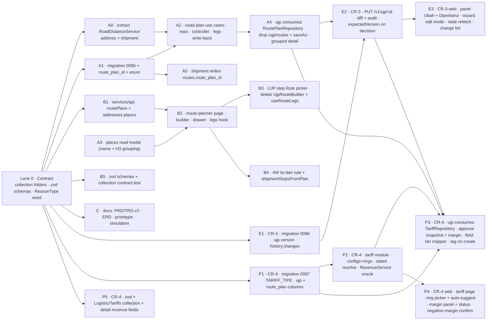

Order: Lane 0 (contract) first, then `{A0 ∥ A1 → A2 → A4, A3, A5} ∥ {B1 → B2 → {B3 ∥ B4}, B5} ∥ C`, with the CR-3 lane `E1 → E2 → E3` behind it and the CR-4 lane `P1 → P2 → P3 ∥ {P4 after contract} ∥ P5` behind *that*. Migration numbers are each claimed once: `0095` by A1, **`0096` by E1** (§4.2), **`0097` by P1** (§4.3). **Conflict flag:** A2 and A4 both touch module imports around `ujp.module.ts` / `route.module.ts` — run them sequentially, not in parallel worktrees. A0 must land before A2 so the planner never reaches into the shipment module for distance. **E2 must land after A4**, and **P3 must land after both A4 and E2**: all three rewrite the UJP response mapper and the create/decide use cases (P3 restructures the mapper into cost/price field tiers), so running them in parallel worktrees would conflict in the same files — they serialize `A4 → E2 → P3`. The new `tariff` module (P2) is otherwise independent and parallel to everything else. CR-4 adds one new module and one new page but no change to `route`/`address`/`shipment` beyond `route_plans.default_ring_id`; like CR-3 it is purely additive at the schema level (`0097`), so it can ship after CR-2 and CR-3 are live without a migration-ordering problem.

Effort delta versus CR-1: ≈ **+1 week human / +1 hour CC net** — the new page is largely offset by the deletions (`UjpRouteBuilder`, `useRouteLegs`, `/v1/ujp/routes*`, `saveAs`).

Tasks with effort estimates: `ASSESSMENT-UJP-PORT-4W.md` §16.8 (T1–T13) in the dash workspace; task JSONL under `~/.gstack/projects/dash/`.

---

## 14. Decisions register

### 14.1 Base (v2)

| # | Decision | Why |
|---|---|---|
| D1 | Vertical slice, not parity with the old app | The dropped pieces existed because the old app had no backend, no shipment, no native list |
| D2 | Shipment created on approve, in the decision transaction; APPROVED terminal | No shipment ever exists for unapproved cash; reject/cancel never touch shipment tables |
| D3 | Extract `Direct4WCreationService`; both callers share it | One shipment writer; repo rule forbids cross-module use-case injection |
| D4 | Daily counter for `UJP-YYYYMMDD-NNNN` | 4-digit random space collides at volume; finance reads the sequence |
| D5 | Money computed server-only; browser uses `/estimate` | Two implementations in two repos is the only way to drift |
| D6 | Email allowlist approver gate, server-enforced; self-approval blocked; fail closed | JWT carries only client roles today; RBAC is a follow-up |
| D7 | `ujp_vehicles` master, SQL-seeded, autofill with override | No vehicle table exists; baseline/price are the riskiest hand-typed inputs |
| D8 | Lift 4W modal Steps 2/3 into shared components first | One implementation of stops, workflows, map, rider auto-select |
| D9 | Full state machine: lock, idempotent re-approve, pre-tx re-validation, reason codes, no DRAFT, ~~no edit after submit~~ → **the edit exclusion is superseded by CR-3** (§14.4); everything else stands | Every race and stale-reference case has a defined outcome — CR-3 adds the edit-versus-decision race to that list rather than reopening it |
| D10 | Nested DTOs mirroring wizard steps; stops/rider reuse 4W DTOs | One step = one DTO = one validation scope |
| D11 | Postgres service container + integration specs in a PR workflow | Lock, rollback and counter races cannot be proven with mocks |
| D12 | `search_text` + GIN + composite indexes; LEFT JOIN shipment | Proven pattern on `shipments` |
| D13 | Estimate hook: debounce, abort, sequence, stale state, Review re-check | Out-of-order responses must never leave an old total on screen |
| D14 | Kept approve → shipment coupling after outside-voice challenge | The hand-carry from UJP to shipment is the problem being removed |
| D15 | Server-side masking of bank account and nominal for non-parties | Parity-plus at near-zero cost |
| D16 | ~~Lanes read-only from `addresses`; no route-plan table~~ → **restored in its correct form by CR-2**: lanes feed the *planner*, and there **is** a plan table (`route_plans`) | CR-1 dropped the lane picker; CR-2 puts the lane book back as the source, one level up from the wizard |
| D17 | ~~Multi-drop km = sum of lane distances as an editable, labelled estimate~~ → **superseded**: km is per leg, server-measured, with a `source` badge | Summing lane distances over-counted a chained route; measuring the chain is the fix |
| DD1–DD14 | UI contract (footer anchor, 5 steps, money-first panel, state table, masking UI, queue list, hairline Review, MoneyInput, subcon disable-in-place, lane chips, responsive, a11y, copy, light only) | Design review 4/10 → 9/10 |

### 14.2 CR-1 (2026-09-15)

Stakeholder review of the flow simulation asked for seven changes; the source-app audit showed only the subcon rule is a port. All seven folded into Phase 1.

| # | Decision |
|---|---|
| CR-D1 | Fold all seven into Phase 1; TRD/PRD move to v2.1. |
| CR-D2 | ~~**Saved routes** in `ujp_routes`, built in the wizard, km from the browser's Google Distance Matrix, optional "Simpan sebagai rute tersimpan".~~ **Superseded by CR2-D2/D3/D9.** |
| CR-D3 | **Km margin** `totalKmWithMargin = km × (1 + pct/100)`, pct from `UJP_KM_MARGIN_PCT` (default 10), snapshotted as `ujp.km_margin_pct`. |
| CR-D4 | **E-money** `e_money ∈ {NONE, FLAZZ, QRIS, FLAZZ_QRIS}`; BBM → QRIS if available, else Flazz, else Transfer; toll + parkir tap → Flazz if available else Transfer; manual lines → Transfer; subcon → all Transfer. New `total_uang_jalan_qris`. |
| CR-D5 | **Fuel price master** `ujp_energy_prices(fuel_type, price, effective_from)`; `ujp_vehicles.fuel_type` replaces the per-vehicle price; the price effective on the delivery date is filled, locked, editable; the UJP snapshots `fuel_type` + `energy_price`. |
| CR-D6 | **Subcon** approve = APPROVED + history, **no shipment**. `ujp_subcon_vendors` seeded; the wizard's vendor select fills the bank block; rider optional; UJP stores `subcon_vendor_id`. |
| CR-D7 | **Client UJP config** `ujp_client_configs(client_id pk, charged_positioning, reverse_charge, default_e_money?, notes, updated_by)`. `km_all_legs` = Σ legs; `km_charged` = legs touching no POSITIONING/RETURN stop; `km_yang_diajukan` defaults to charged ? all : charged, editable. Approve (driver): shipment stops = all when charged, else without POSITIONING/RETURN. Web `/ujp/config`. |
| CR-D8 | **Reverse** `ujp.is_reverse`; when on and `reverse_charge > 0`, "Biaya reverse (client)" is added to Transfer and stored as `reverse_charge_applied`. |
| CR-D9 | ~~**Route builder** is UJP-specific (`UjpRouteBuilder`), sharing `direct4wStops.ts` helpers.~~ **Superseded by CR2-D9.** |

### 14.3 CR-2 (2026-09-17) — Route Planner as a Routes-module extension

Step-0 findings that shaped these: server road distance **already exists** (`AddressResolverService.resolveCoordDistances`, Mapbox + `geocode_distance` H3 cache, 60-day TTL, haversine fallback) so CR-D2's browser Distance Matrix was a custom path next to a built-in; **addresses are lanes** and a route is a chain of them; the **picker exists** (`AddressEndpointFields` + `AddressAutocomplete`, `direct4wStops.ts` helpers); the **route module already owns the executed route**, of which a plan is the template.

| # | Decision |
|---|---|
| CR2-D1 | **Scope = full CR-2**: planner page + drawer, stops from Addresses places with a manual fallback, server legs, UJP step Rute = picker + drawer, 4W stops step gains "Isi dari rute". (B: planner + UJP only, 4W as a TODO — rejected. C: keep the CR-1 builder and add an address picker — rejected.) |
| CR2-D2 | **Home is the existing `route` module** (template sub-domain), not a new module and not UJP. `ujp_routes` → **`route_plans`** via migration `0095`. Endpoints **`/v1/route-plans`** (not `/v1/routes/plans`, which clashes with `/v1/routes/:id`). `routes.route_plan_id uuid NULL` trace column written by `Direct4WCreationService`. Dependency arrows `address ← route ↔ shipment ← ujp`; no `route → ujp`. |
| CR2-D3 | **Legs are server-computed, lane first.** `POST /v1/route-plans/legs` → `legs[{seq, fromSeq, toSeq, km, source: LANE\|DIRECTIONS\|HAVERSINE}]`. Every km stays editable; the plan stores `{km, source, edited}`. `useRouteLegs.ts` is deleted; no Maps key in the wizard path. |
| CR2-D4 | **A stop is a snapshot plus a pointer**: `{seq, role, name, address, latitude, longitude, intent?, addressId, endpoint}`. UJP and shipments always read the snapshot (house pattern: client/rider/vehicle snapshots). The planner shows "alamat berubah" when the snapshot differs from the lane, with a one-click refresh. Enables TODO-25. |
| CR2-D5 | **Manual stops write back DRAFT lanes.** Entered via `AddressEndpointFields` manual mode; on save each consecutive pair involving a manual stop is upserted to Addresses as `state = DRAFT` by global `name_key`, never overwriting a row owned by another client (`client_id` on insert only; `distance` = the measured leg in metres); the stop gets its `addressId`. |
| CR2-D6 | **Permissions**: any authenticated web user may create/edit/deactivate (`active = false`, no hard delete); `created_by`/`updated_by` from the JWT email. Deactivation only hides the plan from pickers. Role separation waits for TODO-21. |
| CR2-D7 | **The 4W picker applies the client rule.** `shipmentStopsFromPlan(plan, chargedPositioning)` in `direct4wStops.ts` mirrors the server rule used at approve; the picker reads `GET /v1/ujp/client-configs`; dropped pool stops are shown greyed. Both implementations assert against one fixture table and the collection example. |
| CR2-D8 | **Lane write-back is best-effort and visible**: the plan saves first; lanes are upserted via the Address use case; the response carries `laneWriteBack {written, failed}`; the UI shows "Rute tersimpan · N alamat belum masuk Addresses" with **Coba lagi**; stops keep `addressId: null` until a retry succeeds. |
| CR2-D9 | **One builder, two hosts.** `pages/route-planner/{index.tsx, RoutePlanBuilder.tsx, RoutePlanDrawer.tsx, useRoutePlanLegs.ts}`; `services/api/routePlans.ts` owns the types; the UJP step Rute is a `SearchSelect` of active plans + "Buat rute baru"; the 4W step imports the same picker. Server enum `RoutePlanStopRole` shared by `route` and `ujp`. In-wizard manual mode and `UjpRouteBuilder.tsx` are removed. |
| CR2-D10 | **Places read model**: `GET /v1/addresses/places?clientIds=&search=&limit=50` — UNION of lane endpoints grouped by (normalized name, H3 res-10 cell), with lat/lng, address, lane count, state (CONFIRMED wins) and a representative `{addressId, endpoint}`; `clientIds` filter with a "semua client" fallback. Browser-side dedup rejected (duplicates and truncation for big clients). Consumer-destination clients whose lanes bypass `addresses` get manual stops only (TODO-32). |
| CR2-D11 | **Contract test**: zod schemas in `services/api/schemas/{ujp,routePlans,addresses}.ts` infer the TS types and guard `unwrap()` in dev/test; a jest test validates every collection response example (path via env, skipped when absent). Collection files gain the missing success + failure examples, `Detail UJP` first. |
| CR2-D12 | **Lane identity is global.** `addresses.name_key` is unique table-wide, not per client; lookup, write-back and places grouping follow that key. A per-client key was rejected — it would reshape an import cache table for a planner feature. |
| CR2-D13 | **Extract `RoadDistanceService`** into the address module (`measureDistanceMeters` + haversine + `geocode_distance` cache, returning meters + source); `AddressResolverService` delegates with its existing specs as the regression net (refactor first, behaviour second). Removes any `route → shipment` import for distance; `ShipmentModule` exports stay as they are. |
| CR2-D14 | **LANE distance only on a coordinate match** (both endpoints in the lane's H3 res-10 cells); otherwise DIRECTIONS. Keeps km deterministic from the pins while staying free for known pairs. |
| CR2-D15 | **New migration `0095_route_plans`** (rename table + indexes, add `routes.route_plan_id`, rename `ujp.route_id`); snapshot renamed per the house rule. `0094` untouched — drizzle tracks file hashes. |
| CR2-D16 | **Drop the deactivate 409.** Deactivation hides the plan; UJP detail and redo read the snapshot and show "rute nonaktif". No `route → ujp` arrow. |
| CR2-D17 | **Plan edits are allowed after use; the UJP flags it**: detail shows "Rute diperbarui setelah pengajuan" when `route_plans.updated_at > ujp.created_at`; approve keeps the snapshot. No versioning (upgrade trigger: reviewers ask what changed). |
| CR2-D18 | **Keep D7-A** — the web helper mirrors the server stop rule against one shared fixture. A UJP endpoint serving the shipment wizard was rejected: it would point `shipment` at `ujp`. |
| CR2-D19 | **Take CR-2 now.** Product call with the simulation in hand; both repos are unmerged feature branches with no PRs, so there is no production cut to phase and the rework mostly deletes code. |

### 14.4 CR-3 (2026-09-17) — the requester edits an undecided UJP

Stakeholder ask: ops can change a UJP while it is *Menunggu persetujuan* or *Ditolak*. This **supersedes the D9 exclusion "no edit-after-submit"** and replaces the REJECTED → "Buat ulang dari UJP ini" (new number) path with an in-place edit. Routine calls, stated as assumptions — re-open only if one is wrong. Source: `ASSESSMENT-UJP-PORT-4W.md` §17.

| # | Decision |
|---|---|
| CR3-D1 | **Who and when**: requester only (`requester_email` = JWT email), status ∈ {`SUBMITTED`, `REJECTED`}. `APPROVED` / `CANCELLED` → 409 "UJP sudah diputuskan". **Approvers do not edit** — they reject with a reason; the person who authorizes the cash must not be the person who can change it. |
| CR3-D2 | **Endpoint** `PUT /v1/ujp/:id`, body identical to `POST /v1/ujp` (all groups; server recomputes money, re-snapshots client / rider / vendor / plan, ignores client totals). Reference ID unchanged. Row-level `FOR UPDATE`. A full body rather than a PATCH: one validation scope per step, and no half-validated request. |
| CR3-D3 | **Transitions**: `SUBMITTED --edit--> SUBMITTED` (`version += 1`, `updated_at`); `REJECTED --edit--> SUBMITTED` (resubmit: `reason_code`, `decision_note`, `decided_by` / `decided_at` cleared, `version += 1`). Still no `DRAFT` — the wizard's local state is the draft. |
| CR3-D4 | **Audit**: `ujp_status_history` gains `changes jsonb NULL` — a list of `{field, from, to}` across the header / payee / vehicle / costs / route / rider groups — written on an `EDITED` row (from = to = `SUBMITTED`) or a `RESUBMITTED` row (`REJECTED` → `SUBMITTED`). Money fields inside `changes` are **masked for non-parties in the response mapper**, on the same rule as the totals, so the audit is not a side channel. New `ujp.version int NOT NULL DEFAULT 1`. |
| CR3-D5 | **Stale-decision guard**: `POST /v1/ujp/:id/decision` gains `expectedVersion`; a mismatch answers 409 `UJP_STALE` — "UJP diperbarui oleh requester, muat ulang". The detail returns `version`; the panel refetches and shows "Diperbarui · lihat perubahan" (the history diff). Checked inside the locked transaction, after the idempotent re-approve check. |
| CR3-D6 | **Web**: the panel footer shows **Ubah** (SUBMITTED) or **Ubah & ajukan ulang** (REJECTED) for the requester, replacing "Buat ulang dari UJP ini". The existing wizard gains an edit mode seeded by `formFromDetail` (written for the redo path it replaces) — title "Ubah UJP-{ref}", primary "Simpan perubahan" / "Ajukan ulang", the rejection banner kept visible on step 1 so the fix is guided; the server estimate flow is unchanged. History rows render the change list. |
| CR3-D7 | **Route plan**: an edit may switch or rebuild the plan through the CR-2 drawer; the snapshot is replaced, and "Rute diperbarui setelah pengajuan" compares against the new `ujp.updated_at` rather than `created_at` — otherwise every edited request would flag its own freshly chosen plan. |

Consequences elsewhere in this document: §2.5 (REJECTED is no longer terminal), §2.9 (lock ordering), §3.1 (`PUT`, `expectedVersion`, the `UJP_DECIDED` / `UJP_STALE` codes), §3.4 (`version`, `editedAfterSubmit`, `canEdit`, `changes`), §4.2 (migration `0096`), §5 (an edit recomputes like a create), §7 (requester-only), §11 and §12 (the concurrency rows and their specs).

### 14.5 CR-4 (2026-09-18) — tariff master + margin

Stakeholder ask: *does the UJP compute a fixed price / per-ring tiering?* No — the port is cost-only. CR-4 adds the **revenue** side so finance sees margin, scoped to a **core price spine** (accounting detail deferred to CR-4b). Source: `ASSESSMENT-UJP-PORT-4W.md` §18. Cross-model outside voice caught four things folded below (drop-type selection → D9, binary-mask limit → D4 field tiers, create-vs-approve time-base → D3 single basis, ring↔config binding → §18.1 FK).

| # | Decision |
|---|---|
| CR4-D1 | **Scope = core price spine, not the accounting system.** Port the tariff master (tipe FLAT/FIXED/PER_RING core rates + `asuransi`, dated) + ring master; UJP tag + revenue snapshot at approve; margin on the approver's detail/list; a tariff config page. **Defer to CR-4b** (§14.5 end): per-body-type rates, `distance_tiers`, driver/helper cost shares, multidrop free-points/extra-rate, a standalone Laporan Margin dashboard. |
| CR4-D2 | **New `tariff` module** (`src/modules/tariff`) owns `tariff_configs` + `tariff_rings`; endpoints `/v1/tariffs*` (list/create/update per client, dated) and rings under it. UJP imports `TariffRepository` (arrow `tariff ← ujp`, like `route ← ujp`). **Not** inside `ujp_client_configs` — two client-scoped configs, different concerns, no merge (outside voice #9). |
| CR4-D3 | **Tag at create, revenue at approve.** UJP stores `tariff_config_id` + `ring_id` at create/edit; approve resolves the tariff **effective on the delivery date**, recomputes cost from the same snapshot inputs, and computes `revenue_amount` + `margin_amount = revenue − cost` from **one** approve-time basis (outside voice #4: no create-time vs approve-time mismatch), snapshotting `revenue_amount`, `margin_amount`, `revenue_status`, `revenue_note`, `tariff`. `/estimate` stays cost-only. |
| CR4-D4 | **Approver-only revenue/margin** (supersedes the binary party mask for price). The mapper moves from one `party` boolean to **field tiers**: cost tier = requester OR approver (as today); **price tier (revenue / margin / tariff) = allowlisted approver only** (outside voice #3). Requester/other see cost, price null + lock. Tariff page approver-gated. |
| CR4-D5 | **Ring auto-suggest, editable, approver-confirmed.** A best-effort `suggestRing(rings, destinationStop)` (keyword/name match; `tariff_rings.urutan` for order + tie-break) pre-fills the ring for PER_RING clients on create; the approver can change it before approve; a list badge flags PER_RING UJPs missing a ring. Heuristic, low-confidence on lane-based destinations (outside voice #7) — always human-confirmed. |
| CR4-D6 | **Plan suggests, UJP snapshots.** `route_plans.default_ring_id` (nullable) pre-fills the ring when a plan is picked; the UJP owns the actual `tariff_config_id` / `ring_id` and snapshots revenue at approve, so re-pricing or plan edits never rewrite past UJPs. |
| CR4-D7 | **Negative margin = warn + explicit approver confirm + store the sign** (not a hard block, unlike source). Server-enforced: an `OK`-revenue approve with `margin < 0` is refused `409 UJP_MARGIN_NEGATIVE` without `confirmNegativeMargin`. The confirm fires **only** when revenue is actually known (CR4-D10) — a low/negative margin on unreliable revenue is never presented as a decision. |
| CR4-D8 | **Tests**: `RevenueService` fixture oracle (FLAT single/multi, FIXED, PER_RING single/multi, +asuransi, dated-boundary day, MULTI_RATE_FALLBACK); approve snapshot + negative-margin confirm; **mapper field-tier masking (critical)** — approver sees price, requester/other null; ring auto-suggest; zod + collection examples for `/v1/tariffs*` and the masked price fields on `Detail UJP`; integration for dated resolution + `UNSUPPORTED_MODE`/`MISSING_RING`. |
| CR4-D9 | **Drop-type from the UJP, fallback surfaced** (outside voice #1/#2). `multi = (DROP_OFF count > 1)`; approve picks `rate_*_multi` else single; if the multi rate is 0/unset it falls back to the single rate and sets `revenue_note = MULTI_RATE_FALLBACK` on the approver panel. No silent fallback. |
| CR4-D10 | **Never fabricate revenue** (outside voice #8/#10). `mode_supported` is checked; a deferred mode → `revenue_status = UNSUPPORTED_MODE`; PER_RING with no ring → `MISSING_RING`; no active tariff → `MISSING_TARIFF`; each → `revenue_amount = null`, margin hidden, panel "Revenue belum bisa dihitung", **approval still allowed**. `OK` is the only state that yields a margin and can trigger the D7 confirm. |

Consequences elsewhere in this document: §1 (summary rows), §2.2/§2.3 (the `tariff` module + arrow), §2.4 (ERD), §2.6 + §2.10 (revenue resolved and snapshotted inside approve), §3.1 (`tariffConfigId`/`ringId` on create/PUT, the approve response `revenue*` + `UJP_MARGIN_NEGATIVE`), §3.4 (approver-only `revenue` block + `isPriceViewer`), §3.5 (the tariff endpoints), §4.3 (migration `0097`) + §4.4 (tables), §5 (margin uses the one cost), §7 (field-tier + tariff gating + server-side confirm), §9/§10 (web + cross-module), §11/§12 (failure modes + specs), §13 (lanes P1–P5).

**Not in scope (CR-4b), deferred with a reason.** Per-body-type rates (`rates_per_body`), `distance_tiers`, driver/helper cost shares, multidrop free-points/extra-rate, a standalone **Laporan Margin** dashboard, and `harga_reverse` on the revenue side (cost-side reverse stays CR-1). Each surfaces as `UNSUPPORTED_MODE` until built — never a fabricated number — and is picked up when a real client's tariff needs body/tier pricing or finance needs a cross-UJP margin report (`gstack-shortcut`, CR4-D1).

---

## 15. Follow-ups and open questions

Recorded in the dash workspace `TODOS.md`:

- **TODO-20** retire the CSV UJP import · **TODO-21** JWT role for approvers *and for route-plan edit rights* · **TODO-22** vehicle admin page · **TODO-23** historical UJPs in `logisticdash` (finance decides before cutover) · **TODO-24** exception filter forwards machine-readable codes · **TODO-25** per-lane cost presets (unblocked by the stop's `addressId` pointer, CR2-D4) · **TODO-26** designer mockups.
- **TODO-30** bulk-confirm the DRAFT lanes the planner writes, from the Addresses page. Open question: who confirms them, and does a DRAFT lane's measured distance need review before it is trusted as a LANE source on the next plan?
- **TODO-31** a Playwright (or equivalent) E2E harness. Open question: the planner → wizard → approve → shipment path is the first flow in this product that crosses three pages and two wizards; jest/RTL can assert each half but not the handoff. Until it exists, that handoff is covered only by the shared fixture (CR2-D7) and manual QA.
- **TODO-32** places for consumer-destination clients whose lanes never reach `addresses`. Open question: is there a second source for those endpoints, or do those clients stay on manual stops permanently? Until answered, their plans produce DRAFT lanes on every save, which is the write-back path working as designed but at a volume nobody has sized.
- **TODO-40 (CR-4b)** the deferred pricing modes — per-body-type rates, `distance_tiers`, driver/helper cost shares, multidrop free-points/extra-rate — each of which today resolves to `UNSUPPORTED_MODE`. Build the first one when a real client's tariff needs it (the `mode_supported` flag is the seam).
- **TODO-41 (CR-4b)** a standalone **Laporan Margin** dashboard across UJPs — the cross-UJP report the source app had. Deferred until finance asks; every UJP already stores its `revenue_amount` / `margin_amount` snapshot, so the data is there.
- **TODO-42 (CR-4)** copy decision for the tariff snapshot on the panel — how much of the resolved tariff (tipe, rate, ring name, asuransi) to show the approver beside the margin versus keeping it to a tooltip. Settle at the first review of a real priced UJP.

- ~~TODO-33~~ resolved 2026-09-17: `ujp.updated_at` exists on the base table; `0096` adds only `version` and `ujp_status_history.changes`.
- **Open question (CR-3), not blocking:** should the **age chip** of a resubmitted request keep counting from the original submission, or restart at the resubmit? The PRD (req 45) keeps the original baseline, on the grounds that the trip has been waiting since it was first raised. If finance starts treating resubmits as fresh work, the chip becomes misleading and this flips — the data to decide it (`created_at` and the `RESUBMITTED` history rows) is recorded either way.
- **Open question (CR-3), not blocking:** the change list renders a field's raw `from` / `to`. For `route.routePlanId` and `rider.id` that is a UUID, which reads badly; the first implementation should resolve those two to their snapshot names in the mapper. Whether every id-shaped field deserves the same treatment is a copy decision for the first review of a real edited request.
- **Open question (CR-4), not blocking:** the negative-margin confirm is modelled here as a server-enforced `confirmNegativeMargin` flag on the decision (`409 UJP_MARGIN_NEGATIVE` when absent) so a scripted approve cannot skip the loss acknowledgement. §18 (CR4-D7) specifies the behaviour — "warn + explicit approver confirm + store the sign" — but not the wire mechanism; if the team prefers a purely client-side confirm, drop the flag and the 409 and keep the panel dialog. Either way the sign is stored and the confirm fires only on an `OK` revenue.

No blocking open questions for implementation.

---

## 16. Changelog

- 2026-09-18 — **v3.1**: change request CR-4 (§14.5, CR4-D1…D10) — the revenue side. New **`tariff` module** (`tariff_configs` + config-scoped `tariff_rings`, `/v1/tariffs*`, `RevenueService`) imported by `ujp`; migration **`0097_tariff`** + `TARIFF_TIPE` enum adds the two tables, seven `ujp` columns (`tariff_config_id`, `ring_id`, `revenue_amount`, `margin_amount`, `revenue_status`, `revenue_note`, `tariff`) and `route_plans.default_ring_id`. The UJP tags tariff + ring at create (`POST`/`PUT` bodies) and **resolves + snapshots revenue and `margin = revenue − cost` at approve on one basis** (§2.10); revenue is **never fabricated** (`revenue_status` gates it). The response mapper splits into **field tiers** — cost tier (requester + approver) and **price tier (approver only)**, a critical masking test; `GET /v1/ujp/:id` gains `route.tariffConfigId`/`ringId`/`ringName`, the approver-only `revenue` block and `viewer.isPriceViewer`. The decision endpoint's approve response gains `revenue*` and a `409 UJP_MARGIN_NEGATIVE` guarded by `confirmNegativeMargin` (CR4-D7). Web gains a `/ujp/tariffs` page, a wizard ring picker with auto-suggest, the approver-only margin section + `revenueStatus` banners, and a missing-ring queue badge. Supersedes the out-of-scope "Ring / PER_RING tariff"; CR-4b (per-body/tier rates, distance tiers, driver/helper shares, margin dashboard) deferred. ERD updated in the same change. Supersedes nothing structurally — additive on top of CR-2/CR-3.
- 2026-09-17 — **v3.0.1**: change request CR-3 (§14.4, CR3-D1…D7) — the requester may edit a UJP while it is `SUBMITTED` or `REJECTED`. New `PUT /v1/ujp/:id` (create body, requester-only, 409 `UJP_DECIDED` on a decided request); `POST /v1/ujp/:id/decision` gains `expectedVersion` with 409 `UJP_STALE`; migration **`0096_ujp_edit`** adds `ujp.version int NOT NULL DEFAULT 1`, `ujp.updated_at` and `ujp_status_history.changes jsonb NULL`; `GET /v1/ujp/:id` gains `header.version`, `header.editedAfterSubmit`, `viewer.canEdit` and the optional `history[].changes`, with money inside the change list masked for non-parties; `REJECTED` stops being terminal (§2.5) and the route-drift flag now compares against `ujp.updated_at`; web gains the panel's **Ubah** / **Ubah & ajukan ulang**, the wizard's edit mode and the change-list rendering, and loses "Buat ulang dari UJP ini". Supersedes the D9 exclusion "no edit-after-submit". ERD updated in the same change.
- 2026-09-17 — **v3.0**: change request CR-2 (§14.3, CR2-D1…D19) — the route planner becomes a template sub-domain of the `route` module. `ujp_routes` → `route_plans` (migration `0095`), `routes.route_plan_id`, `ujp.route_id` → `route_plan_id`; new `/v1/route-plans` (list, create, patch, get + drift, legs) and `GET /v1/addresses/places`; `/v1/ujp/routes*` and `route.saveAs` removed, `route.routeId` → `route.routePlanId`; `GET /v1/ujp/:id` regrouped (§3.4); `RoadDistanceService` extracted into the address module and leg km measured server-side with a `LANE | DIRECTIONS | HAVERSINE` source; new web page `/route-planner` feeding both the UJP wizard and the 4W stops step; `UjpRouteBuilder.tsx` and `useRouteLegs.ts` deleted. Restores D16/D17 in their correct form and supersedes CR-D2 / CR-D9. ERD updated in the same change. Supersedes [TRD v2](./ujp-trd-v2.md).
- 2026-09-15 — v2.1: change request CR-1 from the stakeholder simulation review; supersedes D16/D17, amends D2/D5/D7; ERD gains `ujp_routes`, `ujp_client_configs`, `ujp_energy_prices`, `ujp_subcon_vendors`.
- 2026-09-12 — v2 TRD split out of the combined `ujp-prd-trd-v2.md`; high-level design added as mermaid (before/after, components, module graph, ERD, lifecycle, approve sequence, estimate flow, lanes) so it renders on GitHub alongside [ujp-hld-v1.html](./ujp-hld-v1.html).
- 2026-09-11 — v2 decisions from the engineering review (2026-09-10) and design review (2026-09-11); supersedes v1's D1 (formula on both sides), Phase-3 shipment link and `ujp_*` master replication.
