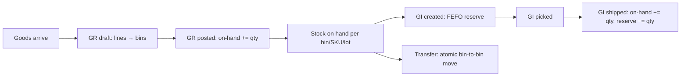

# Warehouse Management — Context v1

> Purpose: the shared understanding of how this module works **today**. This is the doc an agent or new teammate reads before touching anything in the module. Keep it current — update it whenever a feature ships.

## Overview

Today Dash hubs operate as **cross-docks**: client goods arrive as shipments, items are scanned inbound at the hub (inbound module), batched by the dispatch planner, and leave on rider routes the same or next day. There is no concept of *storing* goods — no bins, no on-hand stock, no batch/expiry tracking. The item is the unit of tracking and its lifecycle is measured in hours.

This module introduces a minimal warehouse management system (WMS) so a hub can also **hold client stock over time**: receive goods into a location → section → bin hierarchy, track on-hand vs reserved quantity per SKU and lot, pick and issue stock against outbound orders, and move stock between bins. It is deliberately an MVP — the reference design below describes a full-scale WMS platform, and the PRD/TRD documents which parts we adopt and which we cut.

Nothing in this module exists in production yet. This context doc records the domain model we are adapting and the vocabulary the module uses; once the MVP ships, this doc becomes the description of actual behavior.

## Reference design

The domain model is adapted from a full WMS platform (external reference, courtesy of a partner engineer — eFishery WMS). Its shape, and what we take from it:

| Reference concept | Full platform | Dash MVP adaptation |
|---|---|---|
| Warehouse master | Own `warehouse` table + partner, coverage, access control | **Reuse hubs** (external core-service pitstops), referenced by `hub_id` like every other module |
| Storage hierarchy | 3 levels via Postgres `ltree` (LOCATION → SECTION → BIN) | **Kept as-is** — same 3 levels, same `ltree` path technique; locations typed `STORAGE / QUARANTINE / STAGING`, stock lives only at BIN |
| Stock record | Storage × company × SKU × batch, with `stock`/`reserve` columns | Same granularity, per **client** instead of company: storage × client × SKU × lot |
| Stock tracking | 4 tables (stock adjustment, reserve adjustment, stock move, daily mutation) | **One append-only movement ledger** (`wh_stock_movements`) |
| Inbound | Purchase Order → Goods Receipt (CREATED → SUBMITTED → POSTED), Odoo sync, sortation lines, vendor bills | **Goods Receipt only** (DRAFT → POSTED), supplier as free text, any number of lines to any bins |
| Outbound | Outbound Order + Goods Issue with 10+ statuses, Odoo sync | **One Goods Issue doc**: reserve on create (FEFO), deduct on ship |
| Internal transfer | 4-status approval flow (REQUESTED → APPROVED → PREPARING → DONE) with Odoo picking | **Single-step atomic move**, no approval |
| Inter-warehouse transfer | 2-level approval, realized as OO + PO pair, IMS reservation | **Out of scope** for MVP |
| Stock opname / count adjustment | Manager + FAT approval workflow with Odoo sync | **Out of scope** for MVP — no count-correction mechanism at all (decided 2026-08-12) |
| ERP/Odoo, IMS | Deep sync at every state transition | **None** — WMS is self-contained in logistic-service |

The invariants we keep from the reference — these are the heart of the design:

1. **Reserve-then-deduct.** Allocation reserves stock (`qty_reserved += qty`); physical departure deducts it (`qty_on_hand -= qty`, `qty_reserved -= qty`). Stock never goes negative and never dips below what is reserved: `qty_on_hand ≥ qty_reserved ≥ 0`.
2. **FEFO allocation.** Outbound picks lots by earliest expiry first (falling back to oldest lot number), so old stock leaves first.
3. **Every quantity change has a ledger row.** No stock quantity moves without an append-only `wh_stock_movements` record pointing at the document that caused it.

## Actors & roles

| Actor | Interaction | Auth |
|---|---|---|
| Hub operator (receiver) | Creates and posts goods receipts, puts stock into bins | Internal dashboard, ops JWT |
| Hub operator (picker) | Executes goods issues: picks reserved lines, confirms shipment | Internal dashboard, ops JWT |
| Ops admin | Manages the storage tree, creates goods issues and transfers; reads stock and ledger | Internal dashboard, ops JWT |
| Client | Owns the stored goods; identified by `client_id` (external core-service master). No direct access in MVP | — |
| Dispatch/route modules | Downstream consumers of issued goods (a shipped GI hands items to the existing delivery flow) | Internal |

## Current behavior & flows

Target MVP flows (nothing is live yet):



Storage hierarchy (identical to the reference — bins are addressed by their lineage):

```
Hub Bandung
├── LOC-01 "Zona penyimpanan"  (LOCATION, type STORAGE)     path: 1
│   ├── SEC-A "Rak pakan"      (SECTION)                    path: 1.1
│   │   ├── BIN-A1             (BIN)                        path: 1.1.1
│   │   └── BIN-A2             (BIN)                        path: 1.1.2
│   └── SEC-B "Rak dingin"     (SECTION)                    path: 1.2
├── LOC-02 "Zona karantina"    (LOCATION, type QUARANTINE)  path: 2
└── LOC-03 "Zona staging"      (LOCATION, type STAGING)     path: 3
```

Lifecycle of stock in one bin (adapted from the reference):

| Event | On-hand | Reserved | Available |
|---|---|---|---|
| Empty bin | 0 | 0 | 0 |
| GR-001 posted (+100) | 100 | 0 | 100 |
| GI-001 created (reserve 30) | 100 | 30 | 70 |
| GI-001 shipped (−30) | 70 | 0 | 70 |
| Transfer 5 to quarantine bin (damage) | 65 | 0 | 65 |

## Data owned by this module

Owned entities (see `docs/modules/erd/erd.mermaid`, `WH_*` block): `wh_storages` (self-referencing via `ltree` path), `wh_stocks`, `wh_goods_receipts`, `wh_goods_receipt_lines`, `wh_goods_issues`, `wh_goods_issue_lines`, `wh_transfers`, `wh_transfer_lines`, `wh_stock_movements`.

Read from elsewhere: hubs and clients are external core-service masters, referenced by id with JSONB snapshots (same pattern as shipments/routes).

## APIs & integrations

- Endpoints: `/v1/warehouse/*` on logistic-service (internal, ops JWT). Collection: `dash-api-collections … /Logistic Service/Internal/Warehouse/`.
- No external integrations in MVP (no ERP, no IMS). Goods issues carry a free-text `reference` to link an external order or shipment.

## Known constraints & gotchas

- **Hub ≠ warehouse master.** There is no local warehouse table; if a hub is deactivated in core-service, its storage tree and stock remain and must be drained manually.
- **No count correction in MVP.** Stock opname / adjustments were cut (2026-08-12). If physical count drifts from system count, there is no in-system fix until the opname feature ships — discrepancies must be tracked off-system and reconciled then. This is the MVP's biggest accepted risk.
- **Storage type lives on the LOCATION.** Sections and bins inherit their location's type (`STORAGE`/`QUARANTINE`/`STAGING`); FEFO allocation only touches bins under `STORAGE` locations.
- **SKUs are client-declared strings.** No product master in MVP — `sku` + `item_name` are captured as given on the GR. Typos create phantom SKUs; the UI should suggest previously seen SKUs per client.
- **`BTH` code prefix is taken** by dispatch batches. Stock lots use `LOT…` codes, never `BTH…`.
- Quantities are `numeric(12,2)` from day one (the reference platform had to migrate integer → decimal at migration 130 — we skip that pain).

## Glossary

| Term | Meaning |
|---|---|
| Location | Top storage level — a zone/area in the hub, carries the storage type |
| Section | Middle storage level — a rack/row inside a location |
| Bin | Bottom storage level — the specific slot where stock physically sits; the only level stock attaches to |
| On-hand | Physical quantity sitting in a bin |
| Reserved | Quantity allocated to a goods issue but not yet shipped |
| Available | On-hand − reserved; what can still be allocated |
| Lot | A batch of stock received together, with one expiry date; unit of FEFO |
| FEFO | First-Expired-First-Out — allocation picks earliest expiry first |
| GR / Goods receipt | Document confirming physical arrival of goods into bins |
| GI / Goods issue | Document taking stock out of bins for an order |
| Transfer | Bin-to-bin move within one hub |
| Quarantine | Location type for damaged/returned goods, excluded from FEFO allocation |
| Staging | Location type for goods in transit through the hub floor, excluded from FEFO allocation |

## Open questions

- Do clients get read access to their stock (client portal) in a later phase?
- Storage billing (per bin/day or per unit/day) — pricing model owned elsewhere; WMS only needs to keep the ledger queryable by client and day.
- When does stock opname land (v2?) — until then discrepancy handling is off-system.

## Changelog

- 2026-08-12 — created; domain model adapted (and heavily simplified) from external reference WMS docs
- 2026-08-12 — kept the reference's 3-level storage hierarchy (was flat bins); cut stock opname/adjustments entirely
